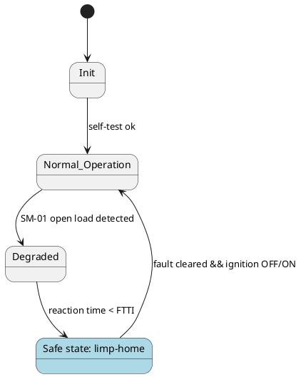

# MagicGrid modelling & PlantUML conventions

## MagicGrid matrix

Fill with **this project's real artefact IDs**:

| | Requirements | Behavior | Structure | Parameters |
|---|---|---|---|---|
| **Problem Domain (black box)** | CR-xxx, SG-xx, FSR-xxx | use cases, activity "activate low beam" | context / item boundary | usage and environment quantities (24 V supply, T_amb) |
| **Solution Domain (white box)** | SYS-REQ-xxx, TSR-xxx | state machine, sequence "open load → DTC" | BDD/IBD lighting ECU | constraints (luminous flux, I_LED, T_j) |
| **Implementation** | HW-REQ-xxx, SW-REQ-xxx | task / cycle time model | HW blocks, SW components | timing budgets, derating curve |

Read MagicGrid columns as *what is required / how it behaves / what it is made of / by which values
it is constrained*, rows as increasing solution commitment.

## The eight required views

| # | View | File |
|---|---|---|
| 1 | Use case (driver, workshop, vehicle gateway, environment) | `03_model/plantuml/uc_lighting.puml` |
| 2 | Requirements diagram (`«deriveReqt»`, `«satisfy»`, `«verify»`) | `req_golden_thread.puml` |
| 3 | Activity "activate low beam incl. fault case" | `act_low_beam.puml` |
| 4 | Sequence "open load → fault reaction → DTC" | `seq_open_load.puml` |
| 5 | State machine "lighting system operating states" incl. safe state | `stm_lighting.puml` |
| 6 | BDD + IBD (ports, flows, signal paths) | `bdd_system.puml`, `ibd_ecu.puml` |
| 7 | Parametric (luminous flux vs. T_j vs. I_LED) | `par_luminous_flux.puml` |
| 8 | Allocation table function → logical → physical | `04_architecture/allocation.md` |

## PlantUML conventions

- Every element label carries its project ID: `[Lighting-ECU\n(ECU_LightingCtrl)]`,
  `SYS-REQ-014`, `SM-01`.
- SysML stereotypes as guillemets: `«block»`, `«requirement»`, `«deriveReqt»`, `«satisfy»`,
  `«verify»`, `«allocate»`.
- Safe state is visually distinct in state machines (e.g. `state "Safe state: limp-home" as SAFE #LightBlue`).
- ASIL shown where meaningful: `note right: ASIL B`.
- Keep each diagram to one message — split rather than cram.

Skeletons:

```plantuml
@startuml req_golden_thread
skinparam rectangle {BackgroundColor White}
rectangle "«requirement»\nSG-01\nNo undetected failure\nof the low beam" as SG01
rectangle "«requirement»\nFSR-001" as FSR001
rectangle "«requirement»\nTSR-003" as TSR003
rectangle "«block»\nSWC_LightManager" as SWC
rectangle "«testCase»\nTC-021" as TC021
SG01 <.. FSR001 : «deriveReqt»
FSR001 <.. TSR003 : «deriveReqt»
TSR003 <.. SWC : «satisfy»
TSR003 <.. TC021 : «verify»
@enduml
```



## Rules

1. One PlantUML block per view, **always followed by 1–2 sentences of reading guidance**.
2. No element that does not exist in the requirements/architecture — raise it as an open point instead.
3. Sources are the single source of truth in `03_model/plantuml/`; rendered images are generated
   artefacts (produced by CI into the gitignored `03_model/exports/`, never hand-edited).
   Binary Cameo models (`.mdzip`) are the exception — those go through Git LFS.
4. Syntax check when available: `plantuml -checkonly 03_model/plantuml/*.puml`. If PlantUML is not
   installed, say so rather than claiming the diagram was validated.
