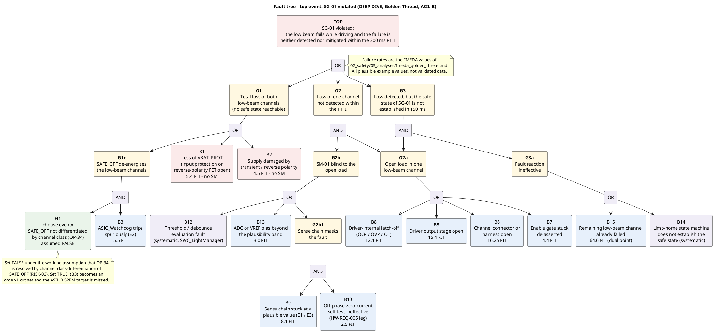

# FTA — SG-01 "No undetected failure of the low beam while driving" (ASIL B)

**Phase 5 · ASPICE SUP.9 / MAN.5 feeding SYS.2 and SYS.3 · ISO 26262-9 (safety analyses, deductive
analysis) · ISO 26262-4 (technical safety concept, as the consumer of the findings)**
**Status:** draft · **Owner:** safety-analyst

> Teaching/reference project. **All failure rates are plausible example values, not validated
> data.** They are taken from [`fmeda_golden_thread.md`](fmeda_golden_thread.md) so that the two
> analyses cannot drift apart.

---

## 1 Top event

The top event is the **violation of the safety goal**, not "the lamp is broken":

> **SG-01 violated — the low beam fails while driving and the failure is neither detected nor
> mitigated within the 300 ms FTTI.**

Three things follow from that wording and shape the whole tree:

1. A channel failure that `SM-01` detects and that leads to limp-home with a warning is **not** the
   top event. The safe state of `SG-01` is degraded-but-visible, so a detected, announced,
   half-illuminated state sits below the top event, not in it.
2. A failure of the **detection** alone is not the top event either. It needs an actual channel
   failure to become dangerous — hence the AND gate in `G2`.
3. Losing **both** channels is the top event regardless of detection, because the safe state is then
   unreachable. That is `G1`, and it is where the single point faults live.

## 2 🔍 DEEP DIVE — the fault tree



Source: [`../../03_model/plantuml/fta_sg01.puml`](../../03_model/plantuml/fta_sg01.puml).

**How to read it:** the three branches under the top OR are three different ways to lose the safety
goal — lose everything (`G1`), lose one channel silently (`G2`), or notice the loss and fail to
react (`G3`); the red basic events `B1` and `B2` hang directly off an OR gate with nothing between
them and the top, which is the visual signature of a single point fault. `G2a` deliberately feeds
two gates: the same open load is the first half of an undetected failure and the first half of a
failed reaction, so it appears in both cut-set families rather than being duplicated as two events.

## 3 Basic events

| ID | Basic event | Element | λ [FIT] | Kind |
|---|---|---|---|---|
| `B1` | Loss of `VBAT_PROT` — input protection or reverse-polarity FET open, output capacitor short | `Power_Supply_Unit` | 5.40 | random |
| `B2` | Supply damaged by transient or reverse polarity | `Power_Supply_Unit` | 4.50 | random |
| `B3` | `ASIC_Watchdog` trips spuriously (E2) | `ASIC_Watchdog` | 5.50 | random |
| `H1` | `SAFE_OFF` not differentiated by channel class | design decision (`OP-34`) | — | **house event, assumed FALSE** |
| `B5` | Driver output stage open (E1) | `LED_Driver_Stage_1` | 15.40 | random |
| `B6` | Channel connector or in-ECU harness open | connector / harness | 16.25 | random |
| `B7` | Enable gate stuck de-asserted | `LED_Driver_Stage_1` | 4.40 | random |
| `B8` | Driver-internal latch-off, OCP/OVP/OT (E3) | `LED_Driver_Stage_1` | 12.10 | random |
| `B9` | Sense chain stuck at a plausible value (E1/E3) | `Current_Sense_Chain` | 8.10 | random |
| `B10` | Off-phase zero-current self-test ineffective | `Current_Sense_Chain` / `SWC_LightManager` | 2.50 | random + systematic |
| `B12` | Threshold and debounce evaluation fault | `SWC_LightManager` | — | **systematic** |
| `B13` | ADC or `VREF` bias beyond the plausibility band | `MCU_Lockstep`, `Power_Supply_Unit` | 3.00 | random |
| `B14` | Limp-home state machine does not establish the safe state | `SWC_LightManager` | — | **systematic** |
| `B15` | The remaining low-beam channel has already failed | second channel path | 64.60 | random, dual point |

`B12` and `B14` carry no λ on purpose. They are software faults, and pricing a systematic fault with
a failure rate would be a category error; they are controlled by the ASIL B process and by the test
cases named in [`verification_matrix.md`](verification_matrix.md), not by a number in this table.

## 4 🔍 DEEP DIVE — minimal cut sets, derived

The tree in Boolean form, gate by gate:

```
TOP  = G1 + G2 + G3
G1   = B1 + B2 + G1c
G1c  = B3 . H1
G2   = G2a . G2b
G2a  = B5 + B6 + B7 + B8
G2b  = G2b1 + B12 + B13
G2b1 = B9 . B10
G3   = G2a . G3a
G3a  = B14 + B15
```

Substituting downwards:

```
TOP = B1 + B2 + B3.H1
    + (B5 + B6 + B7 + B8) . (B9.B10 + B12 + B13)
    + (B5 + B6 + B7 + B8) . (B14 + B15)
```

Expanding the products gives **22 minimal cut sets** plus one that the house event suppresses. No
term absorbs another — every open-load event is distinct and no cut set is a superset of a shorter
one, so the list below is already minimal.

### Order 1 — single point faults

| # | Cut set | λ [FIT] | Why nothing covers it |
|---|---|---|---|
| MCS-1 | `{B1}` | 5.40 | Once `VBAT_PROT` is gone the ECU has no rails, no channels and no way to transmit a warning. `SM-06` can detect the excursion, but detection does not produce light |
| MCS-2 | `{B2}` | 4.50 | Same effect by a different route. The input protection *prevents* the damage; there is no mechanism that *mitigates* it once it has happened |

**Σ 9.90 FIT — 54 % of the entire SPF+RF residue of the FMEDA.**

### Order 2 — 16 cut sets

For each open-load event `Bi ∈ {B5, B6, B7, B8}`:

| Family | Cut sets | Reading |
|---|---|---|
| `{Bi, B12}` | `{B5,B12}` `{B6,B12}` `{B7,B12}` `{B8,B12}` | Channel dies and the threshold evaluation does not classify it → undetected |
| `{Bi, B13}` | `{B5,B13}` `{B6,B13}` `{B7,B13}` `{B8,B13}` | Channel dies and the measurement is biased past the plausibility band → undetected |
| `{Bi, B14}` | `{B5,B14}` `{B6,B14}` `{B7,B14}` `{B8,B14}` | Channel dies, is detected, and the limp-home reaction fails → safe state not reached |
| `{Bi, B15}` | `{B5,B15}` `{B6,B15}` `{B7,B15}` `{B8,B15}` | Both channels gone → no safe state exists to reach |

### Order 3 — 4 cut sets

`{B5, B9, B10}` `{B6, B9, B10}` `{B7, B9, B10}` `{B8, B9, B10}`

The channel fails, the sense chain is stuck at a plausible value, **and** the off-phase
zero-current self-test that exists precisely to catch that is itself ineffective. This is the
structural payoff of `HW-REQ-005`: without it, `{Bi, B9}` would be an order-2 cut set with 8.10 FIT
behind `B9`. The self-test pushes the whole family to order 3.

### Suppressed by the house event

`{B3, H1}` — a spurious watchdog trip **and** an undifferentiated `SAFE_OFF`. Under the `OP-34`
working assumption `H1` is FALSE and the cut set vanishes. If `OP-34` is decided the other way,
`H1` becomes TRUE, the AND gate degenerates, and **`{B3}` is an order-1 cut set worth 5.50 FIT** —
larger than either supply single point fault. `RISK-03` records exactly this.

## 5 Single point faults present: **yes**

**Two: `{B1}` and `{B2}`, both in `Power_Supply_Unit`, both on the power path, together 9.90 FIT.**

The rationale, stated plainly:

- The `SG-01` safe state is *limp-home with a visible remaining channel*. Every mechanism in the
  concept — `SM-01`, `SM-03`, `SM-04` — assumes the ECU is powered and at least one channel can be
  driven. A supply single point fault removes that assumption, so no diagnosis can reach the safe
  state.
- This is therefore **not a diagnostic gap and must not be answered with a new safety mechanism.**
  Adding coverage there would be arithmetic, not safety. The real options are architectural, and
  they belong to `systems-engineer` and `safety-manager`:

  | Option | Effect | Cost |
  |---|---|---|
  | Accept, with an argued residual-risk statement | SPFM stays 91.8 %, above the ASIL B target | The argument has to survive the confirmation review |
  | Split the input protection per channel pair | `{B1}` becomes an order-2 cut set; SPFM ≈ 94 % | A second protection path, a second λ contribution |
  | Feed the two low-beam channels from separate ECUs | Removes the common ECU entirely | A different vehicle architecture; far beyond this item |

  This phase creates no requirement and no `SM-`. The decision is raised as **`OP-54`**.

- **The metric still passes.** SPFM 91.8 % ≥ 90 %, PMHF 1.84 × 10⁻⁸ 1/h < 10⁻⁷ 1/h. A single point
  fault is not automatically a target violation; it is a fault that has to be *shown* to be small
  enough, and here it is — with 1.8 points of margin and no more.

**One further statement the tree makes and the FMEDA does not:** `G3` has two systematic basic
events (`B12`, `B14`) sitting in eight of the 22 cut sets, and neither is covered by a random
failure rate. The `SG-01` argument therefore rests as much on the software verification of
`SWC_LightManager` as on the hardware metric — which is the point of the entry for `SW-REQ-002` …
`SW-REQ-004` in [`verification_matrix.md`](verification_matrix.md).

## 6 Findings routed out of this analysis

| Finding | Action | Owner |
|---|---|---|
| Two order-1 cut sets in the supply, 9.90 FIT, no mechanism | `OP-54` — accept with argument or change the supply architecture | systems-engineer, safety-manager |
| `{B3}` becomes order-1 if `OP-34` is decided without channel-class differentiation | `RISK-03`; `OP-34` stays open | safety-manager |
| `B10` (self-test leg ineffective) is what keeps four cut sets at order 3, but nothing verifies the self-test itself | Fault injection into the off-phase branch, not only into the load | verification-engineer (extends `OP-19`) |
| `B12`, `B14` are systematic and carry eight cut sets | Structural coverage and fault-injection tests on `SWC_LightManager` | verification-engineer (`OP-49`) |

---

**Work products:** `02_safety/05_analyses/fta_sg01.md`, `03_model/plantuml/fta_sg01.puml`
**Open points:** new `OP-54`; `RISK-03` created; `OP-34` deliberately **not** closed (assumed, not
decided); `OP-42` untouched — the `SYS-REQ-018` breach is `systems-engineer`'s.
**Process reference:** ASPICE **SUP.9** (problem resolution) and **MAN.5** (risk management) with
the findings feeding **SYS.2** / **SYS.3** · ISO 26262 **Part 9** (safety analyses, deductive
analysis of failure causes) · **Part 4** (technical safety concept as the consumer of the
findings). Parts and topics named, no clause numbers cited.
