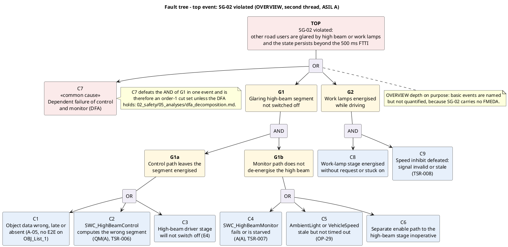

# FTA — SG-02 "No unintended glare caused by high beam or work lamps" (ASIL A)

**Phase 5 · ASPICE SUP.9 feeding SYS.3 · ISO 26262-9 (safety analyses, deductive analysis)**
**Status:** draft · **Owner:** safety-analyst

> Teaching/reference project. All statements are plausible example values, not validated data.

---

## 📋 OVERVIEW — depth, on purpose

This is the **second, deliberately shallower thread**. The tree is developed to named basic events
and to minimal cut sets, but it is **not quantified**: `SG-02` carries no FMEDA, so attaching FIT
values here would fabricate a precision that no other document supports. What it *does* deliver in
full is the structural question the decomposition depends on — whether the AND between control path
and monitor path actually holds — and that question is handed to
[`dfa_decomposition.md`](dfa_decomposition.md).

## 1 Top event

> **SG-02 violated — another road user is glared by the high beam or by a work lamp, and the state
> persists beyond the 500 ms FTTI.**

Note what the wording excludes: a segment that is briefly bright while the masking is computed is
not the top event. Persistence beyond the FTTI is.

## 2 The fault tree



Source: [`../../03_model/plantuml/fta_sg02.puml`](../../03_model/plantuml/fta_sg02.puml).

**How to read it:** the left branch is the ASIL decomposition drawn as a fault tree — the QM(A)
control path (`G1a`) and the A(A) monitor path (`G1b`) meet at an AND gate, and that gate is the
entire reason `TSR-006` may be QM at all. `C7` hangs off the top OR rather than under either path,
because a dependent failure is by definition the event that makes the AND meaningless.

## 3 Minimal cut sets

```
TOP = G1 + G2 + C7
G1  = (C1 + C2 + C3) . (C4 + C5 + C6)
G2  = C8 . C9
```

**11 minimal cut sets:**

| Order | Cut sets | Count |
|---|---|---|
| 1 | `{C7}` | 1 |
| 2 | `{C1,C4}` `{C1,C5}` `{C1,C6}` `{C2,C4}` `{C2,C5}` `{C2,C6}` `{C3,C4}` `{C3,C5}` `{C3,C6}` | 9 |
| 2 | `{C8,C9}` | 1 |

## 4 Single point faults present: **yes — one, and it is not a component**

**`{C7}`, the dependent failure of control path and monitor path.** Every order-2 cut set on the
high-beam branch depends on the two paths failing independently; `C7` is the single event that makes
that assumption false, and it is order 1 by construction.

That is not a defect to be designed out with a mechanism. It is the reason `RISK-02` exists and the
reason `ISO 26262-9` asks for a dependent failure analysis at all. **The `SG-02` fault tree is
therefore only as strong as [`dfa_decomposition.md`](dfa_decomposition.md)**, and the DFA's verdict —
supportable but conditional — transfers directly to this tree.

**A second candidate, stated because the tree as drawn hides it.** `C3` (high-beam stage will not
switch off) is drawn under `G1a`, which presumes the stuck state is *upstream* of the enable gate,
where the monitor's separate enable path can still break it. A stage failed short **downstream** of
the gate cannot be de-energised by either path and would be a genuine order-1 cut set. No safety
mechanism in the current set addresses it; `SM-04`'s overcurrent latch-off happens to help, but a
short that keeps the current in band does not trip it. Raised as part of `OP-57` rather than answered
here — this thread is `📋 OVERVIEW` and a new mechanism is out of this phase's remit.

## 5 Findings

| Finding | Action | Owner |
|---|---|---|
| `{C7}` is order 1; the whole SG-02 argument rests on the DFA | `dfa_decomposition.md`; `RISK-02` answered but conditional | safety-analyst, software-engineer |
| `C5` — a stale-but-not-timed-out `AmbientLight` sits inside a cut set with every control-path event | Confirms `OP-29`; **not closed**, the resolution is a concept decision | safety-manager |
| `C1` — no requirement covers a *missing* `OBJ_List_1` (deliberately un-E2E-protected). `TSR-006`/`TSR-007` cover implausible states, not absence | `OP-57` | systems-engineer, safety-manager |
| High-beam stage failed short downstream of the enable gate | folded into `OP-57` | systems-engineer |

---

**Work products:** `02_safety/05_analyses/fta_sg02.md`, `03_model/plantuml/fta_sg02.puml`
**Open points:** new `OP-57`; `OP-29` confirmed and deliberately **not** closed (it is a concept
decision for `safety-manager`, not an analysis result).
**Process reference:** ASPICE **SUP.9** (problem resolution) feeding **SYS.3** (system architectural
design) · ISO 26262 **Part 9** (safety analyses; analysis of dependent failures) · **Part 3**
(functional safety concept, as the origin of `SG-02`). Parts and topics named, no clause numbers
cited.
