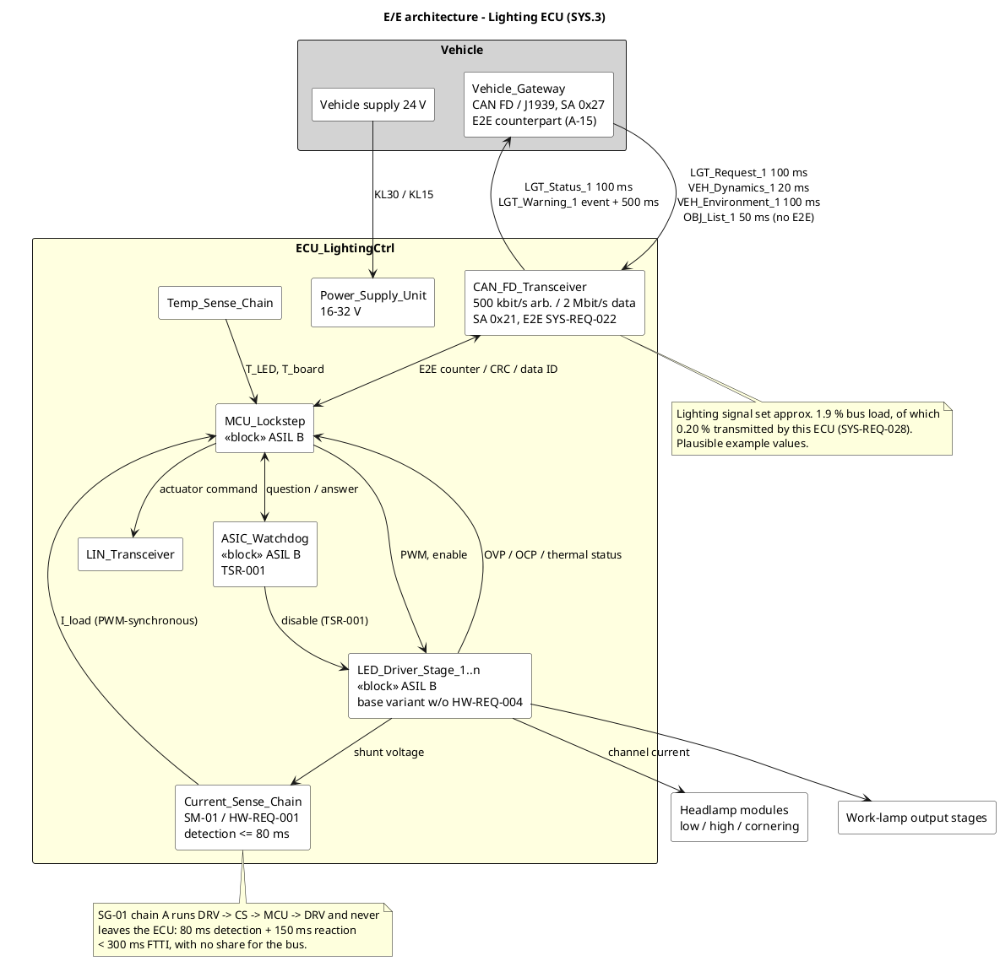

# E/E architecture — Lighting ECU

**Phase 3 · ASPICE SYS.3 · ISO 26262-4 (technical safety concept)**
**Status:** draft · **Owner:** systems-engineer, with safety-manager for the TSR allocation
**Revision:** phase 3 refinement — communication design added (`OP-21`, `OP-22`), see the change
notes in sections 2, 5 and 6.

> Teaching/reference project. All numeric values are plausible example values, not validated data.

---

## 1 📋 OVERVIEW — Architecture blocks

| Block | Element name | Function | ASIL |
|---|---|---|---|
| Microcontroller | `MCU_Lockstep` | Application, monitoring, diagnostics; dual-core lockstep | B |
| External watchdog | `ASIC_Watchdog` | Independent time base, question/answer watchdog, disable path to the driver stages | B |
| LED driver stages | `LED_Driver_Stage_1..n` | Constant-current control per channel, PWM dimming, OVP/OCP/thermal status. Base variant **without** the forced diagnostic window of `HW-REQ-004` (see section 6, `OP-17`) | B |
| Current sensing | `Current_Sense_Chain` | Shunt, amplifier, ADC input per channel; PWM-synchronous sampling. Carries `SM-01`, worst-case detection time 80 ms (`HW-REQ-009`) | B |
| Temperature sensing | `Temp_Sense_Chain` | LED module NTC and ECU board sensor; input to the derating function | B |
| Supply | `Power_Supply_Unit` | 16–32 V input, buck plus linear stage, undervoltage and overvoltage monitoring | B |
| Bus interface | `CAN_FD_Transceiver`, `LIN_Transceiver` | CAN FD / SAE J1939 to the vehicle gateway incl. end-to-end protection of the safety-relevant signal groups (`SYS-REQ-022`), LIN to the actuator | B / QM |
| Diagnostic path | `SWC_DiagnosticManager` | DTC memory, UDS server per ISO 14229 | QM |

**Decision on the microcontroller concept:** lockstep MCU **and** external watchdog, not one or the
other. The lockstep core covers random faults of the computing core; it cannot cover a stalled
clock or a hung application, which is what the watchdog with its independent time base addresses
(`TSR-001`). For ASIL B this pairing is deliberate over-provisioning, and it is what makes the
freedom-from-interference argument for the mixed ASIL B / QM software feasible in phase 7.

**How to read it:** the yellow block is the item boundary of the ECU. The safety-relevant loop of
the Golden Thread runs `DRV → CS → MCU → DRV` and stays inside the ECU — the two bus arrows carry
the request into the loop and the status and warning out of it, but no part of the FTTI budget. The
watchdog has its **own** path to the driver stages so that a hung microcontroller cannot prevent the
de-energisation.

---

## 2 🔍 DEEP DIVE — Interface table

Only interfaces of the Golden Thread and of `SG-02` are listed at signal level; the remaining
interfaces are summarised.

| Signal | Direction | Type | Range | Timing | ASIL | Integrity |
|---|---|---|---|---|---|---|
| `LightRequest` | Gateway → ECU | enum {off, DRL, low, high, work} | 5 states | cyclic 100 ms, timeout 300 ms | B | E2E, group `SG_LightRequest` |
| `IgnitionStatus` | Gateway → ECU | enum {off, on, crank, n/a} | 4 states | cyclic 100 ms, timeout 300 ms | QM | E2E, group `SG_LightRequest` |
| `VehicleSpeed` | Gateway → ECU | uint16, 0.01 km/h | 0 … 150 km/h | cyclic 20 ms, timeout 100 ms | A | E2E, group `SG_VehicleDynamics` |
| `SteeringAngle` | Gateway → ECU | int16, 0.1 ° | −540 … +540 ° | cyclic 20 ms, timeout 100 ms | A | E2E, group `SG_VehicleDynamics` |
| `AmbientLight` | Gateway → ECU | uint16, 1 lx | 0 … 60000 lx | cyclic 100 ms, timeout 500 ms | B | E2E, group `SG_Environment` |
| `ObjectList` | Gateway → ECU | struct, ≤ 8 objects | — | cyclic 50 ms, timeout 200 ms | QM(A) | timeout + per-object valid flag only, **no E2E** |
| `DriverWarningReq` | ECU → Gateway | enum {none, lowBeamFault} | 2 states | event + cyclic 500 ms | B | E2E, group `SG_DriverWarning` |
| `LightingStatus` | ECU → Gateway | bitfield per channel | 16 bit | cyclic 100 ms | B | E2E, group `SG_LightingStatus` |
| `I_Load_Ch1..n` | Sense chain → MCU | uint12 ADC | 0 … 1.5 A | PWM-synchronous, 2.5 ms raster | B | ADC reference plausibility (`HW-REQ-010`) |
| `U_Channel_Ch1..n` | Driver → MCU | uint12 ADC | 0 … 40 V | 10 ms | B | range plausibility |
| `DriverStatus_Ch1..n` | Driver → MCU | bitfield OVP/OCP/OT | 3 bit | ≤ 10 ms | B | driver-internal status readback |
| `T_LED`, `T_Board` | Sense chain → MCU | uint12 ADC | −40 … +150 °C | 100 ms | B | open/short detection by range check |
| `PWM_Ch1..n` | MCU → Driver | PWM | 400 Hz, duty 0 … 100 % | continuous | B | feedback via `I_Load_Ch1..n` (`TSR-002`) |
| `Enable_Ch1..n` | MCU → Driver | digital | 0 / 1 | continuous | B | feedback via `I_Load_Ch1..n` (`TSR-002`) |
| `WD_Disable` | Watchdog → Driver | digital | 0 / 1 | ≤ 50 ms | B | independent path, not routed via `MCU_Lockstep` |

**Change note (phase 3 refinement).** Two changes to the published table, no value was silently
altered:

1. **New column `Integrity`.** The table previously named only timeouts. A timeout covers loss but
   not corruption, repetition or an incorrect sequence, which is not enough for an ASIL B signal.
   The column names the mechanism per signal; the requirements behind it are `SYS-REQ-022` …
   `SYS-REQ-024` and `SYS-REQ-027`.
2. **New row `IgnitionStatus`.** The signal was used by `SYS-REQ-009` and is presumed by `A-06`, but
   it was missing from the interface table — a genuine gap, not a new function. It is carried in the
   `SG_LightRequest` group, so it inherits the group protection although it is QM by itself.
3. **`DriverWarningReq` timing** changed from "cyclic 500 ms" to "event + cyclic 500 ms", see
   `SYS-REQ-026` and chain B of the timing analysis in section 4.

**Timeout handling is part of the interface, not of the application.** Every safety-relevant input
carries a timeout; on timeout the receiving function must assume the signal invalid (`SYS-REQ-024`).
`TSR-008` makes this explicit for the speed signal, because an inhibit that can be defeated by a
lost frame is not an inhibit.

**Protection is per signal group, not per signal.** Counter and checksum are computed over a group
of signals that is transmitted in one frame, because that is the unit that is lost, repeated or
corrupted. A group is invalid as a whole; a single signal within it cannot be "partly valid". This
is why `IgnitionStatus` (QM) rides in an ASIL B group instead of getting its own frame.

**On `ObjectList` at QM(A):** the signal originates outside the item boundary (`A-05`) and feeds the
QM path of the decomposition (`TSR-006`). It is deliberately **not** E2E-protected — protecting it
would suggest an integrity level the QM path does not have and does not need. The safety argument
rests on the independent monitor `TSR-007`, which does not use this signal. The interface agreement
with the vehicle manufacturer is still open (`OP-10`).

---

## 3 🔍 DEEP DIVE — CAN FD / J1939 message catalogue (`OP-21`)

### 3.1 Conventions

| Item | Value |
|---|---|
| Physical layer | CAN FD, 500 kbit/s arbitration phase, 2 Mbit/s data phase, BRS enabled (`A-14`) |
| Identifier | 29-bit J1939 identifier, `ID = priority<<26 \| DP<<24 \| PF<<16 \| PS<<8 \| SA` |
| Parameter groups | PDU2 proprietary B (`PF = 0xFF`), i.e. broadcast, no destination address |
| Source addresses | `0x21` lighting ECU, `0x27` vehicle gateway (placeholders, `A-16`) |
| Byte order | little-endian (Intel), byte index 0-based, bit 0 = LSB of the byte |
| Encoding | SPN style: `physical = raw × resolution + offset`; top raw values reserved for "error" and "not available" |
| E2E profile | equivalent to AUTOSAR E2E Profile 1: 4-bit alive counter, CRC-8 (SAE J1850 polynomial 0x1D, init 0xFF, final XOR 0xFF), 16-bit data identifier prepended to the CRC input |

All PGNs, source addresses, data identifiers and byte positions below are **plausible example
values**. They are placeholders until the OEM J1939 database is available (`A-16`, `OP-27`).

### 3.2 Message overview

| Message | PGN | CAN ID | Prio | Payload | Direction | Cycle | Timeout | Signal group | ASIL |
|---|---|---|---|---|---|---|---|---|---|
| `LGT_Request_1` | 0xFF20 / 65312 | `0x0CFF2027` | 3 | 8 byte | Gateway → ECU | 100 ms | 300 ms | `SG_LightRequest`, DataID `0x0101` | B |
| `VEH_Dynamics_1` | 0xFF21 / 65313 | `0x0CFF2127` | 3 | 8 byte | Gateway → ECU | 20 ms | 100 ms | `SG_VehicleDynamics`, DataID `0x0102` | A |
| `VEH_Environment_1` | 0xFF22 / 65314 | `0x18FF2227` | 6 | 8 byte | Gateway → ECU | 100 ms | 500 ms | `SG_Environment`, DataID `0x0103` | B |
| `OBJ_List_1` | 0xFF23 / 65315 | `0x18FF2327` | 6 | 32 byte | Gateway → ECU | 50 ms | 200 ms | — (no E2E) | QM(A) |
| `LGT_Status_1` | 0xFF30 / 65328 | `0x18FF3021` | 6 | 8 byte | ECU → Gateway | 100 ms | — | `SG_LightingStatus`, DataID `0x0201` | B |
| `LGT_Warning_1` | 0xFF31 / 65329 | `0x0CFF3121` | 3 | 8 byte | ECU → Gateway | event + 500 ms | — | `SG_DriverWarning`, DataID `0x0202` | B |

`LGT_Warning_1` and `LGT_Request_1` carry priority 3 while the status and environment messages carry
priority 6. The warning is the one lighting message whose latency is argued against a safety budget
(chain B, section 4), so it must not queue behind a 32-byte object list.

### 3.3 🔍 DEEP DIVE — Golden Thread messages (SG-01)

**`LGT_Request_1` — PGN 0xFF20, 8 byte, 100 ms**

| Byte.bit | Signal | Length | Encoding | Range / states |
|---|---|---|---|---|
| 0.0 … 0.3 | `LightRequest` | 4 bit | enum, 1/bit, offset 0 | 0 = off, 1 = DRL, 2 = low, 3 = high, 4 = work, 5 … 13 reserved, 14 = error, 15 = not available |
| 0.4 … 0.5 | `IgnitionStatus` | 2 bit | enum, 1/bit, offset 0 | 0 = off, 1 = on, 2 = crank, 3 = not available |
| 0.6 … 0.7 | reserved | 2 bit | — | transmitted as `11b` |
| 1.0 … 1.3 | `SG_LightRequest_Counter` | 4 bit | 1/bit | 0 … 14 incrementing, 15 = invalid |
| 1.4 … 1.7 | reserved | 4 bit | — | transmitted as `1111b` |
| 2 … 6 | reserved | 5 byte | — | transmitted as `0xFF` |
| 7 | `SG_LightRequest_CRC` | 8 bit | CRC-8 over DataID `0x0101` (LSB first) followed by bytes 0 … 6 | — |

**`LGT_Warning_1` — PGN 0xFF31, 8 byte, event + 500 ms**

| Byte.bit | Signal | Length | Encoding | Range / states |
|---|---|---|---|---|
| 0.0 … 0.1 | `DriverWarningReq` | 2 bit | enum, 1/bit, offset 0 | 0 = none, 1 = lowBeamFault, 2 = reserved, 3 = not available |
| 0.2 … 0.7 | reserved | 6 bit | — | transmitted as `1`s |
| 1.0 … 1.3 | `SG_DriverWarning_Counter` | 4 bit | 1/bit | 0 … 14 incrementing, 15 = invalid |
| 1.4 … 1.7, 2 … 6 | reserved | — | — | transmitted as `1`s |
| 7 | `SG_DriverWarning_CRC` | 8 bit | CRC-8 over DataID `0x0202` (LSB first) followed by bytes 0 … 6 | — |

**`LGT_Status_1` — PGN 0xFF30, 8 byte, 100 ms.** The 16-bit `LightingStatus` bitfield of the
interface table is resolved as seven 2-bit channel states with the common encoding
`0 = off, 1 = on, 2 = degraded, 3 = failed`:

| Byte.bit | Signal | Length | Range / states |
|---|---|---|---|
| 0.0 … 0.1 | `LowBeam_Ch1_State` | 2 bit | off / on / degraded / failed |
| 0.2 … 0.3 | `LowBeam_Ch2_State` | 2 bit | off / on / degraded / failed |
| 0.4 … 0.5 | `HighBeam_State` | 2 bit | off / on / degraded / failed |
| 0.6 … 0.7 | `DRL_State` | 2 bit | off / on / degraded / failed |
| 1.0 … 1.1 | `CorneringLeft_State` | 2 bit | off / on / degraded / failed |
| 1.2 … 1.3 | `CorneringRight_State` | 2 bit | off / on / degraded / failed |
| 1.4 … 1.5 | `WorkLamp_State` | 2 bit | off / on / degraded / failed |
| 1.6 … 1.7 | reserved | 2 bit | transmitted as `11b` |
| 2.0 … 2.1 | `OpenLoadDiagAvailable` | 2 bit | 0 = available, 1 = not available (`SYS-REQ-017`), 2/3 reserved |
| 2.2 … 2.7, 4 … 6 | reserved | — | transmitted as `1`s |
| 3.0 … 3.3 | `SG_LightingStatus_Counter` | 4 bit | 0 … 14, 15 = invalid |
| 7 | `SG_LightingStatus_CRC` | 8 bit | CRC-8 over DataID `0x0201` and bytes 0 … 6 |

`OpenLoadDiagAvailable` is the bus-visible form of `SYS-REQ-017`: when the PWM on-time is below the
minimum usable window the diagnosis is declared unavailable rather than silently degraded, and the
vehicle is told so. Without this bit the decision taken under `OP-17` would be invisible outside the
ECU.

### 3.4 🔍 DEEP DIVE — SG-02 messages

**`VEH_Dynamics_1` — PGN 0xFF21, 8 byte, 20 ms** (feeds `TSR-008` work-lamp inhibit and the
cornering light)

| Byte.bit | Signal | Length | Encoding | Range |
|---|---|---|---|---|
| 0 … 1 | `VehicleSpeed` | 16 bit | 0.01 km/h per bit, offset 0 | raw 0 … 15000 → 0 … 150 km/h; `0xFEFF` = error, `0xFFFF` = not available |
| 2 … 3 | `SteeringAngle` | 16 bit | 0.1 ° per bit, offset −540.0 ° | raw 0 … 10800 → −540 … +540 °; `0xFFFF` = not available |
| 4.0 … 4.3 | `SG_VehicleDynamics_Counter` | 4 bit | 1/bit | 0 … 14, 15 = invalid |
| 4.4 … 6 | reserved | — | — | `0xFF` |
| 7 | `SG_VehicleDynamics_CRC` | 8 bit | CRC-8 over DataID `0x0102` and bytes 0 … 6 | — |

> **Note on `SteeringAngle`.** The interface table describes the *application-level* type as
> `int16, 0.1 °`. At frame level the J1939 convention of an unsigned raw value with an offset is
> used instead. Physical range and resolution are identical; only the wire representation differs.
> No published value changed.

**`VEH_Environment_1` — PGN 0xFF22, 8 byte, 100 ms**

| Byte.bit | Signal | Length | Encoding | Range |
|---|---|---|---|---|
| 0 … 1 | `AmbientLight` | 16 bit | 1 lx per bit, offset 0 | 0 … 60000 lx; `0xFFFF` = not available |
| 2.0 … 2.3 | `SG_Environment_Counter` | 4 bit | 1/bit | 0 … 14, 15 = invalid |
| 7 | `SG_Environment_CRC` | 8 bit | CRC-8 over DataID `0x0103` and bytes 0 … 6 | — |

### 3.5 📋 OVERVIEW — remaining messages

**`OBJ_List_1` — PGN 0xFF23, 32 byte CAN FD payload, 50 ms.** Byte 0 carries `ObjectCount`
(0 … 8, 15 = not available), bytes 1 … 24 carry eight 3-byte object records
(`Azimuth` 12 bit at 0.1 ° with offset −204.8 °, `Distance` 8 bit at 1 m, `ObjectClass` 3 bit,
`ObjectValid` 1 bit), bytes 25 … 31 are reserved. No alive counter and no CRC — see the argument in
section 2.

**LIN actuator (`LIN_Transceiver`).** Classic LIN 2.x at 19.2 kbit/s with a 20 ms schedule table;
the frame set is QM and is specified with the actuator supplier. Not detailed here.

**UDS (`SWC_DiagnosticManager`).** ISO 14229 services over the same CAN FD segment using the
OEM-assigned diagnostic identifiers; addressing is functional plus physical. Diagnostic traffic is
not part of the cyclic budget in section 4 because it only occurs at standstill in the workshop
(`SYS-REQ-021`, QM).

---

## 4 🔍 DEEP DIVE — Bus load and timing analysis (`OP-22`)

### 4.1 Frame time on the wire

A CAN FD frame with a 29-bit identifier is transmitted partly at the arbitration bit rate and partly
at the data bit rate. Counted in bits:

| Portion | Bits | Rate | Time |
|---|---|---|---|
| SOF, ID (11 + 18), SRR, IDE, RRS, FDF, res, BRS | 36 | 500 kbit/s | 72 µs |
| worst-case dynamic stuff bits in that portion | 8 | 500 kbit/s | 16 µs |
| ESI, DLC, data (8 byte = 64 bit), stuff count, CRC-17, fixed stuff bits | ≈ 96 | 2 Mbit/s | 48 µs |
| CRC delimiter, ACK slot, ACK delimiter, EOF, intermission | 13 | 500 kbit/s | 26 µs |
| **Total, 8-byte payload** | | | **≈ 162 µs, budgeted as 165 µs** |
| **Total, 32-byte payload** (data phase ≈ 306 bit) | | | **≈ 267 µs, budgeted as 270 µs** |

Engineering estimate, plausible example values. The stuffing terms are upper bounds; a real
calculation would come from the network design tool.

### 4.2 Bus load contribution

| Message | Frames/s | Frame time | Load |
|---|---|---|---|
| `LGT_Request_1` | 10 | 165 µs | 0.17 % |
| `VEH_Dynamics_1` | 50 | 165 µs | 0.83 % |
| `VEH_Environment_1` | 10 | 165 µs | 0.17 % |
| `OBJ_List_1` | 20 | 270 µs | 0.54 % |
| `LGT_Status_1` | 10 | 165 µs | 0.17 % |
| `LGT_Warning_1` | 2 | 165 µs | 0.03 % |
| **Lighting signal set, total** | **102** | | **≈ 1.9 %** |
| of which transmitted by `ECU_LightingCtrl` | 12 | | **≈ 0.20 %** |
| Background load of other ECUs (`A-14`) | | | ≤ 35 % |
| **Segment total** | | | **≈ 37 %** |

The design target for a segment carrying safety-relevant signals is 50 % (`A-14` background plus
this item's contribution leaves 13 percentage points of headroom). The ECU's own transmit budget is
bounded by `SYS-REQ-028` at 1.0 % over any 100 ms window; the worst 100 ms window contains one
`LGT_Status_1`, one event-triggered and one cyclic `LGT_Warning_1` plus one jitter frame — four
frames, 660 µs, **0.66 %**.

### 4.3 🔍 DEEP DIVE — Chain A: SG-01 fault detection to safe state

| Step | Element | Contribution | Source |
|---|---|---|---|
| PWM synchronisation of the sample | `Current_Sense_Chain` | 2.5 ms | `SM-01` |
| ADC acquisition | `Current_Sense_Chain` | 0.1 ms | `SM-01` |
| Threshold window | `SM-01` | 50 ms | `SYS-REQ-014` |
| Debounce | `SM-01` | 20 ms | `SM-01` |
| Task latency to `SWC_LightManager` | `MCU_Lockstep` | 5 ms | `SM-01` |
| **Detection subtotal** | | **77.6 ms, specified ≤ 80 ms** | `HW-REQ-009` |
| **Bus contribution** | — | **0 ms** | see below |
| Fault reaction to the safe state | `SWC_LightManager`, `LED_Driver_Stage_1` | 150 ms | `TSR-004`, `SG-01` |
| **Total** | | **230 ms** | |
| **FTTI** | | **300 ms** | `SG-01` |
| **Margin** | | **70 ms (23 %)** | |

**The bus is not in the SG-01 timing chain.** Detection, decision and fault reaction all happen
inside `ECU_LightingCtrl`; the safe state — remaining channel kept at its set point — needs no
message. This is an architectural property, not an accident, and it is the reason the FTTI argument
survives any bus load assumption. The two bus-borne consequences of the fault, the driver warning
and the status message, are both outside the FTTI budget.

**Change note.** The detection budget in this document previously implied the 70 ms figure of the
phase 2 status. The hardware refinement raised it to 80 ms worst case (`SM-01`, `HW-REQ-009`)
because PWM synchronisation, acquisition and task latency were not counted before. The allocated cap
of `SYS-REQ-018` stays at 100 ms, so the requirement did not change — the design value did, and the
budget still closes with 70 ms of margin.

### 4.4 🔍 DEEP DIVE — Chain B: driver warning over the bus

| Step | Contribution | Source |
|---|---|---|
| Classification complete (end of chain A detection) | t = 0 | — |
| Transmit task period | 10 ms | plausible example value |
| Worst-case queuing and arbitration delay on the segment | 2.5 ms | 1 × in-progress 64-byte frame (0.41 ms) + up to 10 higher-priority frames |
| Frame transmission `LGT_Warning_1` | 0.17 ms | section 4.1 |
| **Inside the item boundary** | **≈ 13 ms, specified ≤ 20 ms** | `SYS-REQ-026` |
| Gateway forwarding to the instrument cluster | 100 ms | `A-17` |
| **To the cluster input** | **≈ 113 ms** | |
| **Budget** | **2000 ms** | `SYS-REQ-010` |

If the first frame is lost, the cyclic repetition of `TSR-005` delivers the warning after at most a
further 500 ms, giving 613 ms — still inside the 2 s budget with a factor of three. That is what the
cyclic repetition buys, and it is why `SYS-REQ-026` adds the event-triggered frame rather than
replacing the cycle: the event frame removes the average latency, the cycle covers the loss case.

### 4.5 📋 OVERVIEW — Chain C: SG-02 high-beam monitor

| Step | Contribution | Source |
|---|---|---|
| Age of `AmbientLight` at evaluation (normal operation) | ≤ 100 ms | interface table |
| Monitor task period | 20 ms | plausible example value |
| **Detection subtotal** | **120 ms** | |
| Fault reaction, de-energise high beam | 250 ms | `TSR-007`, `SG-02` |
| **Total** | **370 ms** | |
| **FTTI** | **500 ms** | `SG-02` |
| **Margin** | **130 ms (26 %)** | |

**Finding — the `AmbientLight` timeout is longer than the SG-02 FTTI.** The interface table gives
`AmbientLight` a timeout of 500 ms, which equals the whole SG-02 FTTI. If the signal simply stops,
`SWC_HighBeamMonitor` would not declare it invalid until the FTTI has already elapsed. The published
value is deliberately left unchanged here; two resolutions are on the table and the choice belongs
to `safety-manager`:

1. shorten the `AmbientLight` timeout to ≤ 200 ms, or
2. require `SWC_HighBeamMonitor` to treat a stale — not yet timed-out — ambient signal older than
   200 ms as "high beam not plausible" and de-energise.

Option 2 is preferred because it keeps the timeout consistent with the 100 ms transmit cycle of a
QM-grade light sensor and puts the safety reaction where the ASIL sits. Tracked as `OP-29`.

---

## 5 🔍 DEEP DIVE — TSR allocation matrix

| TSR | ASIL | Hardware measure | Software measure | System measure |
|---|---|---|---|---|
| TSR-001 | B | `ASIC_Watchdog`, independent time base, disable path to the driver stages | Watchdog service task, question/answer protocol | — |
| TSR-002 | B | `Current_Sense_Chain` feedback | `SWC_LightManager`: command/feedback comparison per cycle; E2E check of `SG_LightRequest` before the command is accepted (`SYS-REQ-023`) | Command source integrity per `SYS-REQ-022`, `SYS-REQ-027` |
| **TSR-003** | **B** | **`SM-01`** — shunt sensing, PWM-synchronous sampling, off-phase self-test (`HW-REQ-001` … `HW-REQ-010`), worst-case detection 80 ms (`HW-REQ-009`) | Threshold evaluation, debouncing, cause discrimination (`SYS-REQ-019`) | Detection budget cap 100 ms (`SYS-REQ-018`); chain A of the timing analysis, no bus contribution |
| TSR-004 | B | Channel-wise independent driver stages | `SWC_LightManager`: limp-home state machine; hold last valid set point on invalid light request (`SYS-REQ-025`) | Safe state defined in `SG-01`, reachable without the bus |
| TSR-005 | B | `CAN_FD_Transceiver` | Event-triggered warning frame ≤ 20 ms plus cyclic 500 ms (`SYS-REQ-026`), E2E-protected group `SG_DriverWarning` | Driver warning displayed by the instrument cluster (`A-04`), gateway forwarding (`A-17`) |
| TSR-006 | QM(A) | — | `SWC_HighBeamControl` | Object data from the vehicle (`A-05`), `OBJ_List_1` deliberately without E2E |
| TSR-007 | A(A) | Separate enable path to the high-beam driver stage | `SWC_HighBeamMonitor`, separate task and memory partition; uses the E2E-protected groups `SG_VehicleDynamics` and `SG_Environment` | Independence argument, DFA in phase 5 (`RISK-02`); ambient-signal staleness open (`OP-29`) |
| TSR-008 | A | — | `SWC_WorkLampControl`, inhibit incl. signal-invalid case | Speed signal timeout and E2E invalidation per `SYS-REQ-023`, `SYS-REQ-024` |

**Reading the matrix:** a TSR with an entry in only one column is a warning sign. `TSR-006` is
QM-only by construction — that is exactly why it is admissible only in combination with `TSR-007`.

**What the communication refinement changed here.** `TSR-002`, `TSR-005` and `TSR-008` previously
relied on the bus behaving well. They now name the mechanism that makes that assumption checkable:
an E2E-protected signal group with an explicit invalidation rule. `TSR-003` and `TSR-004` were not
weakened — they were shown to be independent of the bus altogether, which is the stronger statement.

### 5.1 Allocation of the new system requirements

| SYS-REQ | ASIL | Hardware element | Software element | System / external |
|---|---|---|---|---|
| SYS-REQ-022 | B | `CAN_FD_Transceiver`, CAN controller of `MCU_Lockstep` | `SWC_LightManager` (E2E wrapper on every safety-relevant group) | Gateway counterpart (`A-15`, `OP-10`) |
| SYS-REQ-023 | B | — | `SWC_LightManager` | — |
| SYS-REQ-024 | B | — | `SWC_LightManager` | Timeout values from the interface table |
| SYS-REQ-025 | B | `LED_Driver_Stage_1` | `SWC_LightManager` | Golden Thread, realises the SG-01 safe direction on communication loss |
| SYS-REQ-026 | B | `CAN_FD_Transceiver` | `SWC_LightManager` | Gateway forwarding (`A-17`) |
| SYS-REQ-027 | B | — | `SWC_LightManager` | Data identifiers agreed with the gateway supplier (`OP-28`) |
| SYS-REQ-028 | B | `CAN_FD_Transceiver` | `SWC_LightManager` transmit scheduling | Segment budget (`A-14`) |

The E2E handling is allocated to `SWC_LightManager` rather than to `SWC_DiagnosticManager`, because
`SWC_DiagnosticManager` is QM and must not sit in an ASIL B data path. Whether the E2E wrapper
becomes a component of its own is a software architecture decision and is left to phase 7.

---

## 6 System-level decisions taken in this phase

**OP-17 — gating below the minimum PWM on-time: decided in favour of `SYS-REQ-017`,
"diagnosis not available".** The forced diagnostic window of `HW-REQ-004` injects a current pulse
into a channel that the driver deliberately dimmed, which is visible as flicker at low duty and
constitutes an unrequested actuation of a safety-relevant output — precisely what `TSR-002` is meant
to prevent. Declaring the diagnosis unavailable is honest and bounded: it is reported on the bus,
and it is time-limited because low beam runs at duty ≥ 20 % under `A-09`. `HW-REQ-004` is therefore
**not** implemented in the base variant and is retained as an option for work lamps, where deep
dimming is a normal operating case.

**OP-18 — per-string current sensing: decided against, with a compensating measure.** Per-string
sensing would require a second shunt and sense channel per driver stage; the benefit is confined to
one failure mode (loss of one parallel string). The same failure mode is covered by the channel
voltage measurement `HW-REQ-006`, which is needed anyway to discriminate short-to-battery. The
decision is therefore *channel voltage instead of per-string current*, and it must be revisited if
the FMEDA in phase 5 shows the diagnostic coverage target cannot be met without it.

Both decisions change what the diagnosis can do, not only how it is built, and are consequently
recorded here rather than in the hardware requirements.

**OP-21 / OP-22 — end-to-end protection: decided for a counter-and-CRC profile, not for a plain
timeout.** The alternative considered was to leave the interface at cyclic transmission plus timeout
and to argue integrity from the CAN CRC alone. That argument does not hold across a gateway: the CAN
CRC is regenerated per segment, so a corruption or a mis-routing inside `Vehicle_Gateway` is
invisible to the receiver. The counter also covers repetition and incorrect sequence, which no
transport-layer check covers. The cost is 2 bytes of payload and a receiver-side state machine per
group — cheap against the alternative of raising the whole gateway to ASIL B.

**Deliberately not protected: `OBJ_List_1`.** Extending E2E to the object list would produce a
protected channel into a QM function. The decomposition (`TSR-006` QM(A) / `TSR-007` A(A)) already
states that the object path is not trusted; adding integrity there would blur exactly the boundary
the decomposition depends on.

---

## 7 Open points

| ID | Point | Owner | Status |
|---|---|---|---|
| OP-10 | Interface agreement (DIA) for `ObjectList` with the vehicle manufacturer | safety-manager | open |
| OP-21 | Message catalogue and signal encoding for CAN FD / J1939 at frame level | systems-engineer | **closed** — section 3; residual items split to `OP-27` / `OP-28` |
| OP-22 | Bus load and timing analysis for the cycle times of the interface table | systems-engineer | **closed** — section 4; residual assumption `A-14` |
| OP-23 | The decision against per-string sensing must be revisited after the FMEDA | safety-analyst | open |
| OP-27 | Confirm PGNs, source addresses and the background bus load against the OEM J1939 database and network design (`A-14`, `A-16`) | systems-engineer, with safety-manager via the DIA | open |
| OP-28 | Agree the E2E data identifiers, CRC parameters and counter handling with the gateway supplier (`A-15`) | safety-manager | open |
| OP-29 | `AmbientLight` timeout (500 ms) equals the SG-02 FTTI — decide between shortening the timeout and a staleness reaction in `SWC_HighBeamMonitor` (section 4.5) | safety-manager | open |
| OP-30 | `HW-REQ-004` is not implemented in the base variant but its record does not say so; the hardware requirement set needs the variant marking | hardware-engineer | **closed** — variant applicability added to `HW-REQ-004` |
| OP-31 | `HW-REQ-025` covers the bus short / dominant timeout of `CAN_FD_Transceiver`; still missing are bus-off recovery, wake behaviour and transceiver fault status readback, which `SYS-REQ-026` and `SYS-REQ-028` depend on | hardware-engineer | open |
| OP-32 | `ibd_ecu.puml` does not contain `CAN_FD_Transceiver` and `LIN_Transceiver`, which `bdd_system.puml` now shows as blocks of `ECU_LightingCtrl` | mbse-modeler | **closed** — both added by the parallel hardware refinement of `ibd_ecu.puml` |
| OP-33 | Verification methods and test cases for `SYS-REQ-022` … `SYS-REQ-028` (E2E fault injection, bus load measurement, latency measurement) | verification-engineer | open |

---

**Work products:** `ee_architecture.md` → `04_architecture/` · `allocation.md` →
`04_architecture/` · `TSR-001` … `TSR-008` → `02_safety/04_tsc/` · `SYS-REQ-001` … `SYS-REQ-028` →
`01_requirements/system/` · `bdd_ee_architecture.puml`, `bdd_system.puml`, `ctx_item.puml` →
`03_model/plantuml/`
**Open points:** `OP-10`, `OP-23`, `OP-27` … `OP-33` remain open; `OP-21` and `OP-22` are closed by
sections 3 and 4.
**Process reference:** ASPICE **SYS.2** (system requirements analysis), **SYS.3** (system
architectural design, incl. the interface and dynamic behaviour of the architectural elements) ·
ISO 26262 **Part 4** (technical safety concept, system design, and the allocation of technical
safety requirements to hardware and software) · **Part 6** (software-level realisation of the E2E
mechanism, phase 7) · **Part 9** (ASIL decomposition for `TSR-006` / `TSR-007`).
