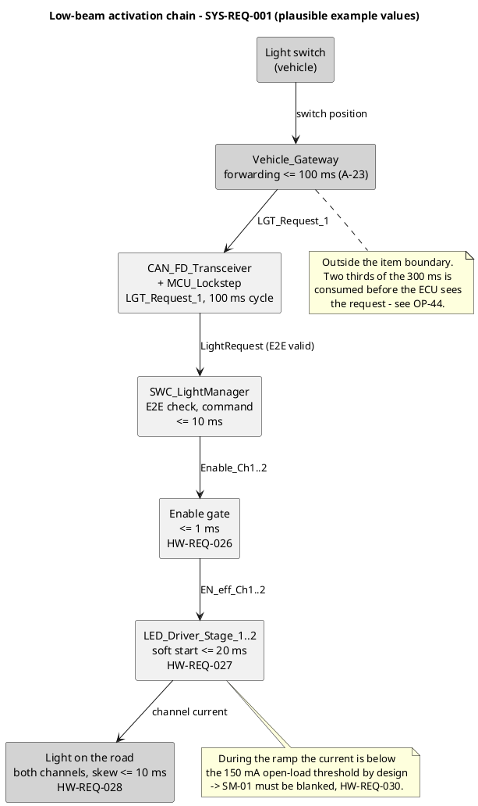

# Analysis — low-beam activation path (SYS-REQ-001)

**Status:** **Applied** to the records. Refines `SYS-REQ-001` into hardware; the records created from
it are listed in section 7.
**Owner:** hardware-engineer · **Process:** ASPICE HWE.1 · ISO 26262-5

> Teaching/reference project. **All numeric values are plausible example values, not validated
> data.**

---

## 1 Why this analysis exists

`SYS-REQ-001` — *"When the driver requests low beam via the light switch signal, the lighting ECU
shall energise both low-beam channels within 300 ms"* — had **no downstream refinement at all**.
`HW-REQ-001` … `HW-REQ-025` derive from `SYS-REQ-012` … `SYS-REQ-020`, from `CR-` records, from
`FSR-` or from `TSR-` records. The low-beam **activation** path was never taken into hardware, while
the low-beam **failure-detection** path was taken into hardware in full detail.

That asymmetry is not harmless. The switch-on transient is where the two paths meet, and nothing in
the record set said what happens when they do.

### 1.1 Two different 300 ms

| Figure | Meaning | Owner |
|---|---|---|
| 300 ms in `SYS-REQ-001` | **Activation latency** — from the driver's request to light on the road | `CR-001`, availability |
| 300 ms FTTI in `SG-01` | **Fault tolerant time interval** — from fault occurrence to the hazard | `SG-01`, safety |

They are numerically equal and otherwise unrelated. Nothing in this analysis, and nothing in
`HW-REQ-026` … `HW-REQ-030`, treats one as evidence for the other. The coincidence is stated here
once so that a later reader does not "simplify" the two into a single budget.

## 2 📋 OVERVIEW — the activation chain



**How to read it:** the chain runs left to right and only the last three blocks are hardware of this
item; the grey blocks at both ends are vehicle scope. The lower note marks the single place where the
activation path collides with the `SG-01` detection path.

## 3 🔍 DEEP DIVE — the activation budget

| Step | Element | Contribution | Source |
|---|---|---|---|
| Gateway forwards the switch position | `Vehicle_Gateway` | 100 ms | `A-23` (new) |
| Signal age at reception: cycle 100 ms + queuing/arbitration 2.5 ms + frame 0.17 ms | CAN FD segment | ≈ 103 ms | interface table, `A-14` |
| E2E check, request evaluation, command output | `SWC_LightManager` | 10 ms | plausible example value |
| Enable gate propagation | `LED_Driver_Stage_1..2` | ≤ 1 ms | **`HW-REQ-026`** |
| Soft start to 95 % of set point | `LED_Driver_Stage_1..2` | ≤ 20 ms | **`HW-REQ-027`** |
| Component and supply spread | `LED_Driver_Stage_1..2` | ≤ 4 ms | plausible example value |
| **Hardware share** | | **≤ 25 ms** | |
| **Total** | | **≈ 238 ms** | |
| **Budget** | | **300 ms** | `SYS-REQ-001` |
| **Margin** | | **62 ms (21 %)** | |

**The budget closes, and the shape of it is the finding.** Of the 300 ms, **203 ms — roughly two
thirds — is spent before the ECU sees the request**: 100 ms of gateway forwarding plus a 100 ms
signal cycle, both outside the item boundary. Hardware and software together hold 35 ms, and the
hardware share is 25 ms of that.

This is not hardware's to fix and is **not absorbed here**. Two consequences belong to
`systems-engineer` (`OP-44`):

1. The margin is thin against changes nobody would consider safety-relevant. Lengthening the
   `LGT_Request_1` cycle from 100 ms to 200 ms, or a gateway respecifying its forwarding from 100 ms
   to 200 ms, each consumes the entire remaining margin on its own.
2. If the 300 ms is ever measured at vehicle level and missed, the finding will surface as an ECU
   defect, because the ECU is where the lamp is. The budget above is the record that says otherwise.

**Channel-to-channel skew (`HW-REQ-028`) is not a term in this table.** Both channels are commanded
by the same register write and each is bounded by `HW-REQ-026` and `HW-REQ-027`, so the asymmetry is
contained inside the 25 ms and does not add to it. The 10 ms is a bound on an observable difference,
not a serialisation allowance.

## 4 🔍 DEEP DIVE — the collision with `SM-01` (Golden Thread)

### 4.1 The mechanism

`HW-REQ-027` requires a monotonic current ramp of at least 5 ms and reaching 95 % of set point within
20 ms. `HW-REQ-001` / `HW-REQ-002` classify a channel current below 150 mA as an open load, with a
guaranteed trip below 130 mA. At the nominal set point of 1.20 A (`A-08`) the ramp crosses the
0 … 150 mA region on **every single switch-on**.

```
I_ch
1.20 A |                    ,---------------------------
       |                ,--'
       |            ,--'
150 mA |........,--'...............................  <- SM-01 threshold (HW-REQ-002)
       |     ,-'
  0 mA +--'--+-------+-------+-------+-------+------> t
       0     ~3 ms   5 ms   20 ms   30 ms
       |<-- below threshold by design -->|
       |<------ blanking, HW-REQ-030 --------->|
```

Unblanked, `SM-01` would classify an open load at **every switch-on of a healthy lamp** — a false
trip into the `SG-01` fault reaction, i.e. limp-home and a DTC, triggered by the driver switching
the light on. A safety mechanism that fires on the normal operating case is worse than no mechanism:
it trains everyone to ignore it.

That the qualification window of `SM-01` is 50 ms and would in most cases outlast the 20 ms ramp is
**not** an argument for leaving it unblanked. It makes the false trip intermittent instead of
certain — dependent on ramp duration at low supply and low temperature, on the phase of the 5 ms
monitoring task, and on how many below-threshold samples the debounce has already collected. An
intermittent false trip is the harder defect, not the milder one.

### 4.2 The blanking interval

| Term | Value | Source |
|---|---|---|
| Enable propagation | 1 ms | `HW-REQ-026` |
| Worst-case ramp to 95 % | 20 ms | `HW-REQ-027` |
| Spread over supply and temperature | 9 ms | plausible example value |
| **Blanking** | **30 ms** | **`HW-REQ-030`** |

### 4.3 The consequence, stated plainly

An open load **already present when the channel is switched on** — a lamp unplugged while the vehicle
stood, the commonest real case — is not detected during the blanking interval. Detection therefore
becomes:

```
t_blank    blanking after enable (HW-REQ-030)                =  30 ms
t_detect   SM-01 detection path (HW-REQ-009)                 =  80 ms
--------------------------------------------------------------------
Start-up detection                                           = 110 ms
Cap of SYS-REQ-018                                           = 100 ms   -> EXCEEDED by 10 ms
--------------------------------------------------------------------
t_react    fault reaction (TSR-004)                          = 150 ms
Total against the FTTI                                       = 260 ms
FTTI (SG-01)                                                 = 300 ms
Margin                                                       =  40 ms  (13 %)
```

Two separate statements, and they must not be merged:

- **Against the `SG-01` FTTI the case closes** at 260 ms with 40 ms of margin. The safety goal is not
  violated.
- **Against `SYS-REQ-018` it does not.** `SYS-REQ-018` caps open-load reporting at 100 ms
  unconditionally, and 110 ms breaches that cap during the switch-on transient. The requirement makes
  no exception for a start-up window, and it is not hardware's requirement to reinterpret.

`SYS-REQ-018` needs either a widened cap or an explicit exemption for the start-up window. That
decision belongs to `systems-engineer` and is raised as **`OP-42`**. Until it is taken, `HW-REQ-030`
stands as written, with the breach visible rather than smoothed over.

**The alternative was deliberately not taken.** Re-deriving the blanking against the 170 mA
guaranteed-no-trip edge of `HW-REQ-002` — blanking only until the ramp passes 170 mA, roughly 3 ms —
would shorten the interval to well inside the cap and make the conflict disappear. It is sound
engineering. It was not done, because it changes the basis of an approved detection concept on
hardware's own authority in order to satisfy a cap that another discipline owns, and the trade
between detection latency and false-trip robustness at the ramp edge is precisely what the review of
`SYS-REQ-018` is for. The option is recorded here so that `systems-engineer` can take it if it wants
it.

### 4.4 What this does **not** change

- **No new `SM-xx`.** `HW-REQ-030` constrains when `SM-01` is allowed to classify. It detects
  nothing and may be credited with no diagnostic coverage.
- **`SM-01.md` is not modified.** `detection_time` stays at ≤ 80 ms, the coverage claim stays at a
  conditional 90 %. The start-up detection case is handed to `safety-analyst` as **`OP-43`**: the
  FMEDA has to decide whether a blanked window at switch-on affects the claim, and `SM-01` already
  carries `OP-15` against the same field. One agent per open field.
- No published value in `HW-REQ-001` … `HW-REQ-025` or `SM-01` … `SM-06` is changed by this analysis.

## 5 📋 OVERVIEW — switch-on as a supply event

Two low-beam channels reaching 1.20 A each within 20 ms is the largest load step the ECU commands.
Steady state at the input is ≈ 4.3 A at 24 V (2 × 1.20 A × 12 LEDs × 3.2 V, converter efficiency
0.9); `HW-REQ-029` caps the instantaneous draw at 8 A, leaving a factor of about 1.9 for charging the
driver output capacitance during the ramp.

The reason this is a requirement and not a design note is `SM-06`. An unbounded switch-on dip at the
protected rail could cross the 9 V undervoltage threshold of `HW-REQ-016` at a low supply voltage —
the ECU would trigger its own safe state at the instant the driver asks for light. `HW-REQ-029`
bounds the dip at 1 V. The 5 ms soft-start floor of `HW-REQ-027` is what makes both bounds
achievable; without it the inrush is set by the output capacitance alone.

## 6 Assumption

`A-23` — the vehicle gateway forwards the light switch position to the lighting ECU within 100 ms.
Plausible example value, open, needs OEM confirmation. It is the largest single term of the
activation budget and it lies outside the item boundary, which is exactly why it is an assumption and
not a requirement. It complements `A-06` (switch position arrives as a bus signal, not as wiring) and
mirrors `A-17` on the outbound direction.

## 7 Records created (applied)

| ID | Subject | Depth |
|---|---|---|
| `HW-REQ-026` | Enable-gate propagation ≤ 1 ms in the energising direction | 📋 |
| `HW-REQ-027` | Soft start: ≥ 95 % of set point within 20 ms, ramp ≥ 5 ms | 📋 |
| `HW-REQ-028` | Channel-to-channel skew ≤ 10 ms | 📋 |
| `HW-REQ-029` | Inrush ≤ 8 A, dip ≤ 1 V, no `SM-06` trip | 📋 |
| `HW-REQ-030` | `SM-01` blanking 30 ms after enable | 🔍 |

Amended: `hw_verification_plan.md` (`HV-13`, `HV-14`, DV/PV scope), `hw_architecture.md` (section 1
owning-HW-REQ column, section 4 note), `09_process/assumptions.md` (`A-23`).

## 8 Open points

| ID | Point | Owner |
|---|---|---|
| `OP-42` | `HW-REQ-030` blanking makes start-up open-load detection 110 ms, exceeding the 100 ms cap of `SYS-REQ-018`. Widen the cap, or exempt the switch-on window explicitly, or accept the shorter 170 mA-edge blanking of section 4.3 | systems-engineer |
| `OP-43` | Does the 30 ms blanking window affect the `SM-01` coverage claim in the FMEDA? Related to `OP-15`, same field | safety-analyst |
| `OP-44` | ≈ 203 ms of the 300 ms activation budget of `SYS-REQ-001` is consumed outside the item boundary (gateway `A-23` + signal cycle). Confirm `A-23`, and confirm that the 300 ms is measured at the light and not at the ECU input | systems-engineer |
| `OP-45` | Test cases for `HW-REQ-026` … `HW-REQ-030` (`HV-13`, `HV-14`) — extension of `OP-19` | verification-engineer |
| `OP-46` | Power-on readiness is deliberately out of scope: `SYS-REQ-001` does not state what happens when the request arrives while the ECU is still booting. A start-up requirement is missing at system level | systems-engineer |

`OP-42` … `OP-46` are allocated against the highest open point in
`09_process/project_status.md` (`OP-39`) and still have to be **entered** in that register — see the
note in section 9.

## 9 Deliberately not touched

`SYS-REQ-001` and `CR-001` themselves; `SM-01.md`; every published value in `HW-REQ-001` …
`HW-REQ-025` and `SM-01` … `SM-06`, in particular the 80 ms / 230 ms of `SM-01`; every diagnostic
coverage number; the timing chains in `04_architecture/ee_architecture.md`; all `TC-xxx` records; and
the open-point register in `09_process/project_status.md`, which was outside the approved scope of
this task and needs `OP-42` … `OP-46` added by whoever owns the next status update.

---

**Work products:** `05_hardware/analysis_low_beam_activation.md`, `05_hardware/HW-REQ-026.md` …
`HW-REQ-030.md`
**Open points:** section 8 (`OP-42` … `OP-46`)
**Process reference:** ASPICE **HWE.1** (hardware requirements analysis), with the verification
entries under **HWE.3** / **HWE.4** · ISO 26262 **Part 5** (specification of hardware safety
requirements, hardware architectural design) · **Part 4** (allocation of technical safety
requirements, and the timing budget against the FTTI of `SG-01`) · **Part 9** (the coverage question
raised by `OP-43` belongs to the FMEDA). Parts and topics named, no clause numbers cited.
