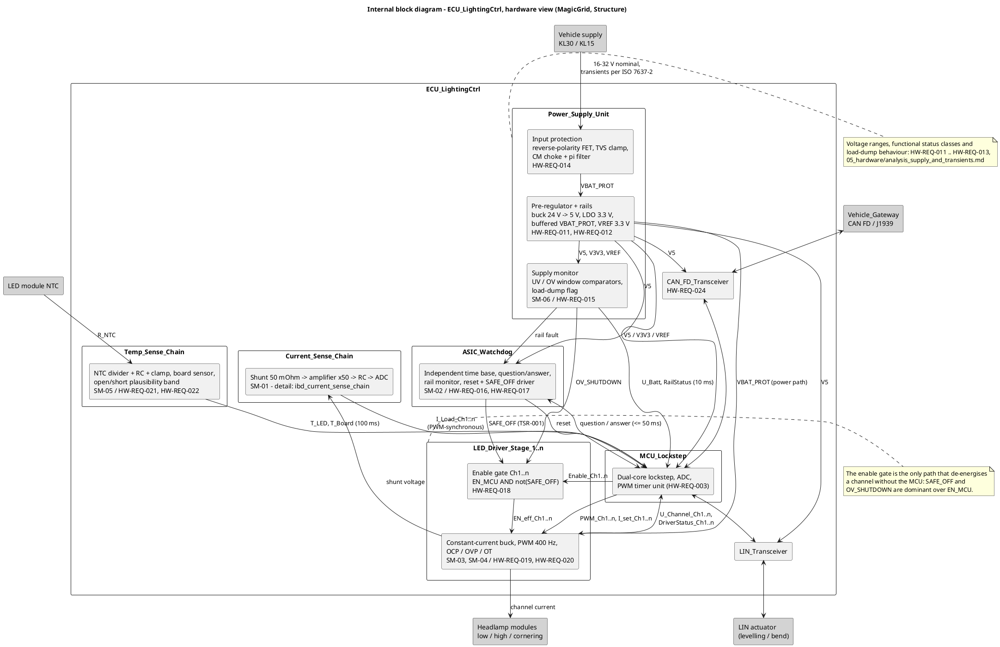
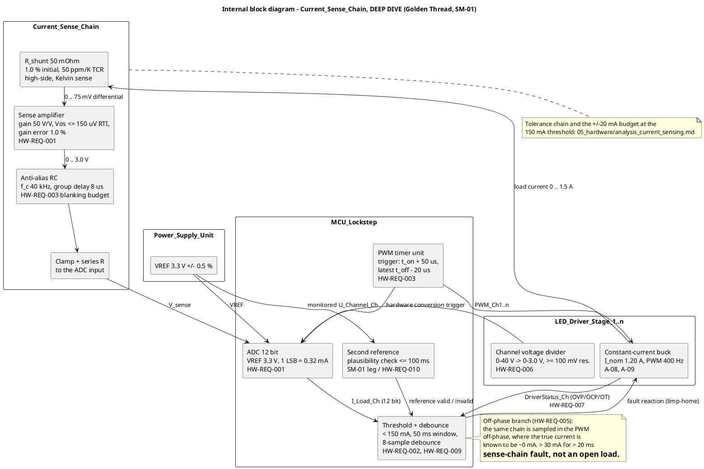

# Hardware architecture — Lighting ECU

**Phase 6 · ASPICE HWE.1 / HWE.2 · ISO 26262-5**
**Status:** draft · **Owner:** hardware-engineer

> Teaching/reference project. **All numeric values are plausible example values, not validated
> data.** Element names are binding and are taken from
> [`../04_architecture/ee_architecture.md`](../04_architecture/ee_architecture.md) — this document
> refines them internally, it does not rename or add top-level blocks.

---

## 1 📋 OVERVIEW — blocks and what they own

| Block | Hardware content (refinement) | Safety mechanisms | Owning HW-REQ |
|---|---|---|---|
| `Power_Supply_Unit` | Reverse-polarity FET, TVS clamp, CM choke + pi filter; buck 24 V → 5 V, LDO 3.3 V, buffered `VBAT_PROT`, 3.3 V ADC reference; UV/OV window comparators | `SM-06` | HW-REQ-011 … 016, 029 |
| `MCU_Lockstep` | Dual-core lockstep, ADC with PWM-timer-triggered conversion, second reference for the plausibility check | contributes to `SM-01` | HW-REQ-003, 010 |
| `ASIC_Watchdog` | Independent time base, question/answer, rail monitor, reset and `SAFE_OFF` driver | `SM-02`, rail leg of `SM-06` | HW-REQ-017, 018 |
| `LED_Driver_Stage_1..n` | Per-channel enable gate; constant-current buck with soft start, PWM 400 Hz, OCP/OVP/OT with status readback; channel voltage divider | `SM-03`, `SM-04`, actuation leg of `SM-02` | HW-REQ-006, 007, 019, 020, 021, 026 … 029 |
| `Current_Sense_Chain` | Shunt 50 mΩ → amplifier ×50 → anti-alias RC → clamp → ADC input | `SM-01` | HW-REQ-001 … 005, 009, 030 |
| `Temp_Sense_Chain` | NTC divider + RC + clamp per LED module, board sensor, plausibility band | `SM-05` | HW-REQ-022, 023, 024 |
| `CAN_FD_Transceiver` | Bus-fault protection, dominant timeout | — | HW-REQ-025 |
| `LIN_Transceiver` | Actuator link | — | — |

Three parts appear here that the E/E architecture does not list as blocks, deliberately kept
**inside** the existing elements so that no element name is invented: the **input protection** and
the **supply monitor** inside `Power_Supply_Unit`, and the **enable gate** inside
`LED_Driver_Stage_1..n`. If the E/E architecture wants them visible, that is a hand-off to
`systems-engineer` (section 5).

## 2 📋 OVERVIEW — internal block diagram

Source: [`../03_model/plantuml/ibd_ecu.puml`](../03_model/plantuml/ibd_ecu.puml).

**How to read it:** power flows top-down — protected input, rails, then the driver stages — while
every diagnostic signal flows back into the ADC/PWM unit of `MCU_Lockstep`; the two dominant
signals `SAFE_OFF` (from `ASIC_Watchdog`) and `OV_SHUTDOWN` (from the supply monitor) bypass the
microcontroller entirely and meet the microcontroller's enable signal only at the per-channel
enable gate. That gate is the single place where a channel can be de-energised without software.

## 3 🔍 DEEP DIVE — `Current_Sense_Chain` (Golden Thread)

Source:
[`../03_model/plantuml/ibd_current_sense_chain.puml`](../03_model/plantuml/ibd_current_sense_chain.puml).

**How to read it:** the measurement path is a straight line — shunt, amplifier, anti-alias filter,
clamp, ADC — and every element on it carries the tolerance term it contributes to the ±20 mA budget
of `HW-REQ-001`; the two elements that are *not* on that line are the ones that make the chain
diagnosable, namely the PWM timer that guarantees the sampling phase (`HW-REQ-003`) and the second
reference that catches a drifting ADC reference (`HW-REQ-010`). The off-phase branch in the note is
the free self-test: the true current is known to be zero there, so the same chain tests itself once
per PWM period.

## 4 🔍 DEEP DIVE — safety mechanisms, detection and reaction against the FTTI

Budgets are stated as **detection ≤ X ms, reaction ≤ Y ms, FTTI = Z ms**. All values are plausible
example values.

| SM | Detected fault | Detection | Reaction | FTTI | Total / margin | Coverage claim |
|---|---|---|---|---|---|---|
| `SM-01` open load, low beam 🔍 | Complete loss of channel current; with the conditional measures also partial string loss, short to battery, driver-internal and sense-chain faults | ≤ 80 ms | ≤ 150 ms (`TSR-004`) | 300 ms (`SG-01`) | 230 ms / **70 ms (23 %)** | 90 % **conditional**, to be confirmed by FMEDA (`OP-15`) |
| `SM-02` watchdog + disable path | Loss of control of the microcontroller: clock stall, hung task, corrupted program flow | ≤ 50 ms | ≤ 10 ms | 300 ms / 500 ms | 60 ms / **240 ms (80 %)** | target 90 %, not confirmed |
| `SM-03` short-to-battery | External short of the channel output to battery, output stuck conducting | ≤ 45 ms | ≤ 150 ms | 300 ms | 195 ms / **105 ms (35 %)** | contributes to `SM-01`, not independent |
| `SM-04` overcurrent | Short to ground, string short, output-stage overload | ≤ 15 ms (limit engages in ≤ 10 µs) | ≤ 150 ms | 300 ms | 165 ms / **135 ms (45 %)** | target 60 %, not confirmed |
| `SM-05` overtemperature + derating | Thermal overload of an LED module; NTC open or short via the plausibility band | ≤ 305 ms | ≤ 1 s (set-point ramp) | ≥ 10 s thermal (`A-21`) | ≈ 1.3 s / **≥ 87 %** | target 70 %, not confirmed |
| `SM-06` voltage monitoring | Under/overvoltage at the supply, load dump beyond the withstand level, rail or reference drift | ≤ 10 ms | ≤ 10 ms (1 ms above 60 V) | 300 ms | 20 ms / **280 ms (93 %)** | target 90 %, not confirmed |

**Every budget closes.** Two remarks that matter more than the arithmetic:

- `SM-05` does **not** run against the 300 ms FTTI of `SG-01`. Its hazard is thermal degradation with
  a module time constant of about 60 s (`A-21`), so a 1.3 s response is generous. Forcing it into the
  300 ms budget would be a category error and would produce a needlessly fast, noisy derating loop.
- `SM-04` is a **protection** function first and a diagnosis second. The analogue current limit acts
  in microseconds, two orders of magnitude faster than the FTTI; what is actually in the FTTI budget
  is the *reporting* of the event through `DriverStatus` (`HW-REQ-007`). A latched channel with no
  status readback would be a silent channel loss.
- All coverage figures except `SM-01` are stated as **targets**. `safety-analyst` owns the numbers
  (`OP-15` for `SM-01`; the rest enter the FMEDA in phase 5). Hardware does not assert DC values
  independently.

**`SM-01` has a second detection case, added by the refinement of `SYS-REQ-001`.** The row above is
the steady-state case: a fault appearing while the channel is already energised, detected in ≤ 80 ms.
An open load that is **already present when the channel is switched on** is subject to the 30 ms
blanking of `HW-REQ-030`, which exists because the soft-start ramp of `HW-REQ-027` passes below the
150 mA threshold by design and would otherwise false-trip on every switch-on.

| Case | Detection | Reaction | Total | FTTI | Margin | Against `SYS-REQ-018` (100 ms cap) |
|---|---|---|---|---|---|---|
| Fault during operation | ≤ 80 ms | ≤ 150 ms | 230 ms | 300 ms | 70 ms (23 %) | within the cap |
| Fault present at switch-on | ≤ 110 ms (30 ms blanking + 80 ms) | ≤ 150 ms | 260 ms | 300 ms | 40 ms (13 %) | **exceeds the cap — `OP-42`** |

The `SG-01` budget closes in both cases. The `SYS-REQ-018` cap does not, and it is left visibly
breached rather than designed around: the cap belongs to `systems-engineer`. No value of `SM-01` was
changed for this — the start-up case is handed to `safety-analyst` as `OP-43`. Derivation:
[`analysis_low_beam_activation.md`](analysis_low_beam_activation.md) section 4.

## 5 Hand-off to `systems-engineer`

1. **`SM-02` conflicts with `SG-01`.** `TSR-001` requires `SAFE_OFF` to de-energise the LED driver
   stages. Applied to the low beam, that *creates* hazard `H-01` instead of preventing it — the safe
   state of `SG-01` is limp-home with a visible remaining channel, not darkness. Hardware's position:
   the disable path must be differentiated by channel class (work lamps and high beam off, low beam
   into a hardware default state). This is a technical-safety-concept decision. See `SM-02.md`.
2. **Interface table additions**: `U_Batt` and `RailStatus` (supply monitor → MCU, 10 ms, ASIL B),
   `SAFE_OFF` and `OV_SHUTDOWN` as separate signals into the enable gate.
3. **Block table**: optionally list input protection, supply monitor and enable gate as parts of
   their parent blocks.
4. **`CR-017` change** and the missing `SYS-REQ` for supply ranges outside 9–32 V — see
   [`analysis_supply_and_transients.md`](analysis_supply_and_transients.md) section 5.
5. **Missing `SYS-REQ` for thermal derating** and the photometric question at the 400 mA floor — see
   [`analysis_thermal_derating.md`](analysis_thermal_derating.md) section 7.

## 6 Open points

| # | Point | Owner |
|---|---|---|
| 1 | `OP-15` — confirm the `SM-01` coverage claim against the FMEDA | safety-analyst |
| 2 | Coverage targets of `SM-02` … `SM-06` to be confirmed or replaced by the FMEDA | safety-analyst |
| 3 | `SAFE_OFF` versus the `SG-01` safe state (section 5.1) | systems-engineer |
| 4 | Photometric compliance at the 400 mA floor | systems-engineer |
| 5 | Component selection has to confirm `A-10` (driver status) and the 65 V output-stage rating | hardware-engineer |
| 6 | Test cases for `HW-REQ-011` … `HW-REQ-025` and `SM-02` … `SM-06` (`OP-19` extension) | verification-engineer |
| 7 | `OP-42` — start-up open-load detection (110 ms) exceeds the 100 ms cap of `SYS-REQ-018`; widen the cap or exempt the switch-on window | systems-engineer |
| 8 | `OP-43` — effect of the `HW-REQ-030` blanking window on the `SM-01` coverage claim in the FMEDA | safety-analyst |
| 9 | `OP-44` — ≈ 203 ms of the 300 ms activation budget of `SYS-REQ-001` lies outside the item boundary (`A-23` plus signal cycle) | systems-engineer |

---

**Work products:** `05_hardware/hw_architecture.md`, `03_model/plantuml/ibd_ecu.puml`,
`03_model/plantuml/ibd_current_sense_chain.puml`, `SM-02` … `SM-06`, `HW-REQ-011` … `HW-REQ-025`;
extended by the `SYS-REQ-001` refinement (`HW-REQ-026` … `HW-REQ-030`,
`analysis_low_beam_activation.md`)
**Open points:** section 6
**Process reference:** ASPICE **HWE.1** (hardware requirements analysis), **HWE.2** (hardware
design) · ISO 26262 **Part 5** (hardware development: hardware safety requirements, hardware
architectural design, hardware architectural metrics) · **Part 9** (safety analyses feeding the
coverage claims).
