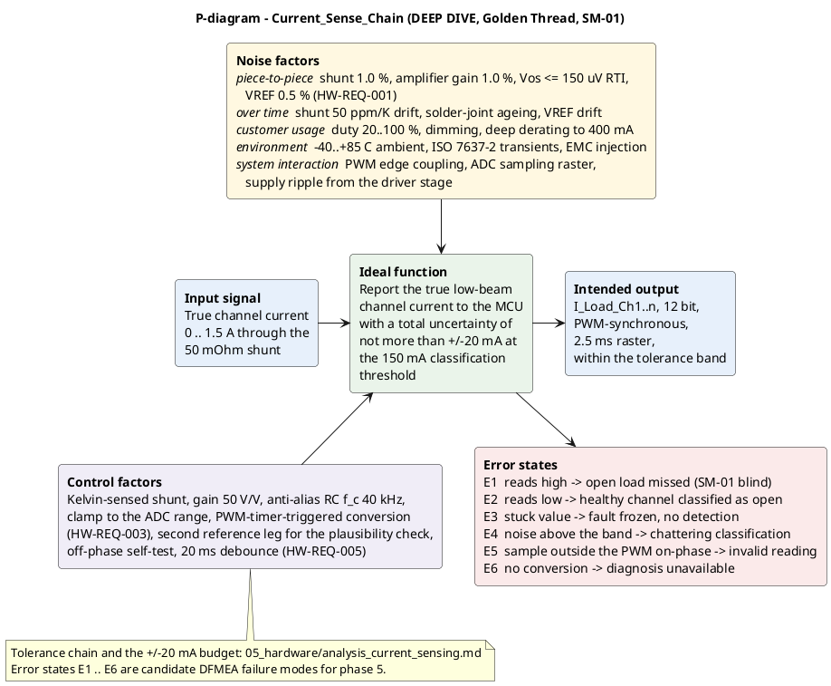
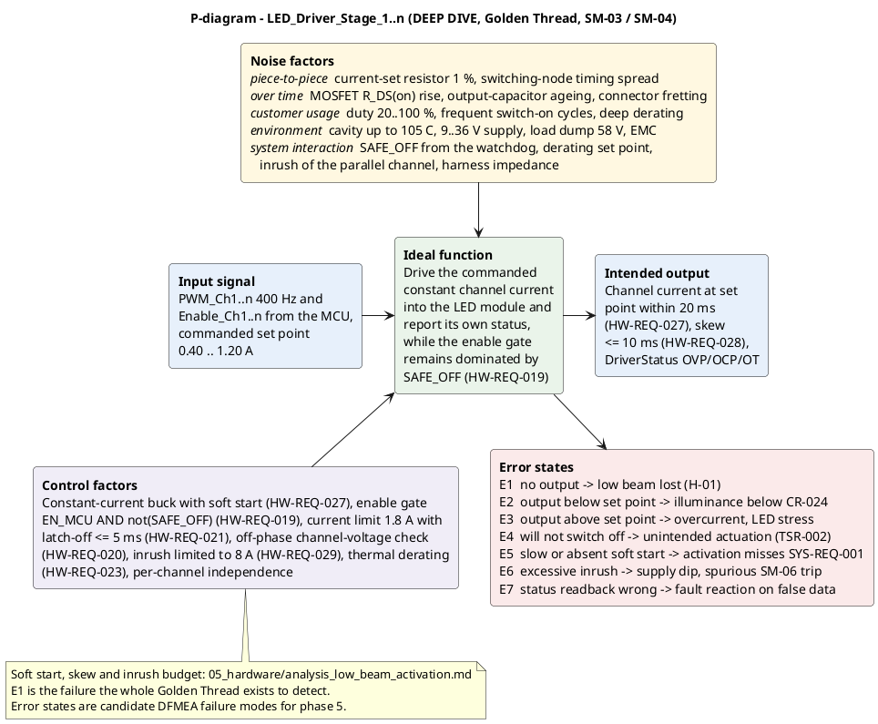
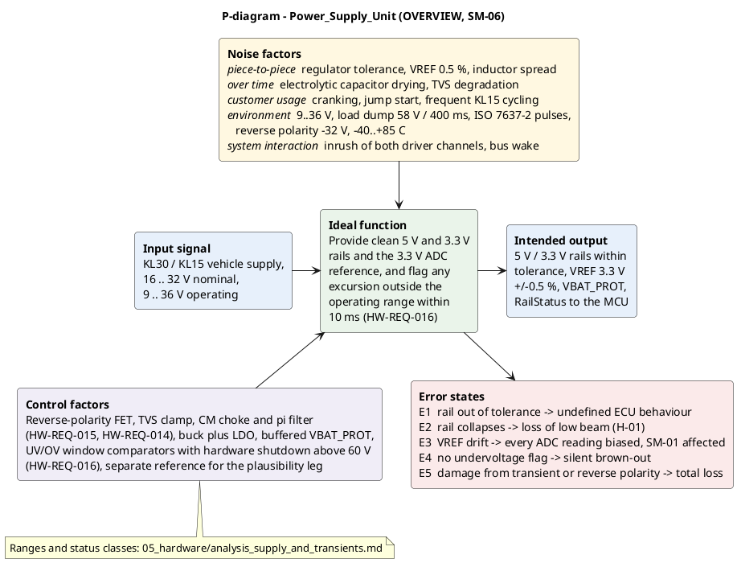
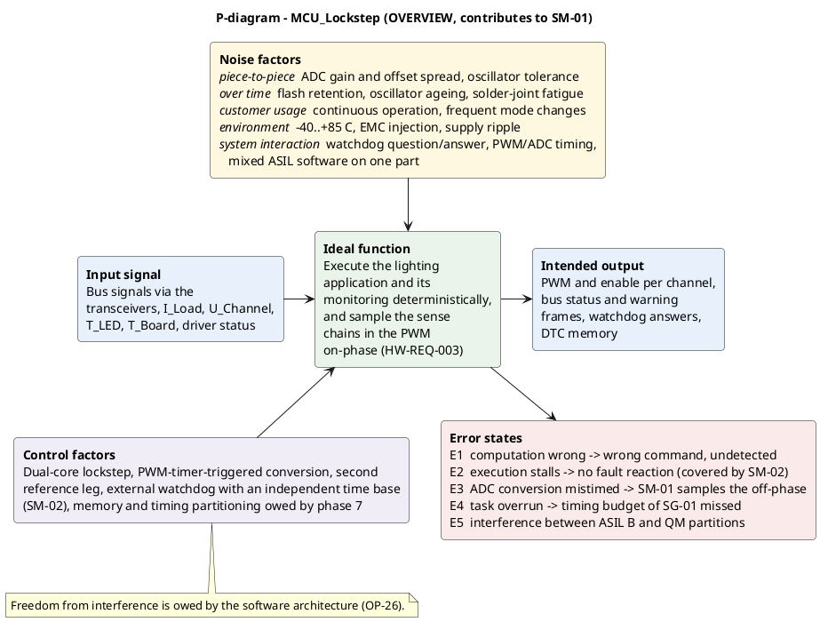
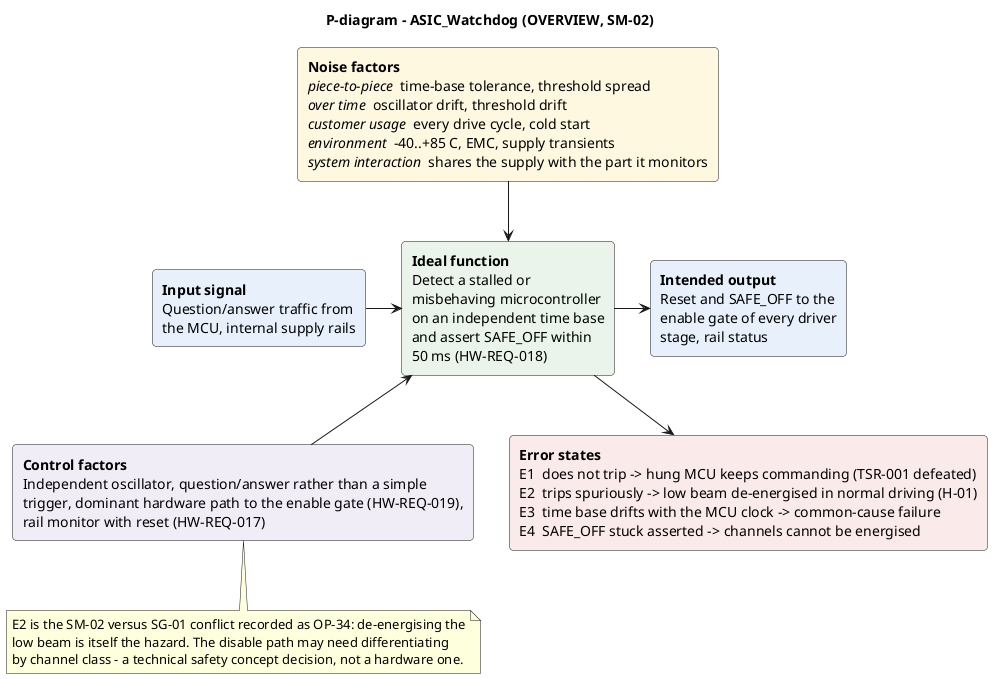
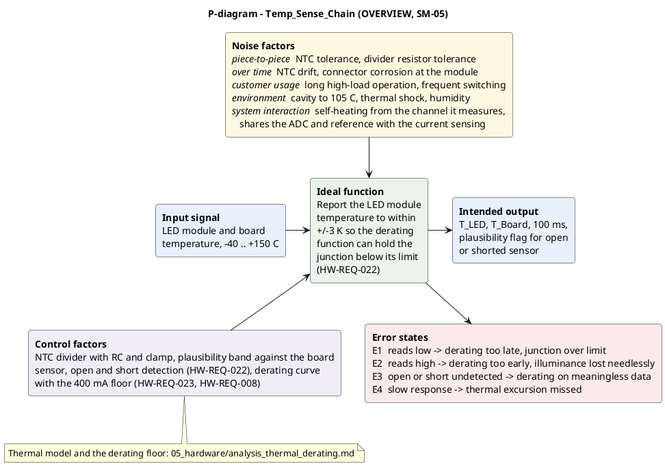
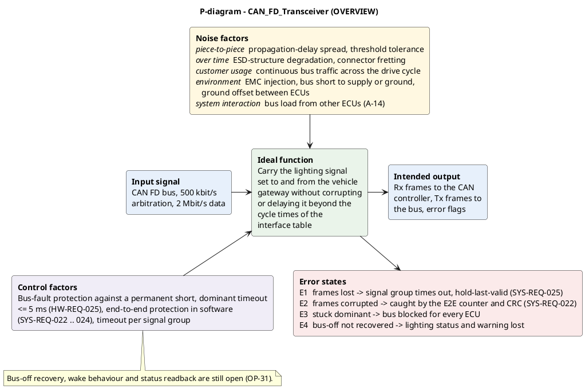
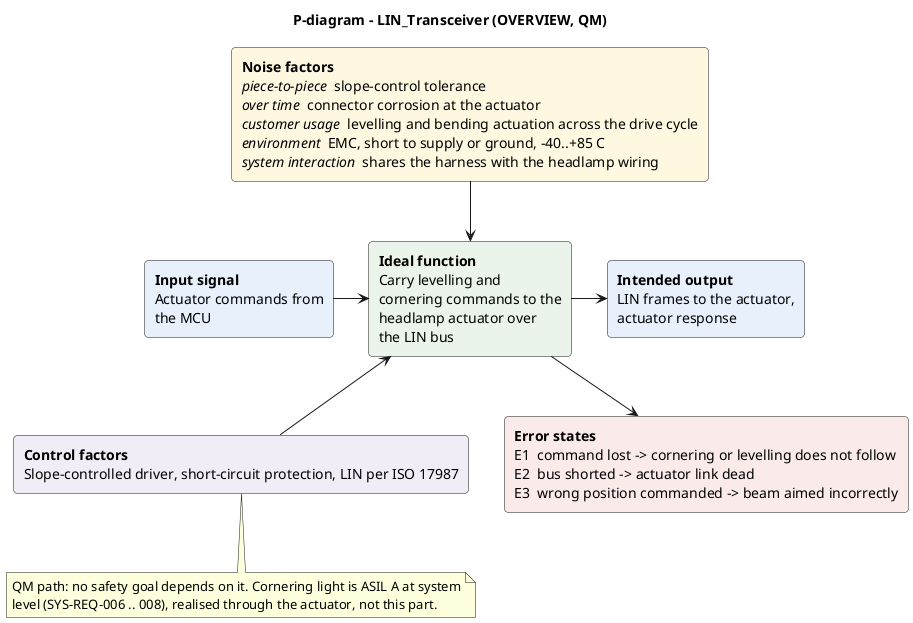

# Hardware components and their P-diagrams

**ASPICE HWE.2 (hardware design) · ISO 26262-5 · Owner:** hardware-engineer
**Status:** draft · **Purpose:** structure and function analysis feeding the phase 5 DFMEA

> Teaching/reference project. All numeric values are plausible example values, not validated data.

---

## 1 Why this document exists

Phase 5 opens with a System-FMEA and a DFMEA per the AIAG-VDA seven-step method, and step 1 of
that method is a **structure analysis**: what the components are and where each one's boundary
runs. The project had never written that down. `hw_architecture.md` names the blocks and lists
what is inside them, but nothing stated what a block is *responsible for*, what its ideal
function is, or how it fails.

A **P-diagram** supplies the missing piece. It states the ideal function, the noise factors that
push a component away from it, the control factors that hold it there, and the **error states** —
which are the failure modes the DFMEA then rates. Written first, the DFMEA rows are *derived*
rather than invented, and the same noise factors feed the FMEDA's failure-mode distribution.

**A P-diagram is a robustness tool, not a safety analysis.** It produces candidate failure modes.
Phase 5 rates them, and may reject some.

## 2 📋 OVERVIEW — the eight components

The element names are the identity; they are the same names used in every `allocated_to` field,
in `ee_architecture.md` and in `ibd_ecu.puml`. No new ID prefix is introduced.

| Component | Boundary — what is inside | Owning `HW-REQ` | Safety mechanisms | ASIL |
|---|---|---|---|---|
| `Power_Supply_Unit` | KL30 input protection through to the 5 V / 3.3 V rails and `VREF`; **not** the vehicle supply itself | `HW-REQ-011` … `016` | `SM-06` | B |
| `MCU_Lockstep` | The microcontroller including its ADC and PWM timer unit; **not** the software running on it | `HW-REQ-003` | contributes to `SM-01` | B |
| `ASIC_Watchdog` | Independent time base, question/answer logic, rail monitor, reset and `SAFE_OFF` driver | `HW-REQ-017`, `018` | `SM-02`, rail leg of `SM-06` | B |
| `LED_Driver_Stage_1..n` | Per-channel enable gate and constant-current stage up to the channel output; **not** the LED module | `HW-REQ-019` … `021`, `026` … `030` | `SM-03`, `SM-04` | B |
| `Current_Sense_Chain` | Shunt, amplifier, anti-alias filter, clamp, up to the ADC input pin; **not** the ADC itself | `HW-REQ-001` … `005`, `009`, `030` | `SM-01` | B |
| `Temp_Sense_Chain` | LED module NTC path and board sensor up to the ADC input; **not** the derating function | `HW-REQ-022`, `023`, `024` | `SM-05` | B |
| `CAN_FD_Transceiver` | Bus interface between the CAN controller and the vehicle bus | `HW-REQ-025` | — | B |
| `LIN_Transceiver` | Actuator link to the headlamp levelling and bending actuator | — | — | QM |

**Two boundaries are worth stating explicitly**, because both are where a DFMEA usually goes
wrong. `Current_Sense_Chain` ends at the ADC *input pin* — the conversion belongs to
`MCU_Lockstep`, which is why a wrong `VREF` shows up as a noise factor in one component and an
error state in another. And `LED_Driver_Stage` ends at the channel output: the LED module is
outside the item boundary, covered by assumption `A-13`.

## 3 🔍 DEEP DIVE — the Golden Thread components

### 3.1 `Current_Sense_Chain`

**How to read it:** the ideal function is a *measurement* accuracy statement, so the noise
factors are the terms of the tolerance chain in `analysis_current_sensing.md` and the control
factors are what buys each term back. Error states `E1` and `E2` are the two directions of the
same failure and are not symmetric in consequence: `E1` makes `SM-01` blind to a real open load
and threatens `SG-01`; `E2` de-energises a healthy channel and *is* `H-01`. A DFMEA that rates
them the same has misread the diagram.

### 3.2 `LED_Driver_Stage_1..n`

**How to read it:** `E1` is the failure the entire Golden Thread exists to detect, which is why
this component carries both `SM-03` and `SM-04` and is the target of `SM-01`'s detection. `E4`
is its mirror image — a stage that will not switch off — and is what `TSR-002` and the dominant
`SAFE_OFF` path address. The soft-start and inrush entries come from
`analysis_low_beam_activation.md`.

## 4 📋 OVERVIEW — the remaining six

### 4.1 `Power_Supply_Unit`

**How to read it:** `E3` is the interesting one — a drifting `VREF` biases every ADC reading in
the ECU at once, so it is a common-cause candidate for the DFA in phase 5 rather than a local
fault.

### 4.2 `MCU_Lockstep`

**How to read it:** the lockstep pair covers computation, not timing, which is why `E2` is
delegated to `SM-02` and why `E5` cannot be closed by hardware at all — freedom from
interference is owed by the software architecture (`OP-26`).

### 4.3 `ASIC_Watchdog`

**How to read it:** `E2` is not a hardware defect to be designed out. A watchdog that trips
spuriously de-energises the low beam, which is `H-01` — the hazard `SG-01` exists to prevent.
That conflict is recorded as `OP-34` and belongs to the technical safety concept.

### 4.4 `Temp_Sense_Chain`

**How to read it:** `E1` and `E2` trade a thermal risk against a photometric one, and the
derating floor of `HW-REQ-008` is where that trade was settled.

### 4.5 `CAN_FD_Transceiver`

**How to read it:** `E1` and `E2` are already answered at system level by the end-to-end
protection and the hold-last-valid rule, which is why they are annotated with `SYS-REQ-` rather
than a hardware measure. `E4` has no answer yet (`OP-31`).

### 4.6 `LIN_Transceiver`

**How to read it:** the only QM component in the set. Cornering light is ASIL A at system level,
but that requirement is met through the actuator rather than through this part.

## 5 Error state → candidate DFMEA failure mode

**Phase 5 takes its DFMEA rows from this table rather than starting fresh.** Every entry is a
*candidate*: the DFMEA rates it with B/A/E and an action priority, and may reject it.

| Component | Error states | Of those, in the Golden Thread |
|---|---|---|
| `Current_Sense_Chain` | `E1` … `E6` | `E1`, `E2`, `E5` |
| `LED_Driver_Stage_1..n` | `E1` … `E7` | `E1`, `E4`, `E5` |
| `Power_Supply_Unit` | `E1` … `E5` | `E2`, `E3` |
| `MCU_Lockstep` | `E1` … `E5` | `E3` |
| `ASIC_Watchdog` | `E1` … `E4` | `E1`, `E2` |
| `Temp_Sense_Chain` | `E1` … `E4` | — |
| `CAN_FD_Transceiver` | `E1` … `E4` | — |
| `LIN_Transceiver` | `E1` … `E3` | — |

Thirty-eight candidates, ten of them on the Golden Thread. The phase 5 spec asks for at least
eight System-FMEA rows with three in the Golden Thread, and a five-row DFMEA extract — so the
selection is a judgement the analyst still has to make and defend, not a matter of transcribing
this table.

**Three candidates are already known to be more than local faults**, and the DFA in phase 5 owes
an answer for each: `Power_Supply_Unit` `E3` (a common `VREF` biasing every reading),
`ASIC_Watchdog` `E3` (a time base that drifts with the part it monitors), and `MCU_Lockstep`
`E5` (mixed-ASIL software sharing one part).

## 6 Open points

| ID | Point | Owner |
|---|---|---|
| `OP-34` | `ASIC_Watchdog` `E2`: de-energising on `SAFE_OFF` is itself `H-01` for the low beam | safety-manager |
| `OP-26` | `MCU_Lockstep` `E5`: freedom from interference needs the software architecture | software-engineer |
| `OP-31` | `CAN_FD_Transceiver` `E4`: bus-off recovery and status readback unspecified | hardware-engineer |
| `OP-8` | The DFA owes an answer on the three coupling candidates in section 5 | safety-analyst |

No new open point is raised here: every one of these already existed, and the P-diagrams have
placed them on a specific component and error state rather than leaving them as prose.

---

**Work products:** `hw_components.md` → `05_hardware/` · `pdiag_*.puml` → `03_model/plantuml/`
**Process reference:** ASPICE **HWE.2** (hardware design) · ISO 26262 **Part 5** (hardware
development) · AIAG-VDA FMEA handbook, step 1 structure analysis and step 2 function analysis —
named by topic, no clause cited.
