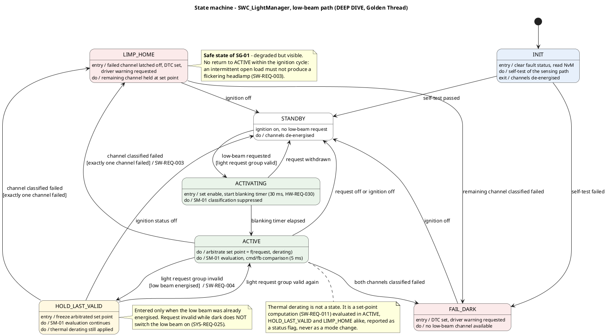

# 🔍 DEEP DIVE — Detailed design `SWC_LightManager`

**Phase 7 · ASPICE SWE.3 (software detailed design and unit construction) · ISO 26262-6 (software
unit design and implementation)**
**Status:** draft · **Owner:** software-engineer

> Teaching/reference project. **All numeric values are plausible example values, not validated
> data.**

---

## 1 Scope

`SWC_LightManager` is the one component of this project taken to detailed design, because it carries
the Golden Thread: `SG-01` → `FSR-001` / `FSR-002` → `TSR-002` / `TSR-003` / `TSR-004` → `SM-01` →
this component → the test cases owed by `verification-engineer`. Everything else stays at
📋 OVERVIEW level in [`../sw_architecture.md`](../sw_architecture.md).

Covered here: interfaces, internal state, the state machine, the error-handling strategy, and
pseudocode for the open-load evaluation path. **Not** covered: the cornering-light and
daytime-running-light functions the component also owns, and any BSW configuration.

## 2 Interfaces

### 2.1 Receiver ports (inputs)

| Name | Direction | Type | Range | Unit | Source |
|---|---|---|---|---|---|
| `LightRequest` | in | `enum` {off, DRL, low, high, work} | 5 states | — | COM, `SG_LightRequest` |
| `LightRequestValid` | in | `boolean` | 0 / 1 | — | E2E check (`SW-REQ-005`) |
| `IgnitionStatus` | in | `enum` {off, on, crank, n/a} | 4 states | — | COM, `SG_LightRequest` |
| `AmbientLight` | in | `uint16` | 0 … 60000 | lx | COM, `SG_Environment` |
| `AmbientLightValid` | in | `boolean` | 0 / 1 | — | E2E check |
| `I_Load_Ch[n]` | in | `uint16` | 0 … 1500 | mA | IoHwAb, `Current_Sense_Chain` |
| `U_Channel_Ch[n]` | in | `uint16` | 0 … 40000 | mV | IoHwAb, `LED_Driver_Stage_1..2` |
| `DriverStatus_Ch[n]` | in | `uint8` bitfield {OVP, OCP, OT} | 3 bit | — | IoHwAb, driver status readback |
| `SampleValid_Ch[n]` | in | `boolean` | 0 / 1 | — | IoHwAb: sample lay inside the PWM on-phase |
| `Blanked_Ch[n]` | in | `boolean` | 0 / 1 | — | IoHwAb, blanking timer (`HW-REQ-030`) |
| `T_LED` | in | `int16` | −40 … +150 | °C | IoHwAb, `Temp_Sense_Chain` |
| `T_LED_Valid` | in | `boolean` | 0 / 1 | — | plausibility band (`HW-REQ-022`) |

### 2.2 Sender ports and service calls (outputs)

| Name | Direction | Type | Range | Unit | Destination |
|---|---|---|---|---|---|
| `Enable_Ch[n]` | out | `boolean` | 0 / 1 | — | IoHwAb → enable gate |
| `SetPoint_Ch[n]` | out | `uint16` | 0 … 1500 | mA | IoHwAb → constant-current stage |
| `ChannelState_Ch[n]` | out | `enum` {off, on, degraded, failed} | 4 states | — | COM, `SG_LightingStatus` |
| `DriverWarningReq` | out | `enum` {none, lowBeamFault} | 2 states | — | COM, `SG_DriverWarning` |
| `DeratingActive` | out | `boolean` | 0 / 1 | — | COM, `SG_LightingStatus`; DEM |
| `Dem_SetEventStatus` | call | client/server | event ID + status | — | DEM (`SWC_DiagnosticManager`) |
| `WdgM_CheckpointReached` | call | client/server | checkpoint ID | — | WdgM (`SW-REQ-010`) |

`[n]` is the channel index, `n ∈ {1, 2}`. Both channels are handled by the same code with the same
constants; there is no channel-specific branch.

### 2.3 Configuration constants

| Constant | Value | Unit | Source |
|---|---|---|---|
| `LM_NUM_LOW_BEAM_CH` | 2 | — | `04_architecture/ee_architecture.md` |
| `LM_I_OPEN_LOAD_MA` | 150 | mA | `SYS-REQ-014`, `HW-REQ-002` |
| `LM_WINDOW_CYCLES` | 10 (= 50 ms at 5 ms) | cycles | `SYS-REQ-014` |
| `LM_DEBOUNCE_CYCLES` | 4 (= 20 ms at 5 ms) | cycles | `SM-01` |
| `LM_DISCREPANCY_CYCLES` | 4 (= 20 ms at 5 ms) | cycles | `SW-REQ-001` |
| `LM_U_SHORT_BAT_MV` | 6000 | mV | `HW-REQ-006`, `SM-03` |
| `LM_I_DERATING_FLOOR_MA` | 400 | mA | `HW-REQ-008`, `HW-REQ-023` |
| `LM_T_DERATE_START_C` | 105 | °C | `HW-REQ-023` |
| `LM_T_DERATE_FLOOR_C` | 125 | °C | `HW-REQ-023` |
| `LM_SETPOINT_NOMINAL_MA` | 1200 | mA | `A-08`, `HW-REQ-023` |

Every constant is quoted from an existing record. **No threshold is invented in the detailed
design** — if a number here disagreed with its source record, the source record would win.

## 3 State machine



**How to read it:** the vertical path `INIT → STANDBY → ACTIVATING → ACTIVE` is normal operation;
everything to the right of `ACTIVE` is a reaction — `HOLD_LAST_VALID` to a communication fault,
`LIMP_HOME` to a single channel failure (the safe state of `SG-01`), `FAIL_DARK` to the loss of both.
Thermal derating deliberately appears as a `do` activity and a status flag, not as a state, so that
the machine does not double in size for a set-point computation.

### 3.1 Transition table

| # | From | To | Trigger / guard | Action | Requirement |
|---|---|---|---|---|---|
| T1 | `INIT` | `STANDBY` | self-test of the sensing path passed | channels de-energised | — |
| T2 | `INIT` | `FAIL_DARK` | self-test failed | DTC, warning request | `SW-REQ-002` |
| T3 | `STANDBY` | `ACTIVATING` | `LightRequest == low` and `LightRequestValid` | set `Enable_Ch[1..2]`, start 30 ms blanking | `SW-REQ-014`, `HW-REQ-030` |
| T4 | `ACTIVATING` | `ACTIVE` | blanking timer elapsed | enable `SM-01` classification | `HW-REQ-030` |
| T5 | `ACTIVATING` | `STANDBY` | request withdrawn | de-energise | — |
| T6 | `ACTIVE` | `HOLD_LAST_VALID` | `!LightRequestValid` and low beam energised | freeze arbitrated set point | `SW-REQ-004` |
| T7 | `HOLD_LAST_VALID` | `ACTIVE` | `LightRequestValid` again | resume arbitration | `SW-REQ-004` |
| T8 | `HOLD_LAST_VALID` | `STANDBY` | `IgnitionStatus == off` | de-energise | `SW-REQ-004` |
| T9 | `ACTIVE` / `HOLD_LAST_VALID` | `LIMP_HOME` | exactly one channel classified failed | latch failed channel off, DTC, warning request, hold remaining channel | `SW-REQ-003`, `SW-REQ-006` |
| T10 | `LIMP_HOME` | `FAIL_DARK` | remaining channel classified failed | DTC, warning request | `SW-REQ-003` |
| T11 | `ACTIVE` | `FAIL_DARK` | both channels classified failed in the same cycle | DTC, warning request | `SW-REQ-003` |
| T12 | `ACTIVE` | `STANDBY` | request off or ignition off | de-energise | — |
| T13 | `LIMP_HOME` / `FAIL_DARK` | `STANDBY` | ignition off | de-energise, latch cleared for the next ignition cycle | `SW-REQ-003` |

**There is no transition from `LIMP_HOME` back to `ACTIVE` within an ignition cycle.** That is
deliberate and it is stated in `SW-REQ-003`: an intermittent open load that were allowed to recover
would produce a flickering headlamp, which is a driver distraction dressed up as a diagnosis. The
latch is cleared only by T13.

## 4 Error-handling strategy

### 4.1 Fault classes and reactions

| Class | Example | Detection | Reaction | Latching |
|---|---|---|---|---|
| Channel fault | open load, short to battery, driver latch-off | `SM-01` path, `RE_LM_Monitor` | `LIMP_HOME` (one channel) or `FAIL_DARK` (both), DTC, driver warning | until next ignition cycle |
| Communication fault | E2E counter, CRC, data identifier, timeout | `RE_LM_RxEval` (`SW-REQ-005`) | `HOLD_LAST_VALID` for the low beam; per-function elsewhere | self-clearing on a valid group |
| Measurement fault | sample outside the PWM on-phase, ADC reference implausible | `SampleValid_Ch[n]`, `HW-REQ-010` | sample discarded, window counters frozen, "diagnosis not available" after 200 ms | self-clearing |
| Thermal sensing fault | NTC open or shorted | `T_LED_Valid` (`HW-REQ-022`) | assume worst case: derate to the floor, DTC | self-clearing |
| Execution fault | runnable overrun, missed checkpoint | OS timing protection, WdgM | watchdog answer withheld → `SM-02` | hardware reset |

### 4.2 The five rules the implementation follows

1. **Discard, never guess.** An input that fails its validity check is discarded; the affected
   counters are frozen, not fed with a substitute value. Freezing the window counters is what keeps a
   burst of invalid samples from producing a false classification.
2. **Fail towards light.** For `SG-01` the safe direction is "keep the lamp on". A communication
   fault holds the last valid set point (`SW-REQ-004`); it never switches the low beam off. The one
   case that does de-energise a channel is a channel classified as failed, where the channel is dark
   already.
3. **One cause per classification.** `SW-REQ-002` allows exactly one of open load, short-to-battery
   or commanded current reduction. The discrimination runs **before** the fault reaction, never after,
   because a wrong cause produces a wrong DTC and a wrong repair.
4. **Report and react are separate paths.** The reaction (state transition and actuation) is in the
   5 ms task and inside the FTTI budget; the report (DTC, driver warning, status) is in the 10 ms and
   100 ms tasks and outside it. A blocked bus can therefore never delay the safe state.
5. **No dynamic behaviour.** No heap, no recursion, no unbounded loop, no variable-length data. Every
   buffer is statically sized by `LM_NUM_LOW_BEAM_CH`.

### 4.3 What the component does **not** handle

Loss of program execution, supply faults and overvoltage are hardware mechanisms (`SM-02`, `SM-06`)
and are outside this component. `SWC_LightManager` contributes only the watchdog checkpoints. Note
`OP-34`: `SM-02` de-energises all driver stages on `SAFE_OFF`, which for the low beam is exactly
`H-01`; the conflict is owned by `safety-manager` and `systems-engineer` and is not worked around
here.

## 5 Pseudocode — open-load evaluation path (`RE_LM_Monitor`, 5 ms)

C-style pseudocode, deterministic, no dynamic memory, no unbounded loop. It implements `SW-REQ-002`
(classification and cause) and `SW-REQ-001` (command/feedback comparison) and produces only the
request for a reaction; the transition itself is made by `RE_LM_Arbitrate` in the same task, in the
order given by the task table.

```c
/* Executed every 5 ms in Task_Safety_5ms. Static state only. */

typedef enum { CAUSE_NONE, CAUSE_OPEN_LOAD, CAUSE_SHORT_BAT, CAUSE_DERATED } lm_cause_t;

typedef struct {
    uint8_t     below_cnt;      /* consecutive cycles below the threshold   */
    uint8_t     debounce_cnt;   /* consecutive cycles after the window      */
    uint8_t     discrep_cnt;    /* consecutive cycles command != feedback   */
    boolean     failed_latched; /* cleared only on ignition off (T13)       */
    lm_cause_t  cause;
} lm_ch_diag_t;

static lm_ch_diag_t lm_diag[LM_NUM_LOW_BEAM_CH];   /* static, never resized */

void RE_LM_Monitor(void)
{
    uint8_t ch;

    for (ch = 0u; ch < LM_NUM_LOW_BEAM_CH; ch++)      /* bounded: 2 iterations */
    {
        lm_ch_diag_t *d = &lm_diag[ch];
        uint16_t i_meas = IoHwAb_GetChannelCurrent(ch);   /* mA  */
        uint16_t u_meas = IoHwAb_GetChannelVoltage(ch);   /* mV  */
        uint8_t  drvsts = IoHwAb_GetDriverStatus(ch);
        boolean  cmd_on = LM_ChannelCommandedOn(ch);

        /* --- 1. gates: only a usable sample may move a counter ------------- */
        if ((!IoHwAb_IsSampleValid(ch)) || IoHwAb_IsBlanked(ch) || (!cmd_on))
        {
            /* Sample outside the PWM on-phase, inside the 30 ms blanking of
               HW-REQ-030, or channel not commanded on: freeze, do not guess.  */
            continue;                                  /* rule 1, section 4.2 */
        }

        /* --- 2. threshold window: 10 cycles = 50 ms (SYS-REQ-014) ---------- */
        if (i_meas < LM_I_OPEN_LOAD_MA)
        {
            if (d->below_cnt < LM_WINDOW_CYCLES)  { d->below_cnt++; }
        }
        else
        {
            d->below_cnt    = 0u;
            d->debounce_cnt = 0u;
            d->cause        = CAUSE_NONE;
        }

        /* --- 3. debounce: 4 further cycles = 20 ms (SM-01) ----------------- */
        if (d->below_cnt >= LM_WINDOW_CYCLES)
        {
            if (d->debounce_cnt < LM_DEBOUNCE_CYCLES) { d->debounce_cnt++; }
        }

        /* --- 4. cause discrimination BEFORE any reaction (SYS-REQ-019) ----- */
        if (d->debounce_cnt >= LM_DEBOUNCE_CYCLES)
        {
            if (LM_GetArbitratedSetPoint(ch) <= LM_I_DERATING_FLOOR_MA)
            {
                d->cause = CAUSE_DERATED;      /* commanded reduction, no fault */
            }
            else if ((u_meas > LM_U_SHORT_BAT_MV) || ((drvsts & LM_DRVSTS_OVP) != 0u))
            {
                d->cause = CAUSE_SHORT_BAT;    /* SM-03 leg                     */
            }
            else
            {
                d->cause = CAUSE_OPEN_LOAD;    /* SM-01                         */
            }

            if (d->cause != CAUSE_DERATED)
            {
                d->failed_latched = TRUE;                        /* T9 / T10   */
                LM_RequestFaultReaction(ch, d->cause);           /* SW-REQ-003 */
                Dem_SetEventStatus(LM_DemEventId(ch, d->cause),
                                   DEM_EVENT_STATUS_FAILED);     /* SW-REQ-012 */
            }
        }

        /* --- 5. command/feedback comparison (SW-REQ-001, TSR-002) ---------- */
        if (cmd_on == (i_meas >= LM_I_OPEN_LOAD_MA))
        {
            d->discrep_cnt = 0u;
        }
        else if (d->discrep_cnt < LM_DISCREPANCY_CYCLES)
        {
            d->discrep_cnt++;
            if (d->discrep_cnt >= LM_DISCREPANCY_CYCLES)
            {
                LM_SetChannelDiscrepancy(ch, TRUE);              /* SW-REQ-001 */
            }
        }
        else
        {
            /* already reported; nothing to do - no silent else (MISRA)        */
        }
    }

    WdgM_CheckpointReached(LM_WDGM_SE_ID, LM_CP_MONITOR_END);    /* SW-REQ-010 */
}
```

### 5.1 Why the code matches the state machine

- `IoHwAb_IsBlanked()` is the `ACTIVATING` state and the 30 ms of `HW-REQ-030`; no counter can move
  inside it, which is why switch-on cannot produce T9.
- `LM_RequestFaultReaction()` only *requests*; `RE_LM_Arbitrate` makes T9, T10 or T11 in the same
  5 ms activation, which is the 5 ms term of the reaction budget in `SW-REQ-013`.
- `failed_latched` is cleared only on T13 (ignition off), which is the "no return to `ACTIVE`" rule.
- `CAUSE_DERATED` produces no reaction at all, because a commanded current reduction is not a fault —
  the third arm of `SYS-REQ-019`, and the reason `SW-REQ-011` feeds the arbitrated set point into the
  monitoring path.

### 5.2 Worst-case execution

Two iterations, no loop whose bound depends on data, no call into the communication stack. Budgeted
WCET for `RE_LM_Monitor` is 0.30 ms of the 0.90 ms of `Task_Safety_5ms` (plausible example value; the
measurement on target is `OP-49`).

## 6 Deliberately not designed here

- Cornering light (`SYS-REQ-006` … `008`) and daytime running lights (`SYS-REQ-009`), which this
  component also owns — 📋 OVERVIEW only, in line with the depth rule.
- The transmit path beyond the request (`RE_LM_Tx`): frame assembly is COM configuration.
- The state machine as a **SysML view** — that is a hand-off to `mbse-modeler`; the PlantUML source
  `03_model/plantuml/stm_lightmanager.puml` is deliberately a design view, not a model element, and
  the existing `stm_lighting.puml` is not touched.

---

**Work products:** `06_software/detailed_design/swc_lightmanager.md`,
`03_model/plantuml/stm_lightmanager.puml`
**Open points:** `OP-49` (unit test cases, WCET measurement on target), `OP-51`
(`SWC_LightManager` aggregates ASIL B, A and QM); depends on `OP-42` (start-up detection cap) and
`OP-34` (`SAFE_OFF` versus `SG-01`)
**Process reference:** ASPICE **SWE.3** (software detailed design and unit construction), verified
under **SWE.4** · ISO 26262 **Part 6** (software unit design and implementation, and the design
principles for software units) · **Part 4** (the reaction time argued against the FTTI allocated at
system level). Parts and topics named, no clause numbers cited.
