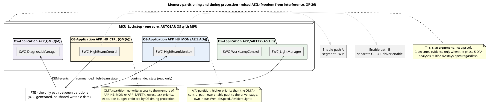

# Freedom from interference — mixed-ASIL software on one microcontroller

**Phase 7 · ASPICE SWE.2 (software architectural design) · ISO 26262-6 (freedom from interference
between software elements of different ASIL) · ISO 26262-9 (dependent failure analysis)**
**Status:** draft · **Owner:** software-engineer, with `safety-analyst` for the analysis that turns
this into evidence

> Teaching/reference project. **All numeric values are plausible example values, not validated
> data.**

---

## 1 What this document is, and what it is not

`OP-26` asked for a freedom-from-interference view once the software architecture existed. This is
that view. It states **how** the mixed-ASIL software is separated and **which platform features**
carry the separation.

**It is an argument, not a proof.** It becomes evidence only when the phase 5 **dependent failure
analysis** examines it — the DFA owed by `OP-8`. Until then:

- `RISK-02` stays open. The decomposition `FSR-005 → FSR-006 QM(A) + FSR-007 A(A)` is not
  demonstrated by an architecture picture, and this document does not claim it is.
- Nothing here may be cited in the safety case as a completed independence argument.
- `OP-26` is closed in the sense that the view now exists and can be analysed. The **substance** of
  the question moves to `safety-analyst`, it does not disappear.

Writing it the other way round — declaring interference impossible because the partitions are drawn —
is the failure mode this section exists to prevent.

## 2 Where mixed ASIL actually occurs

| Pair | ASIL | Why they must be independent |
|---|---|---|
| `SWC_HighBeamControl` ↔ `SWC_HighBeamMonitor` | QM(A) ↔ A(A) | The decomposition of `FSR-005`: the QM control path is only admissible because an independent monitor exists (`TSR-006` / `TSR-007`, `RISK-02`) |
| `SWC_DiagnosticManager` ↔ everything | QM ↔ B | A QM component sharing a microcontroller with the ASIL B Golden Thread must not be able to disturb it |
| `SWC_LightManager` internals | B, A, QM in one component | Cornering light (A) and daytime running lights (QM) sit inside an ASIL B component and therefore **inherit ASIL B** — no interference argument is made, the ASIL is raised instead (`OP-51`) |

## 3 The partitioning

**How to read it:** each package is one AUTOSAR OS-Application with its own memory protection region
and its own task set; the only path between them is the RTE, and the two enable paths on the right
are the reason the monitor can act without the control path's cooperation. The note on the right is
the honest limit of the picture.

| OS-Application | ASIL | Components | Tasks |
|---|---|---|---|
| `APP_SAFETY` | B | `SWC_LightManager`, `SWC_WorkLampControl` | `Task_Sense_2ms5`, `Task_Safety_5ms`, `Task_Ctrl_10ms`, `Task_Slow_100ms` |
| `APP_HB_MON` | A(A) | `SWC_HighBeamMonitor` | `Task_Monitor_20ms` |
| `APP_HB_CTRL` | QM(A) | `SWC_HighBeamControl` | `Task_HighBeam_50ms` |
| `APP_QM` | QM | `SWC_DiagnosticManager` | `Task_Background` |

## 4 The three interference classes and the measure for each

ISO 26262-6 treats interference between software elements under three headings — memory, timing and
execution, and exchange of information. (Part and topic named; no clause number cited.)

### 4.1 Memory

| Measure | Realisation | Effect |
|---|---|---|
| MPU-backed OS-Applications | Each OS-Application has its own data and stack region; tasks run in user mode | A write outside the own region traps as a memory protection violation |
| No shared writable data | Inter-partition data goes through RTE/IOC buffers generated per direction | A QM(A) component cannot corrupt a monitor variable, because it has no address for it |
| Read-only mapping of the commanded state | `SWC_HighBeamMonitor` maps the commanded high-beam state read-only | The monitor cannot be made to write its own input |
| Protection violation reaction | Partition terminated; DEM event; high beam de-energised through the monitor's enable path | Reaction is a defined state, not an undefined one |

### 4.2 Timing and execution

| Measure | Setting (plausible example) | Effect |
|---|---|---|
| Priority assignment | `Task_Monitor_20ms` (A(A), prio 25) above `Task_HighBeam_50ms` (QM(A), prio 20) | The QM path cannot preempt or delay the monitor |
| OS execution budget | `APP_HB_CTRL` ≤ 2.5 ms per 50 ms; `APP_QM` background only | A runaway loop in the QM path is stopped by the OS, not by luck |
| OS timing protection | Execution-time and inter-arrival-time protection per task | Budget overrun terminates the offending task, not the system |
| Deadline supervision | WdgM supervised entities per safety task, checkpoints at runnable entry and exit | A stalled ASIL B runnable withholds the watchdog answer → `SM-02` |
| Total periodic load | 42 % against a rate-monotonic bound of ≈ 73.5 % | Headroom is part of the argument: an overrun is detected long before the schedule saturates |

### 4.3 Exchange of information

| Measure | Realisation |
|---|---|
| Different inputs | The monitor uses `VehicleSpeed` and `AmbientLight`; the control path uses `ObjectList`. No shared input signal |
| Different actuation path | The monitor has its own enable path to the driver stage; it does not ask the control path to switch off |
| E2E on the bus | Alive counter, CRC and data identifier per signal group (`SW-REQ-005`), so a corrupted or mis-routed frame cannot masquerade as a valid input |
| Direction | The commanded state flows control → monitor only. There is no monitor → control path that a fault could travel back along |

## 5 🔍 What this argument does **not** cover

These are the items the DFA has to examine; they are listed so the argument cannot be mistaken for a
complete one.

1. **Single core, shared resources.** All four partitions run on one lockstep core pair with one
   clock, one supply and one MPU. Common-cause failures of clock, supply or the MPU configuration
   itself defeat partitioning by definition — they are covered, if at all, by `SM-02` and `SM-06`,
   not by this document.
2. **Shared peripherals.** ADC, PWM timers and the CAN controller are used by more than one
   partition through the MCAL. A driver-level fault is a shared resource fault; the driver code is
   part of the ASIL B qualified set, which is an assertion the DFA has to check, not a conclusion
   drawn here.
3. **No `HW-REQ` demands the MPU.** The hardware requirements specify the microcontroller's ADC and
   PWM behaviour (`HW-REQ-003`) but nowhere require a memory protection unit or OS timing-protection
   support. The whole of section 4 rests on a platform capability that no requirement currently
   demands — raised as `OP-48` for `hardware-engineer`.
4. **Configuration is not architecture.** Partition boundaries, budgets and the read-only mapping are
   *configuration*. They are only as good as the generated configuration, and verifying that is
   SWE.5 work, not SWE.2 work.
5. **The `SM-02` conflict.** `OP-34` — `SAFE_OFF` de-energising all driver stages produces `H-01` on
   the low beam — cuts straight across this argument, because the disable path is common to every
   partition. Owned by `safety-manager` and `systems-engineer`.

## 6 Status of `OP-26`

| Aspect | State |
|---|---|
| Freedom-from-interference **view** for `SWC_HighBeamControl` (QM(A)) versus `SWC_HighBeamMonitor` (A(A)) | **delivered** — this document |
| Independence **demonstrated** | **no** — needs the DFA (`OP-8`), phase 5 |
| `RISK-02` | **open**, unchanged |
| Platform capability required by a `HW-REQ` | **no** — `OP-48` |

---

**Work products:** `06_software/freedom_from_interference.md`,
`03_model/plantuml/sw_partitions.puml`
**Open points:** `OP-48` (no `HW-REQ` requires MPU / timing protection), `OP-51`
(`SWC_LightManager` aggregates ASIL B, A and QM); depends on `OP-8` / `RISK-02` (DFA) and `OP-34`
**Process reference:** ASPICE **SWE.2** (software architectural design, resource and partitioning
considerations) · ISO 26262 **Part 6** (freedom from interference between software elements of
different ASIL, and software partitioning) · **Part 9** (dependent failure analysis, and criteria
for coexistence of elements). Parts and topics named, no clause numbers cited.
