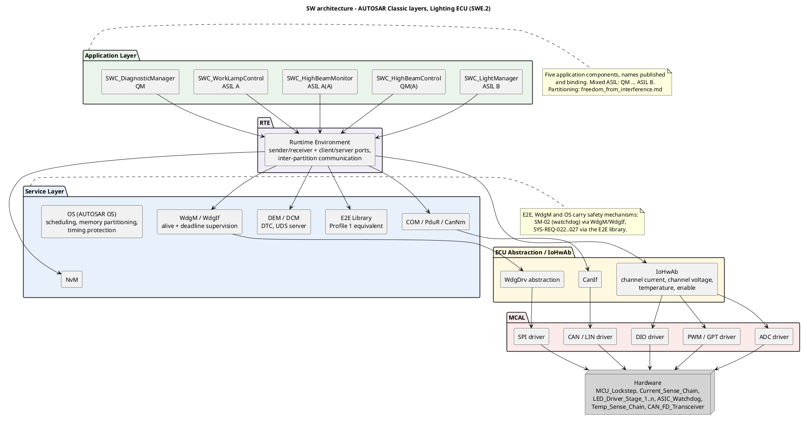
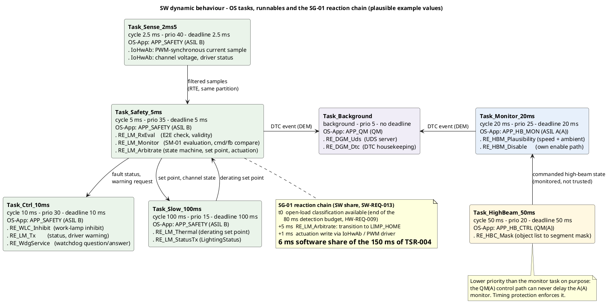

# Software architecture — Lighting ECU

**Phase 7 · ASPICE SWE.2 (software architectural design) · ISO 26262-6 (software architectural
design)**
**Status:** draft · **Owner:** software-engineer

> Teaching/reference project. **All numeric values — cycle times, priorities, WCET, CPU load — are
> plausible example values, not validated data.**

---

## 1 Scope and what this document decides

This document fixes three things and nothing else: the **layering** the software is built on, the
**five application components** and their responsibilities, and the **dynamic behaviour** — which
runnable executes in which task, at what cycle time, at what priority and against what deadline.

The platform is **AUTOSAR Classic** (decision taken with the phase 7 plan). That decision is load
bearing for the safety argument: memory partitioning through OS-Applications and an MPU, timing
protection, the Watchdog Manager and the E2E library are **platform features**, not mechanisms this
project invents. What the project still owes is the *configuration* of those features and the
argument that the configuration is sufficient — see
[`freedom_from_interference.md`](freedom_from_interference.md).

The five component names are **published and binding** (`09_process/project_status.md`, "Next step"):
`SWC_LightManager`, `SWC_HighBeamControl`, `SWC_HighBeamMonitor`, `SWC_WorkLampControl`,
`SWC_DiagnosticManager`. They are not renamed here.

## 2 📋 OVERVIEW — layering

**How to read it:** the stack runs top to bottom from the application components through the RTE and
the service layer to the MCAL and the hardware; every arrow that crosses a package boundary is a
generated or configured interface, never a direct call. The colouring of the application layer is
irrelevant to safety — the ASIL is written into each component and the partitioning is in
`sw_partitions.puml`.

## 3 📋 OVERVIEW — the five application components

| Component | Responsibility | ASIL | Owning requirements | OS-Application |
|---|---|---|---|---|
| `SWC_LightManager` | Low beam: request arbitration, set point, `SM-01` evaluation, fault reaction, thermal derating, E2E of the safety-relevant signal groups, status and warning transmission | B | `SW-REQ-001` … `006`, `011`, `013`, `014` | `APP_SAFETY` |
| `SWC_HighBeamControl` | Glare-free high beam: object list to segment mask | QM(A) | `SW-REQ-007` | `APP_HB_CTRL` |
| `SWC_HighBeamMonitor` | Independent plausibility monitor of the commanded high-beam state, own disable path | A(A) | `SW-REQ-008` | `APP_HB_MON` |
| `SWC_WorkLampControl` | Work-lamp inhibit above 10 km/h and on invalid speed | A | `SW-REQ-009` | `APP_SAFETY` |
| `SWC_DiagnosticManager` | DTC storage and the UDS server | QM | `SW-REQ-012` | `APP_QM` |

**`SWC_LightManager` is large, and that is a finding rather than a design goal.** The allocation
table of `04_architecture/allocation.md` already gave it the four communication functions, because
they are ASIL B and the QM `SWC_DiagnosticManager` must not sit in the data path. Adding the
Golden-Thread lighting logic makes it a component that aggregates ASIL B, ASIL A (cornering light)
and QM (daytime running lights) functions in one partition, so **everything inside it inherits
ASIL B**. Splitting it, or accepting the inheritance explicitly, is raised as `OP-51`; it is not
decided here, because the decision changes the allocation table, which belongs to
`systems-engineer`.

## 4 🔍 DEEP DIVE — dynamic behaviour

### 4.1 Task and runnable mapping

| Task | Cycle | Priority | Deadline | OS-Application | Runnables (in execution order) | WCET budget |
|---|---|---|---|---|---|---|
| `Task_Sense_2ms5` | 2.5 ms | 40 | 2.5 ms | `APP_SAFETY` | IoHwAb acquisition: PWM-synchronous current sample, channel voltage, driver status | 0.25 ms |
| `Task_Safety_5ms` | 5 ms | 35 | 5 ms | `APP_SAFETY` | `RE_LM_RxEval`, `RE_LM_Monitor`, `RE_LM_Arbitrate` | 0.90 ms |
| `Task_Ctrl_10ms` | 10 ms | 30 | 10 ms | `APP_SAFETY` | `RE_WLC_Inhibit`, `RE_LM_Tx`, `RE_WdgService` | 0.60 ms |
| `Task_Monitor_20ms` | 20 ms | 25 | 20 ms | `APP_HB_MON` | `RE_HBM_Plausibility`, `RE_HBM_Disable` | 0.50 ms |
| `Task_HighBeam_50ms` | 50 ms | 20 | 50 ms | `APP_HB_CTRL` | `RE_HBC_Mask` | 2.00 ms |
| `Task_Slow_100ms` | 100 ms | 15 | 100 ms | `APP_SAFETY` | `RE_LM_Thermal`, `RE_LM_StatusTx` | 1.50 ms |
| `Task_Background` | background | 5 | — | `APP_QM` | `RE_DGM_Uds`, `RE_DGM_Dtc` | — |

Priorities are assigned **rate-monotonically** (shorter period, higher priority) with one deliberate
consequence: the A(A) monitor task runs at a higher priority than the QM(A) high-beam control task,
so the QM path can never delay the safety path. That is not a scheduling accident, it is part of the
independence argument.

**How to read it:** each box is one OS task with its period, priority, deadline, owning
OS-Application and the runnables it calls in fixed order; the arrows are data flows through the RTE,
not call sequences. The lower note carries the software share of the `SG-01` fault reaction, which is
the number `SW-REQ-013` makes testable.

### 4.2 Schedulability and load

| Task | Period | WCET | Utilisation |
|---|---|---|---|
| `Task_Sense_2ms5` | 2.5 ms | 0.25 ms | 10.0 % |
| `Task_Safety_5ms` | 5 ms | 0.90 ms | 18.0 % |
| `Task_Ctrl_10ms` | 10 ms | 0.60 ms | 6.0 % |
| `Task_Monitor_20ms` | 20 ms | 0.50 ms | 2.5 % |
| `Task_HighBeam_50ms` | 50 ms | 2.00 ms | 4.0 % |
| `Task_Slow_100ms` | 100 ms | 1.50 ms | 1.5 % |
| **Total (periodic)** | | | **42.0 %** |

The rate-monotonic sufficient bound for six periodic tasks is 6 × (2^(1/6) − 1) ≈ 73.5 %, so 42 % is
schedulable without any further response-time analysis. The worst-case response time of the critical
task is nevertheless stated, because that is the one the `SG-01` argument uses:

`R(Task_Safety_5ms) = 0.90 ms (own WCET) + 2 × 0.25 ms (two activations of the 2.5 ms task inside a
5 ms window) = 1.40 ms` against a 5 ms deadline. Margin 3.6 ms (72 %). Plausible example values;
WCET has to be measured on the target, which is `OP-49` territory.

### 4.3 🔍 DEEP DIVE — the `SG-01` chain, end to end

| Step | Contribution | Owner | Source |
|---|---|---|---|
| PWM synchronisation of the sample | 2.5 ms | `Current_Sense_Chain` | `SM-01` |
| ADC acquisition | 0.1 ms | `Current_Sense_Chain` | `SM-01` |
| Threshold window (10 × 5 ms monitoring cycles) | 50 ms | `SWC_LightManager` | `SYS-REQ-014` |
| Debounce (4 × 5 ms monitoring cycles) | 20 ms | `SWC_LightManager` | `SM-01` |
| Task latency to the evaluation runnable | 5 ms | `MCU_Lockstep` | `SM-01` |
| **Detection subtotal** | **77.6 ms, specified ≤ 80 ms** | | `HW-REQ-009` |
| State transition to `LIMP_HOME` (`RE_LM_Arbitrate`, one 5 ms cycle) | 5 ms | `SWC_LightManager` | `SW-REQ-003` |
| Actuation write through IoHwAb / PWM driver | 1 ms | `SWC_LightManager` | `SW-REQ-013` |
| **Software share of the fault reaction** | **6 ms of the 150 ms allocated by `TSR-004`** | | `SW-REQ-013` |
| **Total against the FTTI** | **80 ms + 150 ms = 230 ms** | | `SG-01` |
| **FTTI** | **300 ms** | | `SG-01` |
| **Margin** | **70 ms (23 %)** | | |

**The 50 ms window and the 20 ms debounce are the same 50 ms and 20 ms already in `SM-01`,** counted
in software cycles rather than added on top: ten and four activations of the 5 ms monitoring task.
The software therefore consumes **no time that the published budget did not already contain**, and
the 230 ms / 70 ms margin of the E/E architecture is unchanged.

**Start-up case, unchanged and not smoothed over.** With the 30 ms blanking of `HW-REQ-030` an open
load present at switch-on is classified at 110 ms, which exceeds the 100 ms cap of `SYS-REQ-018`.
Against the FTTI it still closes: 110 + 150 = 260 ms, margin 40 ms (13 %). The cap conflict is
`OP-42` and belongs to `systems-engineer`; the software implements the blanking as specified and does
not reinterpret the cap.

### 4.4 🔍 DEEP DIVE — the activation chain, software share

| Step | Contribution | Source |
|---|---|---|
| Reception indication of `SG_LightRequest` in the communication stack | 1.0 ms | plausible example value |
| Worst-case wait for the next activation of `RE_LM_RxEval` (5 ms task) | 5.0 ms | task schedule |
| E2E check, request arbitration, state machine, set-point computation | 2.0 ms | WCET budget |
| Actuation write (enable and PWM registers) | 0.5 ms | plausible example value |
| **Software share** | **8.5 ms, specified ≤ 10 ms** | **`SW-REQ-014`** |

This is the 10 ms line of the activation budget in
`05_hardware/analysis_low_beam_activation.md` section 3, now decomposed and owned by a software
requirement. The remaining 290 ms of `SYS-REQ-001` are gateway, bus and hardware and are not
software's to spend. **This 300 ms is an activation latency and has nothing to do with the 300 ms
FTTI of `SG-01`** — the two are numerically equal and unrelated.

### 4.5 📋 OVERVIEW — the `SG-02` chain

| Step | Contribution | Source |
|---|---|---|
| Age of `AmbientLight` at evaluation (normal operation) | ≤ 100 ms | interface table |
| `Task_Monitor_20ms` period | 20 ms | this document |
| **Detection subtotal** | **120 ms** | chain C, `ee_architecture.md` |
| Fault reaction, high beam de-energised | 250 ms | `TSR-007` |
| **Total** | **370 ms** against a 500 ms FTTI, margin 130 ms (26 %) | `SG-02` |

Unchanged from chain C of the E/E architecture. The open finding stays open: the `AmbientLight`
timeout of 500 ms equals the whole `SG-02` FTTI, so a signal that simply stops is not declared
invalid before the FTTI has elapsed. `SW-REQ-008` therefore specifies the monitor **without** a
staleness threshold and the architecture only provides the hook — a signal-age input to the
plausibility decision. **This depends on `OP-29` being decided** by `safety-manager`; the software
does not pick a number that a safety decision owns.

## 5 📋 OVERVIEW — component interfaces

| From → To | Port / mechanism | Content | ASIL |
|---|---|---|---|
| COM → `SWC_LightManager` | S/R, E2E protected | `SG_LightRequest`, `SG_Environment` incl. validity | B |
| COM → `SWC_WorkLampControl` | S/R, E2E protected | `SG_VehicleDynamics` incl. validity | A |
| COM → `SWC_HighBeamControl` | S/R, timeout + valid flag only | `ObjectList` | QM(A) |
| `SWC_HighBeamControl` → `SWC_HighBeamMonitor` | S/R across partitions (IOC), read only | commanded high-beam state | QM(A) → A(A) |
| `SWC_LightManager` → COM | S/R, E2E protected | `SG_LightingStatus`, `SG_DriverWarning` | B |
| all SWCs → DEM | C/S | diagnostic events | per event |
| `SWC_LightManager`, `SWC_HighBeamMonitor` → IoHwAb | C/S | enable, set point, segment mask | B / A(A) |

`SWC_DiagnosticManager` reads from DEM and never writes into a safety function — the QM component is
outside every safety data path, which is the same argument the allocation table already makes.

## 6 📋 OVERVIEW — safety mechanisms realised in software

| Mechanism | Software part | Originating TSR | SW requirement |
|---|---|---|---|
| `SM-01` open-load detection | Threshold window, debounce, cause discrimination, blanking, fault reporting | `TSR-003` | `SW-REQ-002` |
| `SM-02` program-execution monitoring | Watchdog question/answer service, released only after WdgM alive and deadline supervision pass | `TSR-001` | `SW-REQ-010` |
| `SM-03` short-to-battery | Channel-voltage evaluation as the discriminating leg of the open-load classification | `TSR-003` (via `SYS-REQ-019`) | `SW-REQ-002` |
| `SM-05` thermal derating | Derating curve evaluation and floor clamp | — (from `HW-REQ-023`, `CR-014`) | `SW-REQ-011` |
| Command/feedback comparison | Commanded versus measured channel state each 5 ms | `TSR-002` | `SW-REQ-001` |
| End-to-end protection | Alive counter, CRC, data identifier, timeout | — (from `SYS-REQ-022` … `027`) | `SW-REQ-005` |

**Two rows have no `SM-xx`, and that is a real gap rather than a formatting one.** The `SM-` set is
hardware-owned (`05_hardware/`), so the end-to-end protection — an ASIL B measure that the whole
communication argument rests on — exists as requirements but not as a safety mechanism record.
Raised as `OP-47`; it is not created here, because minting an `SM-` record in the hardware folder
from the software phase is exactly the kind of silent cross-discipline edit the project forbids.

## 7 Deliberately not covered

- **No `TC-` records.** Unit and integration test cases belong to `verification-engineer` (`OP-49`).
- **No changes to any published value.** Cycle times, priorities and WCET budgets are new; every
  threshold, timeout, FTTI and detection time is quoted from existing records.
- **No BSW configuration.** The service layer is named at module level; the actual configuration
  (COM signal groups, DEM event set, WdgM supervised entities, OS object set) is an implementation
  work product of SWE.3 that this reference project does not produce.
- **No multi-core allocation.** `MCU_Lockstep` is treated as one lockstep core pair, per
  `05_hardware/hw_components.md`.
- **`OP-34` is not resolved here.** `SM-02` de-energising all driver stages on `SAFE_OFF` conflicts
  with `SG-01`; the software serves the watchdog protocol and does not redefine the disable path.

---

**Work products:** `06_software/sw_architecture.md`, `03_model/plantuml/sw_layers.puml`,
`03_model/plantuml/sw_tasks.puml`
**Open points:** `OP-47` (E2E has no `SM-xx`), `OP-48` (MPU / timing-protection capability not
required by any `HW-REQ`), `OP-49` (unit test cases and WCET measurement), `OP-51`
(`SWC_LightManager` aggregates ASIL B, A and QM in one partition); depends on `OP-29`, `OP-42`,
`OP-34`
**Process reference:** ASPICE **SWE.2** (software architectural design), feeding **SWE.3** ·
ISO 26262 **Part 6** (software architectural design, and the notion of freedom from interference for
mixed-ASIL software) · **Part 4** (the timing budgets are argued against the FTTI allocated at system
level). Parts and topics named, no clause numbers cited.
