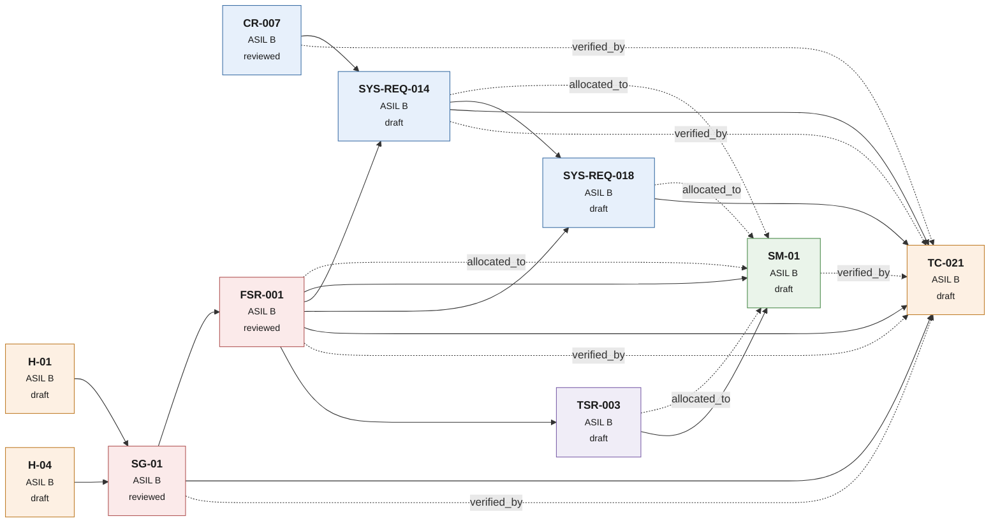
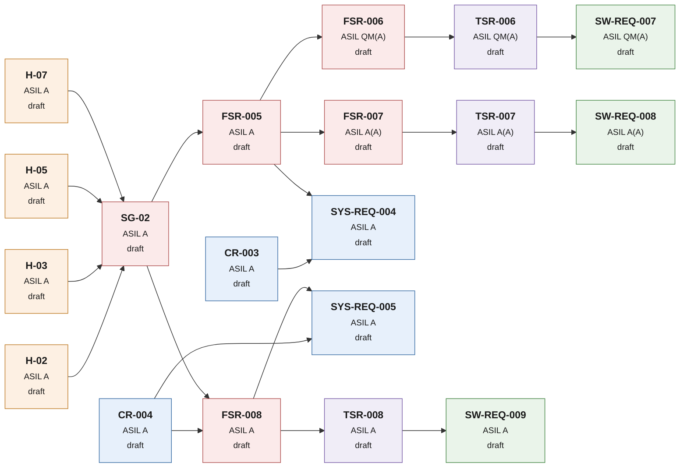

# Traceability views

<!-- generated by tools/gen_trace_graph.py -- do not edit manually -->

Visual companion to the traceability matrix. The matrix proves completeness; these views
show the paths. Both come from the same records — edit the record, never this file.

**Reading the graphs:** solid arrows are derivation (`derived_from`), dotted arrows are
allocation and verification. Colour encodes the record kind, the badge the ASIL and the
status. Node clicks may or may not work depending on the Mermaid settings of the viewer —
the link table under each view always works.

## 1 Golden Thread — SG-01

The one chain worked out in full depth, from the hazard to the test case.



| Record | ASIL | Status | Upstream | Downstream |
|---|---|---|---|---|
| [CR-007](../../01_requirements/customer/CR-007.md) | B | reviewed | — | FSR-004, SYS-REQ-010, SYS-REQ-014, TC-021 |
| [H-01](../../02_safety/02_hara/H-01.md) | B | draft | — | SG-01 |
| [H-04](../../02_safety/02_hara/H-04.md) | B | draft | — | SG-01 |
| [SG-01](../../02_safety/03_fsc/SG-01.md) | B | reviewed | H-01, H-04 | FSR-001, FSR-002, FSR-003, FSR-004, TC-021, TC-021 |
| [FSR-001](../../02_safety/03_fsc/FSR-001.md) | B | reviewed | SG-01 | HW-REQ-001, HW-REQ-005, HW-REQ-009, HW-REQ-010, SM-01, SM-01, SYS-REQ-014, SYS-REQ-016, SYS-REQ-018, TC-021, TC-021, TSR-003, TSR-004 |
| [SYS-REQ-014](../../01_requirements/system/SYS-REQ-014.md) | B | draft | CR-007, FSR-001 | HW-REQ-003, HW-REQ-005, HW-REQ-008, SM-01, SW-REQ-002, SYS-REQ-015, SYS-REQ-016, SYS-REQ-017, SYS-REQ-018, SYS-REQ-019, TC-021, TC-021 |
| [SYS-REQ-018](../../01_requirements/system/SYS-REQ-018.md) | B | draft | FSR-001, SYS-REQ-014 | HW-REQ-009, HW-REQ-030, SM-01, TC-021 |
| [TSR-003](../../02_safety/04_tsc/TSR-003.md) | B | draft | FSR-001 | HW-REQ-020, SM-01, SM-01, SM-03, SW-REQ-002, SW-REQ-013 |
| [SM-01](../../05_hardware/SM-01.md) | B | draft | FSR-001, FSR-001, HW-REQ-001, HW-REQ-002, HW-REQ-003, HW-REQ-004, HW-REQ-005, HW-REQ-006, HW-REQ-007, HW-REQ-008, HW-REQ-009, HW-REQ-010, HW-REQ-030, SW-REQ-002, SYS-REQ-014, SYS-REQ-018, TSR-003, TSR-003 | TC-021 |
| [TC-021](../../07_verification/testcases/TC-021.md) | B | draft | CR-007, FSR-001, FSR-001, SG-01, SG-01, SM-01, SYS-REQ-014, SYS-REQ-014, SYS-REQ-018 | — |

## 2 Safety goal SG-01 — full context

88 connected records.
*Graph shows the derivation skeleton only (78 of 88 records; customer requirements and isolated nodes omitted). Allocation and verification links converge on few nodes and would obscure the structure — they are complete in the table below.*

```mermaid
flowchart LR
    H_01["<b>H-01</b><br/><small>ASIL B</small><br/><small>draft</small>"]
    H_04["<b>H-04</b><br/><small>ASIL B</small><br/><small>draft</small>"]
    SG_01["<b>SG-01</b><br/><small>ASIL B</small><br/><small>reviewed</small>"]
    FSR_001["<b>FSR-001</b><br/><small>ASIL B</small><br/><small>reviewed</small>"]
    FSR_002["<b>FSR-002</b><br/><small>ASIL B</small><br/><small>draft</small>"]
    FSR_003["<b>FSR-003</b><br/><small>ASIL B</small><br/><small>draft</small>"]
    FSR_004["<b>FSR-004</b><br/><small>ASIL B</small><br/><small>draft</small>"]
    SYS_REQ_001["<b>SYS-REQ-001</b><br/><small>ASIL B</small><br/><small>draft</small>"]
    SYS_REQ_002["<b>SYS-REQ-002</b><br/><small>ASIL B</small><br/><small>draft</small>"]
    SYS_REQ_010["<b>SYS-REQ-010</b><br/><small>ASIL B</small><br/><small>draft</small>"]
    SYS_REQ_011["<b>SYS-REQ-011</b><br/><small>ASIL B</small><br/><small>draft</small>"]
    SYS_REQ_012["<b>SYS-REQ-012</b><br/><small>ASIL B</small><br/><small>draft</small>"]
    SYS_REQ_013["<b>SYS-REQ-013</b><br/><small>ASIL B</small><br/><small>draft</small>"]
    SYS_REQ_014["<b>SYS-REQ-014</b><br/><small>ASIL B</small><br/><small>draft</small>"]
    SYS_REQ_015["<b>SYS-REQ-015</b><br/><small>ASIL B</small><br/><small>draft</small>"]
    SYS_REQ_016["<b>SYS-REQ-016</b><br/><small>ASIL B</small><br/><small>draft</small>"]
    SYS_REQ_017["<b>SYS-REQ-017</b><br/><small>ASIL B</small><br/><small>draft</small>"]
    SYS_REQ_018["<b>SYS-REQ-018</b><br/><small>ASIL B</small><br/><small>draft</small>"]
    SYS_REQ_019["<b>SYS-REQ-019</b><br/><small>ASIL B</small><br/><small>draft</small>"]
    SYS_REQ_020["<b>SYS-REQ-020</b><br/><small>ASIL B</small><br/><small>draft</small>"]
    SYS_REQ_022["<b>SYS-REQ-022</b><br/><small>ASIL B</small><br/><small>draft</small>"]
    SYS_REQ_023["<b>SYS-REQ-023</b><br/><small>ASIL B</small><br/><small>draft</small>"]
    SYS_REQ_024["<b>SYS-REQ-024</b><br/><small>ASIL B</small><br/><small>draft</small>"]
    SYS_REQ_025["<b>SYS-REQ-025</b><br/><small>ASIL B</small><br/><small>draft</small>"]
    SYS_REQ_026["<b>SYS-REQ-026</b><br/><small>ASIL B</small><br/><small>draft</small>"]
    SYS_REQ_027["<b>SYS-REQ-027</b><br/><small>ASIL B</small><br/><small>draft</small>"]
    SYS_REQ_028["<b>SYS-REQ-028</b><br/><small>ASIL B</small><br/><small>draft</small>"]
    TSR_001["<b>TSR-001</b><br/><small>ASIL B</small><br/><small>draft</small>"]
    TSR_002["<b>TSR-002</b><br/><small>ASIL B</small><br/><small>draft</small>"]
    TSR_003["<b>TSR-003</b><br/><small>ASIL B</small><br/><small>draft</small>"]
    TSR_004["<b>TSR-004</b><br/><small>ASIL B</small><br/><small>draft</small>"]
    TSR_005["<b>TSR-005</b><br/><small>ASIL B</small><br/><small>draft</small>"]
    HW_REQ_001["<b>HW-REQ-001</b><br/><small>ASIL B</small><br/><small>draft</small>"]
    HW_REQ_002["<b>HW-REQ-002</b><br/><small>ASIL B</small><br/><small>draft</small>"]
    HW_REQ_003["<b>HW-REQ-003</b><br/><small>ASIL B</small><br/><small>draft</small>"]
    HW_REQ_004["<b>HW-REQ-004</b><br/><small>ASIL B</small><br/><small>draft</small>"]
    HW_REQ_005["<b>HW-REQ-005</b><br/><small>ASIL B</small><br/><small>draft</small>"]
    HW_REQ_006["<b>HW-REQ-006</b><br/><small>ASIL B</small><br/><small>draft</small>"]
    HW_REQ_007["<b>HW-REQ-007</b><br/><small>ASIL B</small><br/><small>draft</small>"]
    HW_REQ_008["<b>HW-REQ-008</b><br/><small>ASIL B</small><br/><small>draft</small>"]
    HW_REQ_009["<b>HW-REQ-009</b><br/><small>ASIL B</small><br/><small>draft</small>"]
    HW_REQ_010["<b>HW-REQ-010</b><br/><small>ASIL B</small><br/><small>draft</small>"]
    HW_REQ_011["<b>HW-REQ-011</b><br/><small>ASIL B</small><br/><small>draft</small>"]
    HW_REQ_012["<b>HW-REQ-012</b><br/><small>ASIL B</small><br/><small>draft</small>"]
    HW_REQ_013["<b>HW-REQ-013</b><br/><small>ASIL B</small><br/><small>draft</small>"]
    HW_REQ_015["<b>HW-REQ-015</b><br/><small>ASIL B</small><br/><small>draft</small>"]
    HW_REQ_016["<b>HW-REQ-016</b><br/><small>ASIL B</small><br/><small>draft</small>"]
    HW_REQ_017["<b>HW-REQ-017</b><br/><small>ASIL B</small><br/><small>draft</small>"]
    HW_REQ_018["<b>HW-REQ-018</b><br/><small>ASIL B</small><br/><small>draft</small>"]
    HW_REQ_019["<b>HW-REQ-019</b><br/><small>ASIL B</small><br/><small>draft</small>"]
    HW_REQ_020["<b>HW-REQ-020</b><br/><small>ASIL B</small><br/><small>draft</small>"]
    HW_REQ_021["<b>HW-REQ-021</b><br/><small>ASIL B</small><br/><small>draft</small>"]
    HW_REQ_022["<b>HW-REQ-022</b><br/><small>ASIL B</small><br/><small>draft</small>"]
    HW_REQ_023["<b>HW-REQ-023</b><br/><small>ASIL B</small><br/><small>draft</small>"]
    HW_REQ_024["<b>HW-REQ-024</b><br/><small>ASIL B</small><br/><small>draft</small>"]
    HW_REQ_025["<b>HW-REQ-025</b><br/><small>ASIL B</small><br/><small>draft</small>"]
    HW_REQ_026["<b>HW-REQ-026</b><br/><small>ASIL B</small><br/><small>draft</small>"]
    HW_REQ_027["<b>HW-REQ-027</b><br/><small>ASIL B</small><br/><small>draft</small>"]
    HW_REQ_028["<b>HW-REQ-028</b><br/><small>ASIL B</small><br/><small>draft</small>"]
    HW_REQ_029["<b>HW-REQ-029</b><br/><small>ASIL B</small><br/><small>draft</small>"]
    HW_REQ_030["<b>HW-REQ-030</b><br/><small>ASIL B</small><br/><small>draft</small>"]
    SM_01["<b>SM-01</b><br/><small>ASIL B</small><br/><small>draft</small>"]
    SM_02["<b>SM-02</b><br/><small>ASIL B</small><br/><small>draft</small>"]
    SM_03["<b>SM-03</b><br/><small>ASIL B</small><br/><small>draft</small>"]
    SM_04["<b>SM-04</b><br/><small>ASIL B</small><br/><small>draft</small>"]
    SM_05["<b>SM-05</b><br/><small>ASIL B</small><br/><small>draft</small>"]
    SM_06["<b>SM-06</b><br/><small>ASIL B</small><br/><small>draft</small>"]
    SW_REQ_001["<b>SW-REQ-001</b><br/><small>ASIL B</small><br/><small>draft</small>"]
    SW_REQ_002["<b>SW-REQ-002</b><br/><small>ASIL B</small><br/><small>draft</small>"]
    SW_REQ_003["<b>SW-REQ-003</b><br/><small>ASIL B</small><br/><small>draft</small>"]
    SW_REQ_004["<b>SW-REQ-004</b><br/><small>ASIL B</small><br/><small>draft</small>"]
    SW_REQ_005["<b>SW-REQ-005</b><br/><small>ASIL B</small><br/><small>draft</small>"]
    SW_REQ_006["<b>SW-REQ-006</b><br/><small>ASIL B</small><br/><small>draft</small>"]
    SW_REQ_010["<b>SW-REQ-010</b><br/><small>ASIL B</small><br/><small>draft</small>"]
    SW_REQ_011["<b>SW-REQ-011</b><br/><small>ASIL B</small><br/><small>draft</small>"]
    SW_REQ_013["<b>SW-REQ-013</b><br/><small>ASIL B</small><br/><small>draft</small>"]
    SW_REQ_014["<b>SW-REQ-014</b><br/><small>ASIL B</small><br/><small>draft</small>"]
    TC_021["<b>TC-021</b><br/><small>ASIL B</small><br/><small>draft</small>"]
    FSR_001 --> HW_REQ_001
    FSR_001 --> HW_REQ_005
    FSR_001 --> HW_REQ_009
    FSR_001 --> HW_REQ_010
    FSR_001 --> SM_01
    FSR_001 --> SYS_REQ_014
    FSR_001 --> SYS_REQ_016
    FSR_001 --> SYS_REQ_018
    FSR_001 --> TC_021
    FSR_001 --> TSR_003
    FSR_001 --> TSR_004
    FSR_002 --> HW_REQ_012
    FSR_002 --> HW_REQ_013
    FSR_002 --> HW_REQ_016
    FSR_002 --> HW_REQ_017
    FSR_002 --> HW_REQ_021
    FSR_002 --> HW_REQ_022
    FSR_002 --> SM_02
    FSR_002 --> SM_04
    FSR_002 --> SM_05
    FSR_002 --> SM_06
    FSR_002 --> SYS_REQ_001
    FSR_002 --> SYS_REQ_002
    FSR_002 --> SYS_REQ_012
    FSR_002 --> SYS_REQ_025
    FSR_002 --> TSR_001
    FSR_002 --> TSR_002
    FSR_003 --> SYS_REQ_011
    FSR_003 --> SYS_REQ_013
    FSR_003 --> TSR_004
    FSR_004 --> HW_REQ_025
    FSR_004 --> SYS_REQ_010
    FSR_004 --> TSR_005
    H_01 --> SG_01
    H_04 --> SG_01
    HW_REQ_001 --> HW_REQ_002
    HW_REQ_001 --> HW_REQ_010
    HW_REQ_002 --> HW_REQ_008
    HW_REQ_006 --> HW_REQ_020
    HW_REQ_007 --> HW_REQ_021
    HW_REQ_008 --> HW_REQ_023
    HW_REQ_022 --> HW_REQ_023
    HW_REQ_023 --> HW_REQ_024
    HW_REQ_023 --> SW_REQ_011
    HW_REQ_026 --> HW_REQ_027
    HW_REQ_027 --> HW_REQ_029
    HW_REQ_027 --> HW_REQ_030
    SG_01 --> FSR_001
    SG_01 --> FSR_002
    SG_01 --> FSR_003
    SG_01 --> FSR_004
    SG_01 --> TC_021
    SYS_REQ_001 --> HW_REQ_026
    SYS_REQ_001 --> HW_REQ_027
    SYS_REQ_001 --> HW_REQ_028
    SYS_REQ_001 --> HW_REQ_029
    SYS_REQ_001 --> HW_REQ_030
    SYS_REQ_001 --> SW_REQ_014
    SYS_REQ_010 --> SYS_REQ_026
    SYS_REQ_012 --> HW_REQ_011
    SYS_REQ_012 --> HW_REQ_012
    SYS_REQ_012 --> HW_REQ_013
    SYS_REQ_012 --> HW_REQ_015
    SYS_REQ_012 --> HW_REQ_016
    SYS_REQ_012 --> SM_06
    SYS_REQ_013 --> HW_REQ_011
    SYS_REQ_013 --> HW_REQ_012
    SYS_REQ_014 --> HW_REQ_003
    SYS_REQ_014 --> HW_REQ_005
    SYS_REQ_014 --> HW_REQ_008
    SYS_REQ_014 --> SW_REQ_002
    SYS_REQ_014 --> SYS_REQ_015
    SYS_REQ_014 --> SYS_REQ_016
    SYS_REQ_014 --> SYS_REQ_017
    SYS_REQ_014 --> SYS_REQ_018
    SYS_REQ_014 --> SYS_REQ_019
    SYS_REQ_014 --> TC_021
    SYS_REQ_016 --> HW_REQ_001
    SYS_REQ_016 --> HW_REQ_002
    SYS_REQ_017 --> HW_REQ_004
    SYS_REQ_018 --> HW_REQ_009
    SYS_REQ_018 --> HW_REQ_030
    SYS_REQ_018 --> TC_021
    SYS_REQ_019 --> HW_REQ_006
    SYS_REQ_019 --> HW_REQ_007
    SYS_REQ_019 --> HW_REQ_020
    SYS_REQ_019 --> SM_03
    SYS_REQ_019 --> SW_REQ_002
    SYS_REQ_020 --> HW_REQ_025
    SYS_REQ_020 --> SYS_REQ_022
    SYS_REQ_020 --> SYS_REQ_028
    SYS_REQ_022 --> SW_REQ_005
    SYS_REQ_022 --> SYS_REQ_023
    SYS_REQ_022 --> SYS_REQ_024
    SYS_REQ_022 --> SYS_REQ_027
    SYS_REQ_023 --> SW_REQ_005
    SYS_REQ_024 --> SW_REQ_005
    SYS_REQ_024 --> SYS_REQ_025
    SYS_REQ_025 --> SW_REQ_004
    SYS_REQ_026 --> SW_REQ_006
    SYS_REQ_027 --> SW_REQ_005
    TSR_001 --> HW_REQ_016
    TSR_001 --> HW_REQ_017
    TSR_001 --> HW_REQ_018
    TSR_001 --> HW_REQ_019
    TSR_001 --> SM_02
    TSR_001 --> SM_06
    TSR_001 --> SW_REQ_010
    TSR_002 --> HW_REQ_021
    TSR_002 --> SM_04
    TSR_002 --> SW_REQ_001
    TSR_003 --> HW_REQ_020
    TSR_003 --> SM_01
    TSR_003 --> SM_03
    TSR_003 --> SW_REQ_002
    TSR_003 --> SW_REQ_013
    TSR_004 --> HW_REQ_019
    TSR_004 --> SW_REQ_003
    TSR_004 --> SW_REQ_013
    TSR_005 --> SW_REQ_006
    TSR_005 --> SYS_REQ_026
    classDef fsr fill:#fbeaea,stroke:#b05252,color:#1a1a1a
    class FSR_001,FSR_002,FSR_003,FSR_004 fsr
    classDef h fill:#fdf0e3,stroke:#c07d29,color:#1a1a1a
    class H_01,H_04 h
    classDef hw_req fill:#eaf4ea,stroke:#4a8a4a,color:#1a1a1a
    class HW_REQ_001,HW_REQ_002,HW_REQ_003,HW_REQ_004,HW_REQ_005,HW_REQ_006,HW_REQ_007,HW_REQ_008,HW_REQ_009,HW_REQ_010,HW_REQ_011,HW_REQ_012,HW_REQ_013,HW_REQ_015,HW_REQ_016,HW_REQ_017,HW_REQ_018,HW_REQ_019,HW_REQ_020,HW_REQ_021,HW_REQ_022,HW_REQ_023,HW_REQ_024,HW_REQ_025,HW_REQ_026,HW_REQ_027,HW_REQ_028,HW_REQ_029,HW_REQ_030 hw_req
    classDef sg fill:#fbeaea,stroke:#b05252,color:#1a1a1a
    class SG_01 sg
    classDef sm fill:#eaf4ea,stroke:#4a8a4a,color:#1a1a1a
    class SM_01,SM_02,SM_03,SM_04,SM_05,SM_06 sm
    classDef sw_req fill:#eaf4ea,stroke:#4a8a4a,color:#1a1a1a
    class SW_REQ_001,SW_REQ_002,SW_REQ_003,SW_REQ_004,SW_REQ_005,SW_REQ_006,SW_REQ_010,SW_REQ_011,SW_REQ_013,SW_REQ_014 sw_req
    classDef sys_req fill:#e7f0fb,stroke:#3b6ea5,color:#1a1a1a
    class SYS_REQ_001,SYS_REQ_002,SYS_REQ_010,SYS_REQ_011,SYS_REQ_012,SYS_REQ_013,SYS_REQ_014,SYS_REQ_015,SYS_REQ_016,SYS_REQ_017,SYS_REQ_018,SYS_REQ_019,SYS_REQ_020,SYS_REQ_022,SYS_REQ_023,SYS_REQ_024,SYS_REQ_025,SYS_REQ_026,SYS_REQ_027,SYS_REQ_028 sys_req
    classDef tc fill:#fdf0e3,stroke:#c07d29,color:#1a1a1a
    class TC_021 tc
    classDef tsr fill:#f0edf7,stroke:#7a5ea8,color:#1a1a1a
    class TSR_001,TSR_002,TSR_003,TSR_004,TSR_005 tsr
    click H_01 href "../../02_safety/02_hara/H-01.md" "H-01"
    click H_04 href "../../02_safety/02_hara/H-04.md" "H-04"
    click SG_01 href "../../02_safety/03_fsc/SG-01.md" "SG-01"
    click FSR_001 href "../../02_safety/03_fsc/FSR-001.md" "FSR-001"
    click FSR_002 href "../../02_safety/03_fsc/FSR-002.md" "FSR-002"
    click FSR_003 href "../../02_safety/03_fsc/FSR-003.md" "FSR-003"
    click FSR_004 href "../../02_safety/03_fsc/FSR-004.md" "FSR-004"
    click SYS_REQ_001 href "../../01_requirements/system/SYS-REQ-001.md" "SYS-REQ-001"
    click SYS_REQ_002 href "../../01_requirements/system/SYS-REQ-002.md" "SYS-REQ-002"
    click SYS_REQ_010 href "../../01_requirements/system/SYS-REQ-010.md" "SYS-REQ-010"
    click SYS_REQ_011 href "../../01_requirements/system/SYS-REQ-011.md" "SYS-REQ-011"
    click SYS_REQ_012 href "../../01_requirements/system/SYS-REQ-012.md" "SYS-REQ-012"
    click SYS_REQ_013 href "../../01_requirements/system/SYS-REQ-013.md" "SYS-REQ-013"
    click SYS_REQ_014 href "../../01_requirements/system/SYS-REQ-014.md" "SYS-REQ-014"
    click SYS_REQ_015 href "../../01_requirements/system/SYS-REQ-015.md" "SYS-REQ-015"
    click SYS_REQ_016 href "../../01_requirements/system/SYS-REQ-016.md" "SYS-REQ-016"
    click SYS_REQ_017 href "../../01_requirements/system/SYS-REQ-017.md" "SYS-REQ-017"
    click SYS_REQ_018 href "../../01_requirements/system/SYS-REQ-018.md" "SYS-REQ-018"
    click SYS_REQ_019 href "../../01_requirements/system/SYS-REQ-019.md" "SYS-REQ-019"
    click SYS_REQ_020 href "../../01_requirements/system/SYS-REQ-020.md" "SYS-REQ-020"
    click SYS_REQ_022 href "../../01_requirements/system/SYS-REQ-022.md" "SYS-REQ-022"
    click SYS_REQ_023 href "../../01_requirements/system/SYS-REQ-023.md" "SYS-REQ-023"
    click SYS_REQ_024 href "../../01_requirements/system/SYS-REQ-024.md" "SYS-REQ-024"
    click SYS_REQ_025 href "../../01_requirements/system/SYS-REQ-025.md" "SYS-REQ-025"
    click SYS_REQ_026 href "../../01_requirements/system/SYS-REQ-026.md" "SYS-REQ-026"
    click SYS_REQ_027 href "../../01_requirements/system/SYS-REQ-027.md" "SYS-REQ-027"
    click SYS_REQ_028 href "../../01_requirements/system/SYS-REQ-028.md" "SYS-REQ-028"
    click TSR_001 href "../../02_safety/04_tsc/TSR-001.md" "TSR-001"
    click TSR_002 href "../../02_safety/04_tsc/TSR-002.md" "TSR-002"
    click TSR_003 href "../../02_safety/04_tsc/TSR-003.md" "TSR-003"
    click TSR_004 href "../../02_safety/04_tsc/TSR-004.md" "TSR-004"
    click TSR_005 href "../../02_safety/04_tsc/TSR-005.md" "TSR-005"
    click HW_REQ_001 href "../../05_hardware/HW-REQ-001.md" "HW-REQ-001"
    click HW_REQ_002 href "../../05_hardware/HW-REQ-002.md" "HW-REQ-002"
    click HW_REQ_003 href "../../05_hardware/HW-REQ-003.md" "HW-REQ-003"
    click HW_REQ_004 href "../../05_hardware/HW-REQ-004.md" "HW-REQ-004"
    click HW_REQ_005 href "../../05_hardware/HW-REQ-005.md" "HW-REQ-005"
    click HW_REQ_006 href "../../05_hardware/HW-REQ-006.md" "HW-REQ-006"
    click HW_REQ_007 href "../../05_hardware/HW-REQ-007.md" "HW-REQ-007"
    click HW_REQ_008 href "../../05_hardware/HW-REQ-008.md" "HW-REQ-008"
    click HW_REQ_009 href "../../05_hardware/HW-REQ-009.md" "HW-REQ-009"
    click HW_REQ_010 href "../../05_hardware/HW-REQ-010.md" "HW-REQ-010"
    click HW_REQ_011 href "../../05_hardware/HW-REQ-011.md" "HW-REQ-011"
    click HW_REQ_012 href "../../05_hardware/HW-REQ-012.md" "HW-REQ-012"
    click HW_REQ_013 href "../../05_hardware/HW-REQ-013.md" "HW-REQ-013"
    click HW_REQ_015 href "../../05_hardware/HW-REQ-015.md" "HW-REQ-015"
    click HW_REQ_016 href "../../05_hardware/HW-REQ-016.md" "HW-REQ-016"
    click HW_REQ_017 href "../../05_hardware/HW-REQ-017.md" "HW-REQ-017"
    click HW_REQ_018 href "../../05_hardware/HW-REQ-018.md" "HW-REQ-018"
    click HW_REQ_019 href "../../05_hardware/HW-REQ-019.md" "HW-REQ-019"
    click HW_REQ_020 href "../../05_hardware/HW-REQ-020.md" "HW-REQ-020"
    click HW_REQ_021 href "../../05_hardware/HW-REQ-021.md" "HW-REQ-021"
    click HW_REQ_022 href "../../05_hardware/HW-REQ-022.md" "HW-REQ-022"
    click HW_REQ_023 href "../../05_hardware/HW-REQ-023.md" "HW-REQ-023"
    click HW_REQ_024 href "../../05_hardware/HW-REQ-024.md" "HW-REQ-024"
    click HW_REQ_025 href "../../05_hardware/HW-REQ-025.md" "HW-REQ-025"
    click HW_REQ_026 href "../../05_hardware/HW-REQ-026.md" "HW-REQ-026"
    click HW_REQ_027 href "../../05_hardware/HW-REQ-027.md" "HW-REQ-027"
    click HW_REQ_028 href "../../05_hardware/HW-REQ-028.md" "HW-REQ-028"
    click HW_REQ_029 href "../../05_hardware/HW-REQ-029.md" "HW-REQ-029"
    click HW_REQ_030 href "../../05_hardware/HW-REQ-030.md" "HW-REQ-030"
    click SM_01 href "../../05_hardware/SM-01.md" "SM-01"
    click SM_02 href "../../05_hardware/SM-02.md" "SM-02"
    click SM_03 href "../../05_hardware/SM-03.md" "SM-03"
    click SM_04 href "../../05_hardware/SM-04.md" "SM-04"
    click SM_05 href "../../05_hardware/SM-05.md" "SM-05"
    click SM_06 href "../../05_hardware/SM-06.md" "SM-06"
    click SW_REQ_001 href "../../06_software/SW-REQ-001.md" "SW-REQ-001"
    click SW_REQ_002 href "../../06_software/SW-REQ-002.md" "SW-REQ-002"
    click SW_REQ_003 href "../../06_software/SW-REQ-003.md" "SW-REQ-003"
    click SW_REQ_004 href "../../06_software/SW-REQ-004.md" "SW-REQ-004"
    click SW_REQ_005 href "../../06_software/SW-REQ-005.md" "SW-REQ-005"
    click SW_REQ_006 href "../../06_software/SW-REQ-006.md" "SW-REQ-006"
    click SW_REQ_010 href "../../06_software/SW-REQ-010.md" "SW-REQ-010"
    click SW_REQ_011 href "../../06_software/SW-REQ-011.md" "SW-REQ-011"
    click SW_REQ_013 href "../../06_software/SW-REQ-013.md" "SW-REQ-013"
    click SW_REQ_014 href "../../06_software/SW-REQ-014.md" "SW-REQ-014"
    click TC_021 href "../../07_verification/testcases/TC-021.md" "TC-021"
```

| Record | ASIL | Status | Upstream | Downstream |
|---|---|---|---|---|
| [CR-001](../../01_requirements/customer/CR-001.md) | B | draft | — | SYS-REQ-001 |
| [CR-002](../../01_requirements/customer/CR-002.md) | B | draft | — | SYS-REQ-002, SYS-REQ-003 |
| [CR-007](../../01_requirements/customer/CR-007.md) | B | reviewed | — | FSR-004, SYS-REQ-010, SYS-REQ-014, TC-021 |
| [CR-008](../../01_requirements/customer/CR-008.md) | B | draft | — | SYS-REQ-011 |
| [CR-014](../../01_requirements/customer/CR-014.md) | QM | draft | — | HW-REQ-022, HW-REQ-023, HW-REQ-024, SM-05 |
| [CR-016](../../01_requirements/customer/CR-016.md) | B | draft | — | SYS-REQ-012, SYS-REQ-013 |
| [CR-017](../../01_requirements/customer/CR-017.md) | B | draft | — | HW-REQ-013, HW-REQ-014, HW-REQ-015 |
| [CR-020](../../01_requirements/customer/CR-020.md) | B | draft | — | SYS-REQ-020, SYS-REQ-022 |
| [H-01](../../02_safety/02_hara/H-01.md) | B | draft | — | SG-01 |
| [H-04](../../02_safety/02_hara/H-04.md) | B | draft | — | SG-01 |
| [SG-01](../../02_safety/03_fsc/SG-01.md) | B | reviewed | H-01, H-04 | FSR-001, FSR-002, FSR-003, FSR-004, TC-021, TC-021 |
| [FSR-001](../../02_safety/03_fsc/FSR-001.md) | B | reviewed | SG-01 | HW-REQ-001, HW-REQ-005, HW-REQ-009, HW-REQ-010, SM-01, SM-01, SYS-REQ-014, SYS-REQ-016, SYS-REQ-018, TC-021, TC-021, TSR-003, TSR-004 |
| [FSR-002](../../02_safety/03_fsc/FSR-002.md) | B | draft | SG-01 | HW-REQ-012, HW-REQ-013, HW-REQ-016, HW-REQ-017, HW-REQ-021, HW-REQ-022, SM-02, SM-04, SM-05, SM-06, SYS-REQ-001, SYS-REQ-002, SYS-REQ-012, SYS-REQ-025, TSR-001, TSR-002 |
| [FSR-003](../../02_safety/03_fsc/FSR-003.md) | B | draft | SG-01 | SYS-REQ-011, SYS-REQ-013, TSR-004 |
| [FSR-004](../../02_safety/03_fsc/FSR-004.md) | B | draft | CR-007, SG-01 | HW-REQ-025, SYS-REQ-010, TSR-005 |
| [SYS-REQ-001](../../01_requirements/system/SYS-REQ-001.md) | B | draft | CR-001, FSR-002 | HW-REQ-026, HW-REQ-027, HW-REQ-028, HW-REQ-029, HW-REQ-030, SW-REQ-014 |
| [SYS-REQ-002](../../01_requirements/system/SYS-REQ-002.md) | B | draft | CR-002, FSR-002 | — |
| [SYS-REQ-003](../../01_requirements/system/SYS-REQ-003.md) | B | draft | CR-002 | — |
| [SYS-REQ-010](../../01_requirements/system/SYS-REQ-010.md) | B | draft | CR-007, FSR-004 | SYS-REQ-026 |
| [SYS-REQ-011](../../01_requirements/system/SYS-REQ-011.md) | B | draft | CR-008, FSR-003 | — |
| [SYS-REQ-012](../../01_requirements/system/SYS-REQ-012.md) | B | draft | CR-016, FSR-002 | HW-REQ-011, HW-REQ-012, HW-REQ-013, HW-REQ-015, HW-REQ-016, SM-06 |
| [SYS-REQ-013](../../01_requirements/system/SYS-REQ-013.md) | B | draft | CR-016, FSR-003 | HW-REQ-011, HW-REQ-012 |
| [SYS-REQ-014](../../01_requirements/system/SYS-REQ-014.md) | B | draft | CR-007, FSR-001 | HW-REQ-003, HW-REQ-005, HW-REQ-008, SM-01, SW-REQ-002, SYS-REQ-015, SYS-REQ-016, SYS-REQ-017, SYS-REQ-018, SYS-REQ-019, TC-021, TC-021 |
| [SYS-REQ-015](../../01_requirements/system/SYS-REQ-015.md) | B | draft | SYS-REQ-014 | — |
| [SYS-REQ-016](../../01_requirements/system/SYS-REQ-016.md) | B | draft | FSR-001, SYS-REQ-014 | HW-REQ-001, HW-REQ-002 |
| [SYS-REQ-017](../../01_requirements/system/SYS-REQ-017.md) | B | draft | SYS-REQ-014 | HW-REQ-004 |
| [SYS-REQ-018](../../01_requirements/system/SYS-REQ-018.md) | B | draft | FSR-001, SYS-REQ-014 | HW-REQ-009, HW-REQ-030, SM-01, TC-021 |
| [SYS-REQ-019](../../01_requirements/system/SYS-REQ-019.md) | B | draft | SYS-REQ-014 | HW-REQ-006, HW-REQ-007, HW-REQ-020, SM-03, SW-REQ-002 |
| [SYS-REQ-020](../../01_requirements/system/SYS-REQ-020.md) | B | draft | CR-020 | HW-REQ-025, SYS-REQ-022, SYS-REQ-028 |
| [SYS-REQ-022](../../01_requirements/system/SYS-REQ-022.md) | B | draft | CR-020, SYS-REQ-020 | SW-REQ-005, SYS-REQ-023, SYS-REQ-024, SYS-REQ-027 |
| [SYS-REQ-023](../../01_requirements/system/SYS-REQ-023.md) | B | draft | SYS-REQ-022 | SW-REQ-005 |
| [SYS-REQ-024](../../01_requirements/system/SYS-REQ-024.md) | B | draft | SYS-REQ-022 | SW-REQ-005, SYS-REQ-025 |
| [SYS-REQ-025](../../01_requirements/system/SYS-REQ-025.md) | B | draft | FSR-002, SYS-REQ-024 | SW-REQ-004 |
| [SYS-REQ-026](../../01_requirements/system/SYS-REQ-026.md) | B | draft | SYS-REQ-010, TSR-005 | SW-REQ-006 |
| [SYS-REQ-027](../../01_requirements/system/SYS-REQ-027.md) | B | draft | SYS-REQ-022 | SW-REQ-005 |
| [SYS-REQ-028](../../01_requirements/system/SYS-REQ-028.md) | B | draft | SYS-REQ-020 | — |
| [TSR-001](../../02_safety/04_tsc/TSR-001.md) | B | draft | FSR-002 | HW-REQ-016, HW-REQ-017, HW-REQ-018, HW-REQ-019, SM-02, SM-06, SW-REQ-010 |
| [TSR-002](../../02_safety/04_tsc/TSR-002.md) | B | draft | FSR-002 | HW-REQ-021, SM-04, SW-REQ-001 |
| [TSR-003](../../02_safety/04_tsc/TSR-003.md) | B | draft | FSR-001 | HW-REQ-020, SM-01, SM-01, SM-03, SW-REQ-002, SW-REQ-013 |
| [TSR-004](../../02_safety/04_tsc/TSR-004.md) | B | draft | FSR-001, FSR-003 | HW-REQ-019, SW-REQ-003, SW-REQ-013 |
| [TSR-005](../../02_safety/04_tsc/TSR-005.md) | B | draft | FSR-004 | SW-REQ-006, SYS-REQ-026 |
| [HW-REQ-001](../../05_hardware/HW-REQ-001.md) | B | draft | FSR-001, SYS-REQ-016 | HW-REQ-002, HW-REQ-010, SM-01 |
| [HW-REQ-002](../../05_hardware/HW-REQ-002.md) | B | draft | HW-REQ-001, SYS-REQ-016 | HW-REQ-008, SM-01 |
| [HW-REQ-003](../../05_hardware/HW-REQ-003.md) | B | draft | SYS-REQ-014 | SM-01 |
| [HW-REQ-004](../../05_hardware/HW-REQ-004.md) | B | draft | SYS-REQ-017 | SM-01 |
| [HW-REQ-005](../../05_hardware/HW-REQ-005.md) | B | draft | FSR-001, SYS-REQ-014 | SM-01 |
| [HW-REQ-006](../../05_hardware/HW-REQ-006.md) | B | draft | SYS-REQ-019 | HW-REQ-020, SM-01 |
| [HW-REQ-007](../../05_hardware/HW-REQ-007.md) | B | draft | SYS-REQ-019 | HW-REQ-021, SM-01 |
| [HW-REQ-008](../../05_hardware/HW-REQ-008.md) | B | draft | HW-REQ-002, SYS-REQ-014 | HW-REQ-023, SM-01 |
| [HW-REQ-009](../../05_hardware/HW-REQ-009.md) | B | draft | FSR-001, SYS-REQ-018 | SM-01 |
| [HW-REQ-010](../../05_hardware/HW-REQ-010.md) | B | draft | FSR-001, HW-REQ-001 | SM-01 |
| [HW-REQ-011](../../05_hardware/HW-REQ-011.md) | B | draft | SYS-REQ-012, SYS-REQ-013 | SM-06 |
| [HW-REQ-012](../../05_hardware/HW-REQ-012.md) | B | draft | FSR-002, SYS-REQ-012, SYS-REQ-013 | — |
| [HW-REQ-013](../../05_hardware/HW-REQ-013.md) | B | draft | CR-017, FSR-002, SYS-REQ-012 | — |
| [HW-REQ-014](../../05_hardware/HW-REQ-014.md) | B | draft | CR-017 | — |
| [HW-REQ-015](../../05_hardware/HW-REQ-015.md) | B | draft | CR-017, SYS-REQ-012 | — |
| [HW-REQ-016](../../05_hardware/HW-REQ-016.md) | B | draft | FSR-002, SYS-REQ-012, TSR-001 | SM-06 |
| [HW-REQ-017](../../05_hardware/HW-REQ-017.md) | B | draft | FSR-002, TSR-001 | SM-06 |
| [HW-REQ-018](../../05_hardware/HW-REQ-018.md) | B | draft | TSR-001 | SM-02 |
| [HW-REQ-019](../../05_hardware/HW-REQ-019.md) | B | draft | TSR-001, TSR-004 | SM-02 |
| [HW-REQ-020](../../05_hardware/HW-REQ-020.md) | B | draft | HW-REQ-006, SYS-REQ-019, TSR-003 | SM-03 |
| [HW-REQ-021](../../05_hardware/HW-REQ-021.md) | B | draft | FSR-002, HW-REQ-007, TSR-002 | SM-04 |
| [HW-REQ-022](../../05_hardware/HW-REQ-022.md) | B | draft | CR-014, FSR-002 | HW-REQ-023, SM-05 |
| [HW-REQ-023](../../05_hardware/HW-REQ-023.md) | B | draft | CR-014, HW-REQ-008, HW-REQ-022 | HW-REQ-024, SM-05, SW-REQ-011 |
| [HW-REQ-024](../../05_hardware/HW-REQ-024.md) | B | draft | CR-014, HW-REQ-023 | — |
| [HW-REQ-025](../../05_hardware/HW-REQ-025.md) | B | draft | FSR-004, SYS-REQ-020 | — |
| [HW-REQ-026](../../05_hardware/HW-REQ-026.md) | B | draft | SYS-REQ-001 | HW-REQ-027 |
| [HW-REQ-027](../../05_hardware/HW-REQ-027.md) | B | draft | HW-REQ-026, SYS-REQ-001 | HW-REQ-029, HW-REQ-030 |
| [HW-REQ-028](../../05_hardware/HW-REQ-028.md) | B | draft | SYS-REQ-001 | — |
| [HW-REQ-029](../../05_hardware/HW-REQ-029.md) | B | draft | HW-REQ-027, SYS-REQ-001 | — |
| [HW-REQ-030](../../05_hardware/HW-REQ-030.md) | B | draft | HW-REQ-027, SYS-REQ-001, SYS-REQ-018 | SM-01 |
| [SM-01](../../05_hardware/SM-01.md) | B | draft | FSR-001, FSR-001, HW-REQ-001, HW-REQ-002, HW-REQ-003, HW-REQ-004, HW-REQ-005, HW-REQ-006, HW-REQ-007, HW-REQ-008, HW-REQ-009, HW-REQ-010, HW-REQ-030, SW-REQ-002, SYS-REQ-014, SYS-REQ-018, TSR-003, TSR-003 | TC-021 |
| [SM-02](../../05_hardware/SM-02.md) | B | draft | FSR-002, HW-REQ-018, HW-REQ-019, SW-REQ-010, TSR-001 | — |
| [SM-03](../../05_hardware/SM-03.md) | B | draft | HW-REQ-020, SYS-REQ-019, TSR-003 | — |
| [SM-04](../../05_hardware/SM-04.md) | B | draft | FSR-002, HW-REQ-021, TSR-002 | — |
| [SM-05](../../05_hardware/SM-05.md) | B | draft | CR-014, FSR-002, HW-REQ-022, HW-REQ-023, SW-REQ-011 | — |
| [SM-06](../../05_hardware/SM-06.md) | B | draft | FSR-002, HW-REQ-011, HW-REQ-016, HW-REQ-017, SYS-REQ-012, TSR-001 | — |
| [SW-REQ-001](../../06_software/SW-REQ-001.md) | B | draft | TSR-002 | — |
| [SW-REQ-002](../../06_software/SW-REQ-002.md) | B | draft | SYS-REQ-014, SYS-REQ-019, TSR-003 | SM-01 |
| [SW-REQ-003](../../06_software/SW-REQ-003.md) | B | draft | TSR-004 | — |
| [SW-REQ-004](../../06_software/SW-REQ-004.md) | B | draft | SYS-REQ-025 | — |
| [SW-REQ-005](../../06_software/SW-REQ-005.md) | B | draft | SYS-REQ-022, SYS-REQ-023, SYS-REQ-024, SYS-REQ-027 | — |
| [SW-REQ-006](../../06_software/SW-REQ-006.md) | B | draft | SYS-REQ-026, TSR-005 | — |
| [SW-REQ-010](../../06_software/SW-REQ-010.md) | B | draft | TSR-001 | SM-02 |
| [SW-REQ-011](../../06_software/SW-REQ-011.md) | B | draft | HW-REQ-023 | SM-05 |
| [SW-REQ-013](../../06_software/SW-REQ-013.md) | B | draft | TSR-003, TSR-004 | — |
| [SW-REQ-014](../../06_software/SW-REQ-014.md) | B | draft | SYS-REQ-001 | — |
| [TC-021](../../07_verification/testcases/TC-021.md) | B | draft | CR-007, FSR-001, FSR-001, SG-01, SG-01, SM-01, SYS-REQ-014, SYS-REQ-014, SYS-REQ-018 | — |

## 3 Safety goal SG-02 — full context

19 connected records.



| Record | ASIL | Status | Upstream | Downstream |
|---|---|---|---|---|
| [CR-003](../../01_requirements/customer/CR-003.md) | A | draft | — | SYS-REQ-004 |
| [CR-004](../../01_requirements/customer/CR-004.md) | A | draft | — | FSR-008, SYS-REQ-005 |
| [H-02](../../02_safety/02_hara/H-02.md) | A | draft | — | SG-02 |
| [H-03](../../02_safety/02_hara/H-03.md) | A | draft | — | SG-02 |
| [H-05](../../02_safety/02_hara/H-05.md) | A | draft | — | SG-02 |
| [H-07](../../02_safety/02_hara/H-07.md) | A | draft | — | SG-02 |
| [SG-02](../../02_safety/03_fsc/SG-02.md) | A | draft | H-02, H-03, H-05, H-07 | FSR-005, FSR-008 |
| [FSR-005](../../02_safety/03_fsc/FSR-005.md) | A | draft | SG-02 | FSR-006, FSR-007, SYS-REQ-004 |
| [FSR-006](../../02_safety/03_fsc/FSR-006.md) | QM(A) | draft | FSR-005 | TSR-006 |
| [FSR-007](../../02_safety/03_fsc/FSR-007.md) | A(A) | draft | FSR-005 | TSR-007 |
| [FSR-008](../../02_safety/03_fsc/FSR-008.md) | A | draft | CR-004, SG-02 | SYS-REQ-005, TSR-008 |
| [SYS-REQ-004](../../01_requirements/system/SYS-REQ-004.md) | A | draft | CR-003, FSR-005 | — |
| [SYS-REQ-005](../../01_requirements/system/SYS-REQ-005.md) | A | draft | CR-004, FSR-008 | — |
| [TSR-006](../../02_safety/04_tsc/TSR-006.md) | QM(A) | draft | FSR-006 | SW-REQ-007 |
| [TSR-007](../../02_safety/04_tsc/TSR-007.md) | A(A) | draft | FSR-007 | SW-REQ-008 |
| [TSR-008](../../02_safety/04_tsc/TSR-008.md) | A | draft | FSR-008 | SW-REQ-009 |
| [SW-REQ-007](../../06_software/SW-REQ-007.md) | QM(A) | draft | TSR-006 | — |
| [SW-REQ-008](../../06_software/SW-REQ-008.md) | A(A) | draft | TSR-007 | — |
| [SW-REQ-009](../../06_software/SW-REQ-009.md) | A | draft | TSR-008 | — |

## 4 Level summary

135 records, 196 typed links.

| Level | Kind | Records |
|---|---|---|
| 0 | `CR-` | 28 |
| 0 | `H-` | 7 |
| 1 | `SG-` | 2 |
| 2 | `FSR-` | 8 |
| 3 | `SYS-REQ-` | 28 |
| 3 | `TSR-` | 8 |
| 4 | `HW-REQ-` | 30 |
| 4 | `SM-` | 6 |
| 4 | `SW-REQ-` | 14 |
| 5 | `TC-` | 1 |
| 6 | `RISK-` | 3 |

Interactive exploration of all records: [`trace_explorer.html`](trace_explorer.html) — open it locally in a browser; GitHub does not render HTML files stored in a repository.
