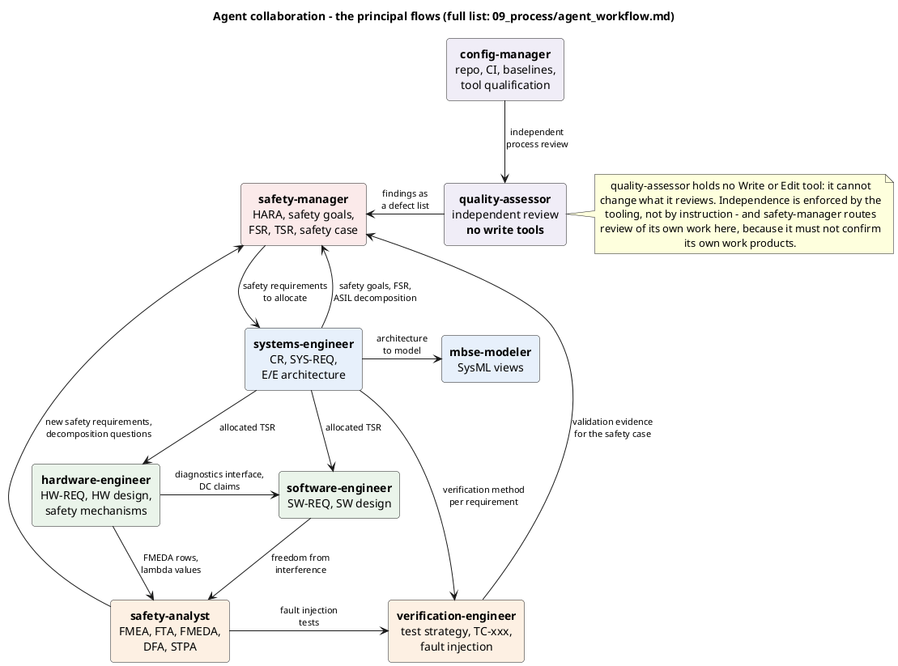
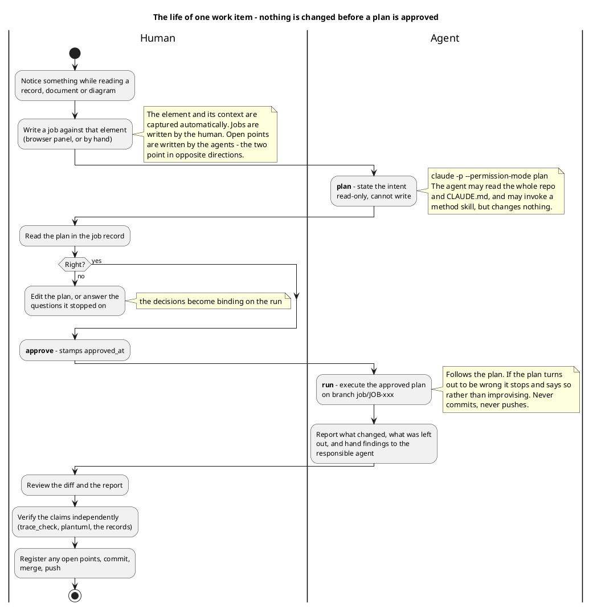

# How the agents work — tasks, inputs, outputs, handoffs

**Owner:** config-manager · **Status:** draft · **ASPICE MAN.3** (project management), **SUP.4**
(joint review)

> Companion to [`README.md`](../README.md) §"Working with the agents", which says *which agent
> leads which V-model stage*, and to [`HOWTO.md`](../HOWTO.md) §3, which maps phase to agent. This
> document describes how they **interact**: what each one needs as input, what it produces, and
> what it hands to whom.

---

## 1 How an agent gets work

Three routes, all of which now pass through the same gate.

| Route | Trigger | When to use it |
|---|---|---|
| **Phase** | `/phase-run`, or saying "phase 5" / "next" | Working the project forward in its intended order |
| **Direct** | "use the safety-analyst agent to …", or a method skill such as `/hara` | A focused piece of work outside the phase rhythm |
| **Job** | `tools/jobs.py` — captured in the requirements browser | Something noticed while reading a record, document or diagram |

**All three are governed by the same rule**, stated in [`CLAUDE.md`](../CLAUDE.md) §"Plan first,
then change": any task that will create or modify a work product starts with a plan for approval.
A subagent is therefore invoked twice — once to plan, read-only, and once to carry out the
approved plan.

Only the job route enforces this mechanically (`plan` → `approve` → `run`, with the planning phase
run under the CLI's read-only plan mode). The other two hold because `CLAUDE.md` and the agent
definitions say so. **That difference is worth knowing**: one is a gate, the other is an
instruction.

## 2 What each agent needs and produces

Every agent reads `CLAUDE.md` first — project variables, ID scheme, the Golden Thread depth rule
and the format rules are binding for all of them. The table lists what is specific to each.

| Agent | Task | Needs as input | Produces | Method skill |
|---|---|---|---|---|
| `safety-manager` | ISO 26262 concept phase and safety management | item boundary, `CR-`, vehicle-level assumptions | item definition, HARA, `H-xx`, `SG-xx`, `FSR-`, `TSR-`, ASIL decomposition, safety case | `hara`, `safety-case-gsn` |
| `systems-engineer` | Customer and system requirements, E/E architecture | customer specification, `FSR-`, `TSR-` to allocate | `CR-`, `SYS-REQ-`, `ee_architecture.md`, interface table, allocation matrix | `requirements-authoring` |
| `mbse-modeler` | SysML v1.6 / MagicGrid views | architecture elements, requirements, safe-state semantics | `03_model/plantuml/*.puml`, MagicGrid matrix, allocation table | `mbse-magicgrid` |
| `hardware-engineer` | Hardware requirements, design, safety mechanisms | allocated `TSR-`, `SYS-REQ-`, environmental requirements | `HW-REQ-`, `SM-xx`, `hw_architecture.md`, `hw_components.md`, analyses, HW verification plan | — |
| `software-engineer` | Software requirements, architecture, detailed design | allocated `TSR-`, timing budgets, HW diagnostics interface | `SW-REQ-`, SW architecture, `SWC_LightManager` detailed design, MISRA deviations | — |
| `safety-analyst` | The safety analyses | architecture, `SM-xx`, λ values, component structure and P-diagrams | System-FMEA, DFMEA, FTA with cut sets, FMEDA with SPFM/LFM/PMHF, DFA, STPA | `safety-analyses` |
| `verification-engineer` | Test strategy and test cases | requirements with their verification method, safety mechanisms, analyses | test strategy, `TC-xxx`, fault-injection tests, regression strategy | — |
| `config-manager` | Repo, CI, baselines, evidence | repo state, tool behaviour, process requirements | repo structure, workflows, templates, `aspice_mapping.md`, tool qualification | — |
| `quality-assessor` | Independent review | every work product, and the standards' expectations | findings as a defect list — **never an edit** | `trace-audit` |

**The `Needs as input` column is the important one.** An agent invoked without its input does not
fail loudly; it invents. `safety-analyst` asked for an FMEDA before `hw_components.md` existed
would have produced a plausible component structure of its own, and it would have drifted from the
architecture within a page.

## 3 Who hands what to whom

**How to read it:** the diagram shows the principal flows only. The complete set — every handoff
each agent declares in its own definition — is the table below. Read the diagram for the shape and
the table for the detail.

| From | To | What flows |
|---|---|---|
| `safety-manager` | `systems-engineer` | requirement derivation, architecture allocation |
| `safety-manager` | `safety-analyst` | FMEA / FTA / FMEDA / DFA / STPA execution |
| `safety-manager` | `hardware-engineer` | HW metrics evidence |
| `safety-manager` | `software-engineer` | freedom from interference |
| `safety-manager` | `verification-engineer` | verification and validation evidence |
| `safety-manager` | `quality-assessor` | independent review of its own work products |
| `systems-engineer` | `safety-manager` | safety goals, FSR, ASIL decomposition |
| `systems-engineer` | `safety-analyst` | FMEA / FTA / FMEDA feedback into the architecture |
| `systems-engineer` | `mbse-modeler` | SysML views of the architecture |
| `systems-engineer` | `verification-engineer` | verification method per requirement |
| `hardware-engineer` | `safety-analyst` | FMEDA rows, λ values, metric computation |
| `hardware-engineer` | `systems-engineer` | TSR allocation conflicts |
| `hardware-engineer` | `software-engineer` | SW-side diagnostics and DTC handling |
| `hardware-engineer` | `verification-engineer` | fault injection test design |
| `software-engineer` | `hardware-engineer` | HW diagnostics interface, DC claims |
| `software-engineer` | `systems-engineer` | TSR allocation conflicts |
| `software-engineer` | `mbse-modeler` | component state machine as a SysML view |
| `software-engineer` | `verification-engineer` | unit/integration test spec, coverage gate |
| `safety-analyst` | `safety-manager` | new safety requirements, decomposition questions |
| `safety-analyst` | `systems-engineer` | architecture change resulting from an analysis |
| `safety-analyst` | `hardware-engineer` | diagnostic coverage claims |
| `safety-analyst` | `verification-engineer` | fault injection tests derived from the analyses |
| `mbse-modeler` | `systems-engineer` | missing or ambiguous architecture elements |
| `mbse-modeler` | `safety-manager` | safe state and fault reaction semantics |
| `mbse-modeler` | `software-engineer` | component-internal state machines |
| `verification-engineer` | owning agent | untestable or ambiguous requirements |
| `verification-engineer` | `safety-analyst` | which mechanism is proven by which test |
| `verification-engineer` | `safety-manager` | validation evidence for the safety case |
| `config-manager` | `safety-manager` | tool qualification, confirmation measures |
| `config-manager` | `software-engineer` / `verification-engineer` | coverage gate thresholds |
| `config-manager` | `quality-assessor` | independent process review |
| `quality-assessor` | responsible agent | findings as a defect list |

**A handoff is a declaration, not a mechanism.** Nothing routes these automatically: each edge
exists because the agent's own definition says to hand that item onward, and it is honoured only
if the agent does so and a human notices when it does not. In practice they mostly do — the
`JOB-003` run handed a `SYS-REQ-018` conflict to `systems-engineer` rather than designing around
it — but "mostly" is the honest word, and the human review step is what catches the rest.

## 4 Two structural properties worth knowing

**`quality-assessor` cannot edit.** Its tool list is `Read, Grep, Glob, Bash` — no `Write`, no
`Edit`. It physically cannot change the artefact it is reviewing, so its independence is enforced
by tooling rather than by instruction. That is the one place in this project where a process
property is guaranteed rather than requested.

**`safety-manager` must not confirm its own work.** Its own definition routes independent review
to `quality-assessor`. This is the ISO 26262 confirmation-measure idea — the reviewer must be
independent of the author — expressed as an agent rule. It is an instruction, not a mechanism, and
would not survive an assessment on its own; the confirmation measures owed by phase 9 are what
make it real.

## 5 The life of one work item

**How to read it:** the swimlane boundary is the point of the diagram. Everything that changes the
repository happens on the agent side, and every decision about *whether* it should happen sits on
the human side. The read-only planning step is what makes that division real rather than
aspirational.

## 6 What the agents do not do

- **They do not commit or push.** `run` leaves the changes in the working tree on a branch. Every
  commit in this repository was made after a human read the diff.
- **They do not file open points.** An agent proposes findings; a human registers them in
  `project_status.md`. This is deliberate: an open point is an agent reporting on its own work, so
  a job that files one automatically would put words in the agent's mouth.
- **They do not run in CI.** A job file is data that becomes an instruction; running one
  unattended, on a branch someone else wrote, is the injection surface this project avoids.
- **They do not verify their own claims.** An agent's report of "checks pass" is a claim, and it
  has been wrong: one job reported all generators clean when the browser was stale, because the
  runner writes the job outcome after the agent stops. The human re-runs the checks.

## 7 Known weaknesses of this model

| Weakness | Consequence |
|---|---|
| An agent reads the repository at plan time and writes at run time, with human decisions in between | Allocated IDs can collide with records added meanwhile — `JOB-003` reused `OP-40` and `OP-41`, caught only in review |
| Handoffs are declarations | An agent can silently keep work that belongs to another |
| The plan-first rule is a gate only on the job route | Phase and direct invocation depend on the definitions being followed |
| Method skills are invoked by the agent, not enforced | An agent can write a requirement without consulting `requirements-authoring` |

None of these is closed. They are listed because a workflow document that describes only the
intended path is a sales brochure.

---

**Work products:** `agent_workflow.md` → `09_process/` · `agent_handoffs.puml`,
`agent_work_item.puml` → `03_model/plantuml/`
**Process reference:** ASPICE **MAN.3** (project management — roles and responsibilities) and
**SUP.4** (joint review — independence of the reviewer) · ISO 26262 **Part 2** (safety management,
confirmation measures and the independence they require). Parts and topics named; no clause
numbers cited.
