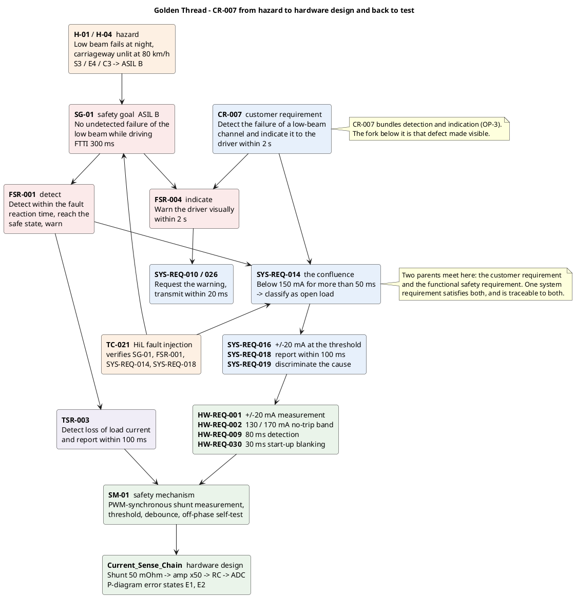

# Walkthrough — one customer requirement from top to bottom

**Purpose:** show what a complete derivation looks like in this project · **Owner:** config-manager
**Status:** draft · **Subject:** `CR-007`, the Golden Thread

> Teaching/reference project. All numeric values are plausible example values, not validated data.

---

## 1 Why this requirement

`CR-007` is the only customer requirement in the project whose derivation reaches every level.
Counted from the trace graph: **28 downstream records, four levels deep**, and the only chain that
ends in a test case. Every other customer requirement stops at system or hardware level.

| | `CR-007` | next best |
|---|---|---|
| Downstream records | 28 | 8 (`CR-020`) |
| Levels | 4 | 3 |
| Reaches `HW-REQ` | yes | yes |
| Reaches a safety mechanism | yes | `CR-016` only |
| Reaches a test case | **yes** | none |

That is not an accident: `CR-007` is the customer-side entry into `SG-01`, the safety goal the
project deliberately develops in full depth. The other threads are breadth.

## 2 The thread

**How to read it:** two roots, not one. The hazard `H-01` produces the safety goal on the left;
the customer requirement enters from the right. They meet at `SYS-REQ-014`, and everything below
that point serves both. `TC-021` closes the loop upwards.

## 3 Level by level

### 3.1 Hazard → safety goal

> **`H-01`** — Failure of the low beam (both channels) during night driving: carriageway unlit at
> 80 km/h, running off the road or colliding with an unlit obstacle. **S3 / E4 / C3 → ASIL B**
>
> **`SG-01`** — No undetected failure of the low beam while driving. **FTTI 300 ms**

**Why this is right:** the safety goal is phrased as the *absence of the hazard*, not as a
solution. It does not say "monitor the current" — that would fix the design at the wrong level.
The word that carries the whole thread is **undetected**: a failure is tolerable, a failure nobody
notices is not. Everything below implements that one word.

### 3.2 Customer requirement

> **`CR-007`** — The lighting system shall detect the failure of a low-beam channel and indicate
> it visually to the driver in the instrument cluster within 2 s.

**Why this is right:** it is testable (2 s, instrument cluster, visually) and it is written in the
customer's language — nothing about shunts or thresholds. **It is also the one defect in this
thread; see section 6.**

### 3.3 Functional safety requirements

> **`FSR-001`** — When a low-beam channel fails, the lighting system shall detect the failure
> within the fault reaction time, transition to the safe state and warn the driver.
>
> **`FSR-004`** — When the lighting system has detected the failure of a low-beam channel, it
> shall warn the driver visually within 2 s.

**Why this is right:** `FSR-001` derives from `SG-01` alone — it is pure safety. `FSR-004` derives
from **both** `SG-01` and `CR-007`, because the 2 s figure is a customer number, not a safety
number: the FTTI says nothing about how fast a human must be told. Recording both parents is what
keeps that distinction visible.

### 3.4 Technical safety requirement

> **`TSR-003`** — The lighting ECU shall detect the loss of load current in a low-beam channel and
> report it to the fault reaction within 100 ms of fault occurrence.

**Why this is right:** this is the first level that names a *technique* — load current — and it is
the correct level to do so. The 100 ms is a budget allocation, carved out of the 300 ms FTTI so
that detection plus reaction still fits.

### 3.5 System requirements — the confluence

> **`SYS-REQ-014`** — When the load current of a low-beam channel, measured during the PWM
> on-phase, remains below 150 mA for more than 50 ms, the lighting ECU shall classify the channel
> as "open load".
> `derived_from: [CR-007, FSR-001]`

**This is the most instructive record in the repository.** One system requirement satisfies a
customer need *and* a functional safety requirement, and is traceable to both. Neither parent is
lost: an impact analysis starting from `CR-007` finds it, and so does one starting from `SG-01`.
Had it been written twice — once "for the customer" and once "for safety" — the two copies would
have drifted the first time a value changed.

Its siblings each add one property the classification needs:

| Record | Adds |
|---|---|
| `SYS-REQ-016` | how accurate the measurement has to be: ±20 mA at the threshold |
| `SYS-REQ-017` | what happens when the PWM on-time is too short to measure |
| `SYS-REQ-018` | how fast the fault must reach the fault reaction: 100 ms |
| `SYS-REQ-019` | that the cause must be discriminated before reacting |

`SYS-REQ-019` is worth pausing on. Without it, a commanded current reduction — thermal derating —
would look identical to a broken channel, and the system would enter the safe state during normal
operation. A requirement that exists to prevent a *correct* measurement from causing a *wrong*
reaction.

### 3.6 Hardware requirements

> **`HW-REQ-001`** — ±20 mA total uncertainty at 150 mA over −40 °C to +85 °C.
> **`HW-REQ-002`** — below 130 mA always evaluated as below threshold; above 170 mA never.
> **`HW-REQ-009`** — hardware detection path reports within 80 ms.

**Why this is right:** `HW-REQ-002` is the one to notice. `SYS-REQ-016` states an uncertainty;
`HW-REQ-002` converts it into a **guaranteed band** — a statement about what must never happen
rather than about a tolerance. That is the translation from a system-level number into something a
hardware engineer can design and a test can falsify. The tolerance chain that gets there is in
`05_hardware/analysis_current_sensing.md`.

### 3.7 Safety mechanism and hardware design

> **`SM-01`** — Open-load detection via PWM-synchronous shunt current measurement with threshold
> comparison, debouncing, off-phase zero-current self-test and discrimination against
> short-to-battery and commanded reduction.
> `allocated_to: [ECU_LightingCtrl, LED_Driver_Stage_1, Current_Sense_Chain]`

The allocation lands on real hardware: `Current_Sense_Chain` — shunt 50 mΩ → amplifier ×50 →
anti-alias RC → clamp → ADC input, defined in `05_hardware/hw_components.md` with its own
P-diagram. That P-diagram's error states `E1` (reads high, open load missed) and `E2` (reads low,
healthy channel classified as failed) are the two ways this thread can fail, and they are the rows
the phase 5 DFMEA will rate.

**The thread ends in a physical part with named failure modes.** That is what "top to bottom"
means here.

## 4 The numbers stay consistent

A trace is only worth something if the values agree along it. Every figure below is set once and
consumed downstream:

| Value | Set in | Consumed by | Check |
|---|---|---|---|
| FTTI 300 ms | `SG-01` | the whole thread | 80 + 150 = 230 ms, margin 70 ms ✔ |
| Report within 100 ms | `TSR-003` → `SYS-REQ-018` | `HW-REQ-009` | 80 ms ≤ 100 ms ✔ |
| Detection 80 ms | `HW-REQ-009` | `SM-01` budget | consistent with `SM-01` ✔ |
| Threshold 150 mA | `SYS-REQ-014` | `HW-REQ-001`, `HW-REQ-002` | ✔ |
| Uncertainty ±20 mA | `SYS-REQ-016` | `HW-REQ-001` | ✔ |
| No-trip band 130 / 170 mA | `HW-REQ-002` | `SM-01`, `HW-REQ-030` | 150 ± 20 ✔ |
| Indication 2 s | `CR-007` → `FSR-004` | `SYS-REQ-010`, `SYS-REQ-026` | ✔ |

**One row does not close, and it is left visible rather than smoothed over.** `HW-REQ-030` blanks
`SM-01` for 30 ms after switch-on, which added to the 80 ms of `HW-REQ-009` gives 110 ms — against
the 100 ms cap of `SYS-REQ-018`. Recorded as `OP-42`, owned by the requirement's owner. See
section 6.

## 5 Verification closes the loop

> **`TC-021`** — Fault injection of an open load on low-beam channel 1: evidence of detection,
> fault reaction within the fault reaction time, driver warning and DTC entry. HiL.
> `derived_from: [SYS-REQ-014, SYS-REQ-018, FSR-001, SG-01]`

One test case verifies at **four levels at once**: the safety goal, the functional safety
requirement, and two system requirements. That is deliberate and it is the right shape — a fault
injection at the input of the thread, observed at its output, exercises everything between.

It is also the reason `SG-01` shows a verification link at all. A safety goal cannot be tested
directly; it is tested through the thread that implements it.

## 6 🔍 The defect in this thread, and why it is shown

`CR-007` says: *detect the failure of a low-beam channel **and** indicate it to the driver*. That
is **two requirements in one**, and `OP-3` has recorded it as such since phase 1.

**The trace graph exposes it.** A well-formed customer requirement produces one branch; `CR-007`
produces two — a detection branch through `SYS-REQ-014` and an indication branch through
`FSR-004` and `SYS-REQ-010`. The fork in the diagram is not an artefact of drawing: it is the
non-atomicity, made visible.

Why it matters in practice:

- **Verification splits.** `TC-021` covers detection. Nothing yet covers the 2 s indication, and
  no test case can cover both cleanly, because they have different observation points.
- **Status is ambiguous.** If the detection branch is verified and the indication branch is not,
  `CR-007` is neither "verified" nor "open". A single status field cannot describe two
  requirements.
- **The fix is not free.** Splitting it into `CR-007a` / `CR-007b` would break the ID rule
  (`CLAUDE.md`: never reuse, never silently change), so it needs a requirement-change issue and an
  impact analysis across 28 downstream records. That is exactly why `OP-3` says "change only via a
  requirement-change issue" and why it is still open.

**This is the useful lesson, more than the clean part above.** A trace graph is not only evidence
that the work was done — it is a diagnostic. Requirement-quality defects show up as structural
anomalies in the graph long before anyone re-reads the requirement text.

## 7 What is still open on this thread

| ID | Point | Owner |
|---|---|---|
| `OP-3` | `CR-007` is not atomic; change only via a requirement-change issue | systems-engineer |
| `OP-15` | `SM-01`'s 90 % diagnostic coverage is conditional until the FMEDA confirms it | safety-analyst |
| `OP-42` | `HW-REQ-030`'s blanking makes start-up detection 110 ms against a 100 ms cap | systems-engineer |
| `OP-20` | `SYS-REQ-014`, `SM-01` and `TC-021` dropped to `draft` by the phase 3 refinement | safety-manager |

Every record on the thread is still `draft` except `CR-007`, `SG-01` and `FSR-001`. **A complete
trace is not the same as a mature one** — this thread demonstrates structure, not release
readiness.

---

**Work products:** `golden_thread_walkthrough.md` → `09_process/` ·
`req_cr007_thread.puml` → `03_model/plantuml/`
**Process reference:** ASPICE **SUP.8** (configuration management, evidence) and **SUP.10**
(change request management, for `OP-3`) · ISO 26262 **Part 8** (management of safety requirements
— bidirectional traceability) · **Part 3** for the hazard and safety goal, **Part 4** for the
technical safety requirement, **Part 5** for the hardware. Parts and topics named; no clause
numbers cited.
