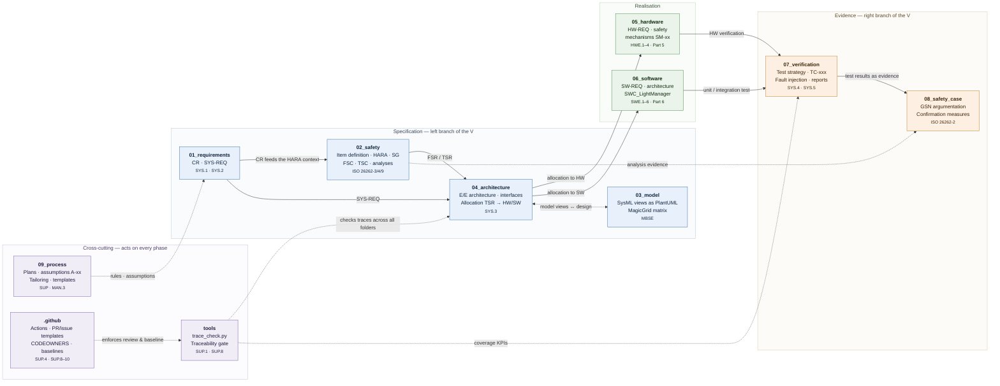

# Commercial vehicle lighting system — MBSE reference project (ASPICE + ISO 26262)

Teaching/reference project for an **adaptive front-lighting system incl. work-lamp control** in a
heavy commercial vehicle (N3, 18 t tractor unit). Model-based throughout (MagicGrid / SysML v1.6),
compliant with Automotive SPICE (PAM 4.0) and ISO 26262:2018, with GitHub as the configuration
management and evidence layer.

> **Not a production baseline.** All numeric values are plausible example values, not validated data.

- **Target ASIL:** ASIL B (loss of low beam during night driving)
- **Golden Thread:** `SG-01` → `FSR-001` → `TSR` → `SM-01` → `SWC_LightManager` → `TC-021` →
  FTA path → FMEDA row → safety case argument
- **Second, shallower thread:** `SG-02` (glare from high beam / work lamps)

## Project scope

What is developed in this project, what is only an interface, and what is deliberately excluded.
The block diagram is the graphical form of
[`02_safety/01_item_definition/item_definition.md`](02_safety/01_item_definition/item_definition.md)
and defines the item boundary per ISO 26262-3.

![Block diagram of the project scope: the item boundary in green contains ECU_LightingCtrl with
MCU_Lockstep and ASIC_Watchdog, the LED driver stages, current and temperature sensing, the headlamp
modules and the work-lamp output stages. External systems in blue — environment sensing (A-05),
Vehicle_Gateway on CAN FD / SAE J1939 (A-02, A-06), 24 V vehicle supply KL30/KL15 (A-01), instrument
cluster (A-04) and diagnostic tester with UDS per ISO 14229. A grey panel lists what is excluded:
rear lighting, interior lighting, indicators and hazard warning, fog lamps and body-builder
lighting.](project-scope.svg)

**How to read it:** the green block is the item boundary — ECU logic, LED drivers and the
current/temperature sensing are specified, designed and verified in this project. Blue blocks are
external systems; only the interface to them is in scope, and each carries the assumption
(`A-01` … `A-06`) under which it is treated as given. The grey panel lists what is explicitly
excluded — naming exclusions rather than leaving them tacit is what makes the boundary auditable.

> The graphic is derived from
> [`02_safety/01_item_definition/item_definition.md`](02_safety/01_item_definition/item_definition.md),
> which stays the authoritative boundary definition together with the PlantUML source
> [`03_model/plantuml/ctx_item.puml`](03_model/plantuml/ctx_item.puml). It is hand-authored SVG, so
> a label can be corrected in the file rather than by regenerating an image.

| Aspect | In scope | Interface only | Out of scope |
|---|---|---|---|
| **Lighting functions** | Low beam, high beam, daytime running lights, cornering light, headlamp levelling, work lamps | — | Rear, interior, indicators, hazard warning, fog lamps |
| **Electronics** | Lighting ECU, LED driver stages, current and temperature sensing | 24 V supply, CAN FD / LIN transceivers | Body-builder lighting behind the body interface |
| **Functional safety** | `SG-01`, `SG-02` and everything derived from them | Object detection (`A-05`), instrument cluster (`A-04`) | Vehicle-level safety concept |
| **Cybersecurity** | — | ISO 21434 interface requirements (`CR-023`) | Detailed cybersecurity concept |

## Getting started

Working guide: **[HOWTO.md](HOWTO.md)** · Binding project context: **[CLAUDE.md](CLAUDE.md)** ·
Current state: **[09_process/project_status.md](09_process/project_status.md)**

```bash
python3 tools/trace_check.py     # traceability consistency check
```

In Claude Code: `/phase-run` starts phase 0 and works through phases 0–11 one at a time.

## Structure

The folders mirror the V-cycle: specification (left branch) → realisation → evidence (right branch).
Cross-cutting folders act on every phase.



**How to read it:** solid arrows are the derivation flow of the work products — every edge is held
in the traceability graph as `derived_from` or `allocated_to`. Dotted arrows are evidence and
control relations: `tools/` checks the traces, `.github/` enforces review and baseline,
`09_process/` sets the rules. The Golden Thread `SG-01` runs once through all four blocks.

| Path | Content | Process reference |
|---|---|---|
| `01_requirements/` | Customer requirements, system requirements | SYS.1, SYS.2 |
| `02_safety/` | Item definition, HARA, FSC, TSC, safety analyses | ISO 26262-3/4/9 |
| `03_model/` | PlantUML model views (sources), exports (CI-generated) | MBSE |
| `04_architecture/` | E/E architecture, interfaces, allocation | SYS.3 |
| `05_hardware/` | HW requirements, safety mechanisms, HW verification | HWE.1–4, Part 5 |
| `06_software/` | SW requirements, architecture, detailed design | SWE.1–6, Part 6 |
| `07_verification/` | Test strategy, test cases, reports | SYS.4, SYS.5 |
| `08_safety_case/` | GSN, work product status, confirmation measures | ISO 26262-2 |
| `09_process/` | Plans, templates, assumptions, tailoring, meta-prompt | SUP, MAN.3 |
| `tools/` | CI scripts (traceability, folder overviews) | SUP.1, SUP.8 |

## Working with the agents

Phases 0–11 are not worked by a generalist but by **nine specialist agents** with clear
responsibilities. The `phase-run` skill routes each phase to the lead agent, the **method skills**
supply the procedures, and two gates secure the result.

![V-model of the project: six stages from system concept and requirements, through architecture and
analysis, hardware and software design, implementation, unit testing, system and integration test,
to validation and release. Each stage names the agents that lead it together with their scope — for
example systems-engineer for CR elicitation and SYS-REQ derivation, safety-manager for item
definition, HARA and the functional safety concept. config-manager and quality-assessor run
continuously as supporting processes. A quick-start panel shows /phase-run followed by "next", and
direct invocation such as "use the safety-analyst agent to..." or /hara.](v-model.svg)

**How to read it:** the left branch descends from requirements to design, the right branch ascends
from unit test to release, and the dashed arrows are the bi-directional traceability between the two
— every verification level refers back to the specification level opposite it. `config-manager` and
`quality-assessor` are not stages but run continuously alongside all of them.

**What makes this V-model different** from the textbook one is stated in the banner at the top: each
stage carries the **agent that leads it and that agent's scope**. No stage is worked by a
generalist — the `safety-analyst` owns FMEA, FTA and FMEDA, the `mbse-modeler` owns the SysML views,
and the handoffs between them are part of the agent definitions rather than a matter of habit.

Two gates are not shown in the diagram but apply at every stage: `tools/trace_check.py` checks the
traces mechanically, and the `quality-assessor` reviews independently and read-only. Both return
findings to the responsible agent before a PR or baseline follows.

### How the agents hand off to each other

The V-model above shows *who leads which stage*. This shows *what flows between them* — an FMEA
finding from the `safety-analyst` becoming a new requirement for the `systems-engineer`, a TSR
allocation conflict going back from hardware to systems, validation evidence arriving at the safety
case.

![Agent collaboration network: nine agents as boxes with labelled arrows between them.
safety-manager exchanges safety requirements and safety goals with systems-engineer, which passes
the architecture to mbse-modeler and allocated TSR down to hardware-engineer and software-engineer.
Those two exchange the diagnostics interface and DC claims, and both feed the safety-analyst with
FMEDA rows and freedom-from-interference evidence. safety-analyst returns new safety requirements to
safety-manager and fault injection tests to verification-engineer, which returns validation evidence
to the safety case. config-manager triggers independent process review by quality-assessor, which
returns findings as a defect list.](agent-handoffs.svg)

**How to read it:** these are the principal flows only — the complete list of all thirty-two
declared handoffs, together with what each agent needs as input and produces as output, is in
[`09_process/agent_workflow.md`](09_process/agent_workflow.md).

Two things are worth noticing. **`quality-assessor` holds no `Write` or `Edit` tool**, so it
physically cannot change what it reviews — independence enforced by tooling rather than by
instruction, and the one place in this project where a process property is guaranteed rather than
requested. And **`safety-manager` routes review of its own work to `quality-assessor`**, because an
author must not confirm their own work products.

**A handoff is a declaration, not a mechanism.** Each arrow exists because the agent's own
definition says to hand that item onward. Nothing routes it automatically, and the human review step
is what catches the cases where it does not happen.

> The diagram is rendered from
> [`03_model/plantuml/agent_handoffs.puml`](03_model/plantuml/agent_handoffs.puml). Regenerate it
> with `plantuml -tsvg -pipe < 03_model/plantuml/agent_handoffs.puml > agent-handoffs.svg` when
> that source changes — the SVG is committed for display here and is not regenerated by CI.

> The six stages of the diagram summarise the twelve project phases (0–11); the exact mapping of
> phase to agent is in [HOWTO.md](HOWTO.md), section 3.

### Control words

| Input | Effect |
|---|---|
| `/phase-run` | starts or continues the phase sequence |
| `next` | next phase |
| `deeper: <topic>` | works the topic out at detail level; IDs and values stay unchanged |
| `shorter` | next phase at overview level only |

Who leads which phase and which skills exist: **[HOWTO.md](HOWTO.md)**, sections 3 and 4.

## Reading the project: the requirements browser

The records are Markdown files, which is right for version control and wrong for reading: nothing
in a folder of 120 files tells you how a requirement connects to anything else.
[`07_verification/reports/requirements_browser.html`](07_verification/reports/requirements_browser.html)
is a **single self-contained page** — generated, never hand-edited — that presents the project the
way a requirements management tool does. Open it straight from a checkout; it needs no server and
makes no network request.

![The requirements browser showing its V-model overview. A sidebar on the left lists the ASPICE
process areas grouped by level, each with a record count. The main area shows the system level split
into a specification column and a verification column: SYS.1 requirements elicitation with 28
records, SYS.2 system requirements analysis with 28 records, SYS.3 system architectural design with
3 documents, and on the verification side SYS.4 system integration marked "not started" with a
dashed border and SYS.5 system qualification test with 1 record. The hardware level follows below. A
header bar shows requirements coverage 90/104 = 87 percent, test coverage 3/3, 120 records and 22
model views.](requirements-browser.jpg)

**What the screenshot shows is the point of it.** The default view is not a list of what exists but
the **V-model with every process area on it, populated or not**. `SYS.4` has a dashed border and
reads *not started*; the whole `SWE.1`–`SWE.6` arm below it reads the same. A folder tree can only
show you what is there. For a reference project, the absence is half the lesson.

Beyond that view it offers:

- **Three groupings** — ASPICE process areas, ISO 26262 parts, or repository folders. A record can
  appear under two frameworks, because they ask different questions of the same artefact.
- **Every record** with its attributes, its upstream and downstream links as clickable chips, and
  its rationale — plus the **open points the agents raised on that element**, so a finding is
  visible where it applies rather than buried in `project_status.md`.
- **All model views rendered**, including the P-diagrams, and the **narrative documents rendered
  in-page** with their internal links resolved.
- **Search and filters** by ASIL, status and type, and a URL fragment per record, document and
  diagram — so a review comment can point at `#r/SYS-REQ-025` rather than at a file and a line.
- **Task capture**: press `t` on anything to write a job for an agent. See
  [`09_process/jobs/README.md`](09_process/jobs/README.md).

The header figures come from `trace_check.py` itself rather than being recomputed, so the page
cannot report a different coverage than the gate does.

```bash
python3 tools/gen_req_browser.py          # regenerate
python3 tools/jobs.py serve               # serve it, and accept captured tasks
```

It is regenerated by the pre-commit hook and by CI, and a stale page fails the pull-request check.
**It is for navigating, not for citing:** every record view names the record file as the source of
truth, and completeness is argued from `traceability_matrix.md` and `trace_check.py`, never from a
picture.

## Language

The project is **English throughout**. The only German document is
`09_process/prompts/prompt_beleuchtungssystem_aspice_iso26262.md` — the original commissioning
document, deliberately left unchanged as the record of what was requested.
