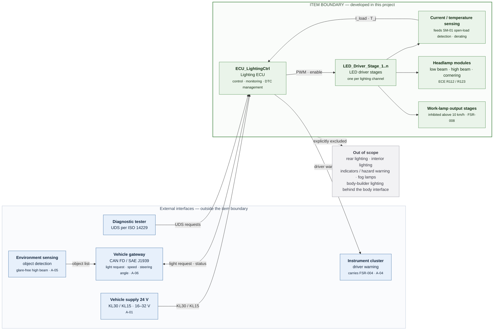
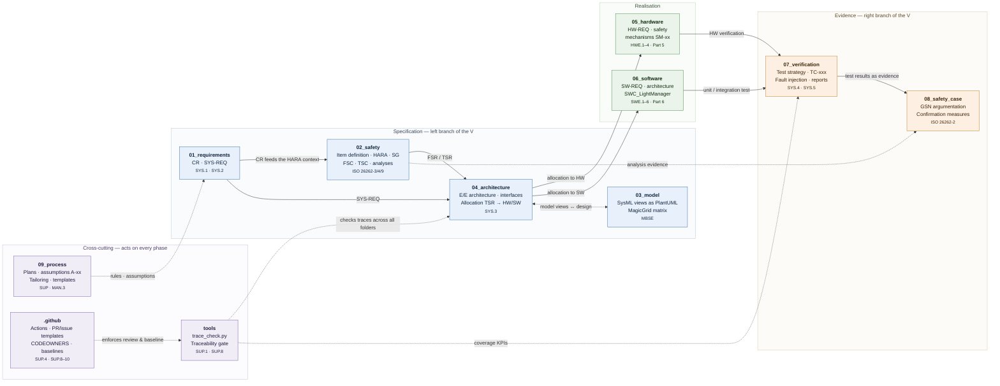

# Commercial vehicle lighting system — MBSE reference project (ASPICE + ISO 26262)

Teaching/reference project for an **adaptive front-lighting system incl. work-lamp control** in a
heavy commercial vehicle (N3, 18 t tractor unit). Model-based throughout (MagicGrid / SysML v1.6),
compliant with Automotive SPICE (PAM 4.0) and ISO 26262:2018, with GitHub as the configuration
management and evidence layer.

> **Not a production baseline.** All numeric values are plausible example values, not validated data.

- **Target ASIL:** ASIL B (loss of low beam during night driving)
- **Golden Thread:** `SG-01` → `FSR-001` → `TSR` → `SM-01` → `SWC_LightManager` → `TC-021` →
  FTA path → FMEDA row → safety case argument
- **Second, shallower thread:** `SG-02` (glare from high beam / work lamps)

## Project scope

What is developed in this project, what is only an interface, and what is deliberately excluded.
The block diagram is the graphical form of
[`02_safety/01_item_definition/item_definition.md`](02_safety/01_item_definition/item_definition.md)
and defines the item boundary per ISO 26262-3.



**How to read it:** green is inside the item boundary — those elements are specified, designed and
verified here. Blue elements are external systems; only the interface to them is in scope, and each
one carries the assumption (`A-01` … `A-06`) under which it is treated as given. Grey is explicitly
out of scope: naming exclusions rather than leaving them tacit is what makes the boundary auditable.

| Aspect | In scope | Interface only | Out of scope |
|---|---|---|---|
| **Lighting functions** | Low beam, high beam, daytime running lights, cornering light, headlamp levelling, work lamps | — | Rear, interior, indicators, hazard warning, fog lamps |
| **Electronics** | Lighting ECU, LED driver stages, current and temperature sensing | 24 V supply, CAN FD / LIN transceivers | Body-builder lighting behind the body interface |
| **Functional safety** | `SG-01`, `SG-02` and everything derived from them | Object detection (`A-05`), instrument cluster (`A-04`) | Vehicle-level safety concept |
| **Cybersecurity** | — | ISO 21434 interface requirements (`CR-023`) | Detailed cybersecurity concept |

## Getting started

Working guide: **[HOWTO.md](HOWTO.md)** · Binding project context: **[CLAUDE.md](CLAUDE.md)** ·
Current state: **[09_process/project_status.md](09_process/project_status.md)**

```bash
python3 tools/trace_check.py     # traceability consistency check
```

In Claude Code: `/phase-run` starts phase 0 and works through phases 0–11 one at a time.

## Structure

The folders mirror the V-cycle: specification (left branch) → realisation → evidence (right branch).
Cross-cutting folders act on every phase.



**How to read it:** solid arrows are the derivation flow of the work products — every edge is held
in the traceability graph as `derived_from` or `allocated_to`. Dotted arrows are evidence and
control relations: `tools/` checks the traces, `.github/` enforces review and baseline,
`09_process/` sets the rules. The Golden Thread `SG-01` runs once through all four blocks.

| Path | Content | Process reference |
|---|---|---|
| `01_requirements/` | Customer requirements, system requirements | SYS.1, SYS.2 |
| `02_safety/` | Item definition, HARA, FSC, TSC, safety analyses | ISO 26262-3/4/9 |
| `03_model/` | PlantUML model views (sources), exports (CI-generated) | MBSE |
| `04_architecture/` | E/E architecture, interfaces, allocation | SYS.3 |
| `05_hardware/` | HW requirements, safety mechanisms, HW verification | HWE.1–4, Part 5 |
| `06_software/` | SW requirements, architecture, detailed design | SWE.1–6, Part 6 |
| `07_verification/` | Test strategy, test cases, reports | SYS.4, SYS.5 |
| `08_safety_case/` | GSN, work product status, confirmation measures | ISO 26262-2 |
| `09_process/` | Plans, templates, assumptions, tailoring, meta-prompt | SUP, MAN.3 |
| `tools/` | CI scripts (traceability, folder overviews) | SUP.1, SUP.8 |

## Working with the agents

Phases 0–11 are not worked by a generalist but by **nine specialist agents** with clear
responsibilities. The `phase-run` skill routes each phase to the lead agent, the **method skills**
supply the procedures, and two gates secure the result.


**How to read it:** the left branch descends from requirements to design, the right branch ascends
from unit test to release, and the dashed arrows are the bi-directional traceability between the two
— every verification level refers back to the specification level opposite it. Each stage names the
agents that lead it; `config-manager` and `quality-assessor` are not stages but run continuously
alongside all of them.

Two gates are not shown in the diagram but apply at every stage: `tools/trace_check.py` checks the
traces mechanically, and the `quality-assessor` reviews independently and read-only. Both return
findings to the responsible agent before a PR or baseline follows. The agents also hand off to each
other — an FMEA finding from the `safety-analyst`, for instance, becomes a new requirement for the
`systems-engineer`.

> The six stages of the diagram summarise the twelve project phases (0–11); the exact mapping of
> phase to agent is in [HOWTO.md](HOWTO.md), section 3.

### Control words

| Input | Effect |
|---|---|
| `/phase-run` | starts or continues the phase sequence |
| `next` | next phase |
| `deeper: <topic>` | works the topic out at detail level; IDs and values stay unchanged |
| `shorter` | next phase at overview level only |

Who leads which phase and which skills exist: **[HOWTO.md](HOWTO.md)**, sections 3 and 4.

## Language

The project is **English throughout**. The only German document is
`09_process/prompts/prompt_beleuchtungssystem_aspice_iso26262.md` — the original commissioning
document, deliberately left unchanged as the record of what was requested.
