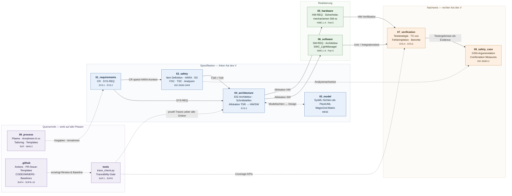
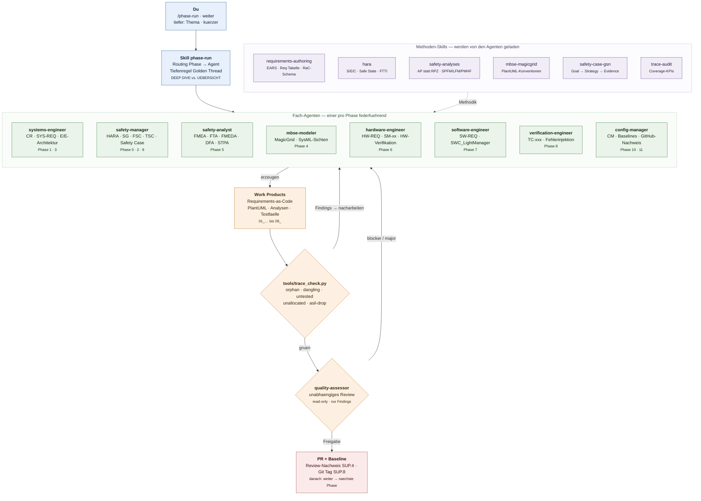

# Beleuchtungssystem Nutzfahrzeug — MBSE-Referenzprojekt (ASPICE + ISO 26262)

Lehr-/Referenzprojekt fuer ein **adaptives Front-Beleuchtungssystem inkl. Arbeitsscheinwerfer-
Steuerung** in einem schweren Nutzfahrzeug (N3, 18 t Sattelzugmaschine).
Durchgaengig modellbasiert (MagicGrid / SysML v1.6), normkonform nach Automotive SPICE (PAM 4.0)
und ISO 26262:2018, mit GitHub als Konfigurationsmanagement- und Nachweisebene.

> **Kein Serienstand.** Alle Zahlenwerte sind plausible Beispielwerte, keine validierten Daten.

- **Ziel-ASIL:** ASIL B (Ausfall Abblendlicht bei Nachtfahrt)
- **Golden Thread:** `SG-01` → `FSR-001` → `TSR` → `SM-01` → `SWC_LightManager` → `TC-021` →
  FTA-Pfad → FMEDA-Zeile → Safety-Case-Argument
- **Zweiter, flacherer Faden:** `SG-02` (Blendung durch Fernlicht/Arbeitsscheinwerfer)

## Einstieg

Arbeitsanleitung: **[HOWTO.md](HOWTO.md)** · Verbindlicher Projektkontext: **[CLAUDE.md](CLAUDE.md)**

```bash
python3 tools/trace_check.py     # Traceability-Konsistenzpruefung
```

In Claude Code: `/phase-run` startet Phase 0 und arbeitet die Phasen 0–11 getaktet ab.

## Struktur

Die Ordner bilden den V-Zyklus ab: Spezifikation (linker Ast) → Realisierung → Nachweis (rechter
Ast). Querschnittsordner wirken auf alle Phasen.



**Leseanleitung:** Durchgezogene Pfeile sind der Ableitungsfluss der Work Products — jede Kante ist
im Traceability-Graph als `derived_from` bzw. `allocated_to` hinterlegt. Gestrichelte Pfeile sind
Nachweis- und Steuerbeziehungen: `tools/` prueft die Traces, `.github/` erzwingt Review und
Baseline, `09_process/` setzt die Vorgaben. Der Golden Thread `SG-01` laeuft einmal quer durch alle
vier Bloecke.

| Pfad | Inhalt | Prozessbezug |
|---|---|---|
| `01_requirements/` | Kundenanforderungen, Systemanforderungen | SYS.1, SYS.2 |
| `02_safety/` | Item Definition, HARA, FSC, TSC, Sicherheitsanalysen | ISO 26262-3/4/9 |
| `03_model/` | PlantUML-Modellsichten (Quellen), Exporte (CI-generiert) | MBSE |
| `04_architecture/` | E/E-Architektur, Schnittstellen, Allokation | SYS.3 |
| `05_hardware/` | HW-Anforderungen, Sicherheitsmechanismen, HW-Verifikation | HWE.1–4, Part 5 |
| `06_software/` | SW-Anforderungen, Architektur, Detaildesign | SWE.1–6, Part 6 |
| `07_verification/` | Teststrategie, Testfaelle, Berichte | SYS.4, SYS.5 |
| `08_safety_case/` | GSN, Work-Product-Status, Confirmation Measures | ISO 26262-2 |
| `09_process/` | Plaene, Templates, Annahmen, Tailoring, Meta-Prompt | SUP, MAN.3 |
| `tools/` | CI-Skripte (Traceability) | SUP.1, SUP.8 |

## Arbeiten mit den Agenten

Die Phasen 0–11 werden nicht von einem Generalisten abgearbeitet, sondern von **neun Fach-Agenten**
mit klarer Zustaendigkeit. Der Skill `phase-run` routet jede Phase an den federfuehrenden Agenten,
die **Methoden-Skills** liefern die Verfahren, und zwei Gates sichern das Ergebnis ab.



**Leseanleitung:** Der Ablauf laeuft von oben nach unten — du startest mit `/phase-run`, der Skill
waehlt den zustaendigen Agenten, dieser erzeugt die Work Products. Danach greifen zwei Gates:
`tools/trace_check.py` prueft die Traces maschinell, der `quality-assessor` reviewt unabhaengig und
read-only. Beide Gates fuehren bei Findings zurueck zu den Agenten — erst nach Freigabe entstehen
PR und Baseline. Die Agenten reichen untereinander weiter (Handoffs), z. B. eine FMEA-Erkenntnis
vom `safety-analyst` als neue Anforderung an den `systems-engineer`.

### Steuerworte

| Eingabe | Wirkung |
|---|---|
| `/phase-run` | startet bzw. setzt die Phasenfolge fort |
| `weiter` | naechste Phase |
| `tiefer: <Thema>` | Thema auf Detailniveau ausarbeiten, IDs und Werte bleiben unveraendert |
| `kuerzer` | naechste Phase nur auf Uebersichtsniveau |

Wer welche Phase verantwortet und welche Skills es gibt: **[HOWTO.md](HOWTO.md)**, Abschnitte 3 und 4.
